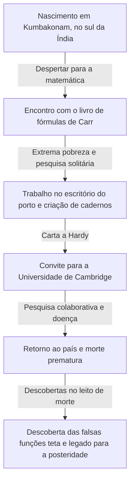
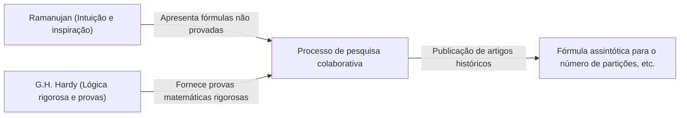

# Srinivasa Ramanujan: O mágico indiano que teceu a intuição e o infinito

## 1. Introdução: Uma "singularidade" que desceu ao mundo da matemática

Ao desvendar a história da matemática, vemos que grandes talentos surgiram em cada época, construindo novas teorias por meio da acumulação de lógica. No entanto, nessa longa história, há uma pessoa que, ignorando o senso comum e os paradigmas existentes, escreveu a verdade como se fosse diretamente inspirada por Deus. Esse homem é Srinivasa Ramanujan (1887-1920), conhecido como "o mágico indiano".

Sua vida, que começou na extrema pobreza, tocou as profundezas da matemática como um autodidata e o levou a atravessar o oceano até a Universidade de Cambridge, na Inglaterra, é tão dramática quanto um filme. Os milhares de fórmulas e teoremas que ele deixou não apenas surpreenderam os matemáticos da época, mas, mais de um século depois, continuam sendo aplicados em campos científicos de ponta, como a física dos buracos negros e a teoria das cordas.

Neste artigo, exploraremos a fundo a vida de Ramanujan, sua pesquisa colaborativa histórica com G.H. Hardy e o incalculável legado que ele deixou para a ciência moderna.

---

## 2. Nascimento e infância: O despertar para a matemática

Ramanujan nasceu em 22 de dezembro de 1887, em uma família brâmane pobre em Erode, Tamil Nadu, no sul da Índia. Desde a infância, ele demonstrou uma memória e capacidade de cálculo extraordinárias, com excelentes notas na escola.

O que determinou seu destino foi seu encontro, aos 15 anos, com o livro de George Shoobridge Carr, "Synopsis of Elementary Results in Pure and Applied Mathematics". Este livro era uma coleção de fórmulas para exames, listando milhares de teoremas e fórmulas matemáticas sem provas. No entanto, para Ramanujan, este livro se tornou o melhor livro didático. Ele tentou provar essas fórmulas por conta própria e começou a descobrir novos teoremas um após o outro, anotando-os em seus cadernos.

No entanto, sua imersão anormal na matemática lançou uma sombra sobre sua vida. Embora tenha ganhado uma bolsa universitária, não mostrou nenhum interesse por outras matérias além da matemática, reprovando repetidamente, e acabou sendo expulso da universidade. Depois disso, trabalhou em vários empregos, passando dias solitários focado apenas em equações na pobreza extrema.

---

## 3. Trabalho no escritório do porto e a carta do destino

Para ganhar a vida, Ramanujan começou a trabalhar como escriturário no escritório do porto de Madras. Seu chefe, Narayana Iyer, também era apaixonado por matemática e percebeu o extraordinário talento de Ramanujan. Encorajado pelas pessoas ao redor, Ramanujan começou a enviar cartas resumindo suas pesquisas a renomados matemáticos britânicos.

Na época, cartas de um jovem indiano desconhecido foram ignoradas pela maioria dos matemáticos como "delírios de um louco". No entanto, apenas um gênio da matemática viu o verdadeiro valor daquelas cartas. Esse foi Godfrey Harold Hardy (G.H. Hardy) da Universidade de Cambridge.

Em 1913, a carta que Hardy recebeu estava repleta de mais de 100 fórmulas complexas, sem qualquer prova. A princípio, Hardy achou que fosse uma brincadeira, mas ao examinar as equações com mais atenção, ficou atônito. Hardy afirmou: "Elas não poderiam sequer ser imaginadas por alguém que não fosse um matemático do mais alto nível. Devem ser verdadeiras, pois se não fossem, ninguém teria a imaginação para inventá-las."

---

## 4. Dias em Cambridge: A fusão da intuição e da lógica

Em 1914, graças aos esforços de Hardy, Ramanujan atravessou o mar e foi convidado para o Trinity College, na Universidade de Cambridge. A partir daqui, começa uma pesquisa colaborativa milagrosa na história da matemática.

Ramanujan e Hardy tinham personalidades diametralmente opostas, como água e óleo.

Hardy era um matemático ortodoxo que valorizava a lógica estrita e as provas. Ramanujan, por outro lado, era um gênio que tirava conclusões apenas por intuição e inspiração. Segundo Ramanujan, as fórmulas eram "escritas em sua língua pela deusa Namagiri em seus sonhos", e ele não compreendia totalmente o conceito de prova em si.

Hardy realizou a tarefa muito delicada de ensinar a Ramanujan métodos de prova rigorosos da matemática moderna sem anular sua intuição. A pesquisa conjunta dos dois foi muito produtiva, publicando uma sucessão de artigos importantes.

---

## 5. Principais conquistas de Ramanujan

As conquistas deixadas por Ramanujan são variadas, mas são especialmente notáveis na teoria dos números e séries infinitas.

### 5.1 Fórmula assintótica para partições (Partitions)
O número de maneiras pelas quais um número inteiro positivo pode ser expresso como a soma de inteiros positivos é chamado de "número de partição". Por exemplo, as partições de 4 são 5: (4), (3+1), (2+2), (2+1+1), (1+1+1+1). À medida que os números aumentam, o número de partições explode, mas Ramanujan e Hardy desenvolveram o "Método do Círculo" (Circle Method), que permite uma aproximação altamente precisa do número de partição $p(n)$ para um grande número $n$, e derivaram uma fórmula assintótica. Esta é uma conquista monumental na teoria analítica dos números.

### 5.2 Séries infinitas de Pi
Ramanujan descobriu muitas séries infinitas para calcular o valor de $\pi$ com velocidades de convergência inacreditáveis. Suas fórmulas são extremamente complexas, mas ainda são usadas hoje como base de algoritmos de computador para calcular pi.

### 5.3 A função $\tau$ de Ramanujan
No estudo das formas modulares, Ramanujan definiu uma função chamada $\tau(n)$ e fez várias conjecturas. Essas conjecturas (Conjecturas de Ramanujan) foram provadas por matemáticos posteriores e tiveram um impacto profundo em amplas áreas da matemática moderna, como geometria algébrica e teoria da representação.

---

## 6. Doença, morte precoce e cadernos perdidos

A vida na Inglaterra durante a Primeira Guerra Mundial foi difícil para Ramanujan, que era um vegetariano estrito. A escassez de alimentos, o clima frio e o excesso de trabalho destruíram seu corpo, e ele desenvolveu tuberculose (ou, segundo alguns, deficiência grave de vitaminas ou amebíase hepática).

Há uma famosa anedota com Hardy quando este o visitou enquanto estava doente na cama. Quando Hardy reclamou que "o número do táxi em que vim era 1729, um número muito chato", Ramanujan respondeu imediatamente: "Não, é um número muito interessante. É o menor número que pode ser expresso como a soma de dois cubos de duas maneiras diferentes ($1^3 + 12^3 = 9^3 + 10^3$)." A partir deste episódio, 1729 passou a ser conhecido como o "Número do Táxi" (Taxicab number).

Embora tenha retornado à Índia em 1919, Ramanujan faleceu no ano seguinte, em 1920, com apenas 32 anos de idade.

Até pouco antes de sua morte, ele continuou a escrever equações em sua cama. Os cadernos que ele escreveu ali (os cadernos perdidos) ficaram desaparecidos por décadas depois que saíram de suas mãos, mas foram descobertos em 1976 por George Andrews na biblioteca da Universidade da Pensilvânia.

### Funções Pseudo-Teta (Mock Theta Functions)
Essas notas, escritas em seu leito de morte, continham a teoria de uma classe de funções completamente nova, chamada "funções pseudo-teta". Ninguém entendeu seu significado na época, mas no século XXI descobriu-se que elas estão diretamente relacionadas ao modelo da teoria das cordas que calcula a entropia de um buraco negro. Ramanujan, à beira da morte, antecipou as equações da astrofísica mais avançada.

---

## 7. Conclusão: Um presente de Deus chamado intuição

Os cadernos deixados por Srinivasa Ramanujan continuam sendo uma fonte inesgotável de ideias para os matemáticos até os dias de hoje. Muitas das fórmulas que ele descobriu já foram provadas e sistematizadas, mas o maior mistério de "como ele teve a intuição para essas fórmulas" provavelmente nunca será resolvido.

A vida de Ramanujan nos ensina que "o pensamento humano e a intuição ainda têm um potencial insondável". Sua paixão e legado de buscar apenas a verdade pura, apesar de sofrer extrema pobreza e doença, continuarão a iluminar as fronteiras da ciência.
