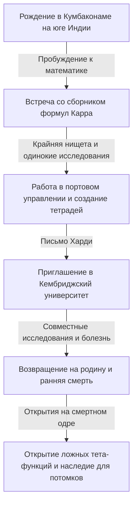
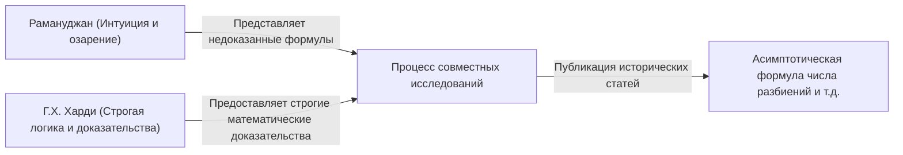

# Сриниваса Рамануджан: Индийский маг, сплетший интуицию и бесконечность

## 1. Введение: "Сингулярность", сошедшая в мир математики

Изучая историю математики, мы видим, что великие таланты появлялись в каждую эпоху, создавая новые теории путем накопления логики. Однако в этой долгой истории есть человек, который, не обращая внимания на здравый смысл или существующие рамки, писал истину так, словно получал вдохновение прямо от Бога. Это Сриниваса Рамануджан (1887-1920), прозванный "индийским магом".

Его жизнь, начавшаяся в крайней нищете, его путь самоучки к глубинам математики и переезд в Кембриджский университет в Англии — все это похоже на драматический фильм. Тысячи формул и теорем, оставленных им, не только поразили математиков того времени, но и спустя более века продолжают применяться в самых передовых областях науки, таких как физика черных дыр и теория струн.

В этой статье мы подробно рассмотрим жизнь Рамануджана, его историческое сотрудничество с Г.Х. Харди и его неоценимое наследие для современной науки.

---

## 2. Происхождение и детство: Пробуждение к математике

Рамануджан родился 22 декабря 1887 года в бедной семье брахманов в Ироуде, штат Тамилнад на юге Индии. С раннего детства он проявлял необычайную память и способности к вычислениям, имея отличные оценки в школе.

Решающим в его судьбе стало знакомство в 15 лет с книгой Джорджа Шубриджа Карра "Сборник элементарных результатов чистой и прикладной математики" (Synopsis of Elementary Results in Pure and Applied Mathematics). Эта книга представляла собой собрание формул для подготовки к экзаменам, где тысячи математических теорем и формул перечислялись без доказательств. Однако для Рамануджана она стала лучшим учебником. Он попытался доказать эти формулы самостоятельно и стал делать одно за другим открытия новых теорем, записывая их в свои тетради.

Однако чрезмерное погружение в математику бросило тень на его жизнь. Хотя он получил университетскую стипендию, он не проявлял никакого интереса к другим предметам, кроме математики, постоянно проваливал экзамены и в итоге был отчислен. После этого он перебивался случайными заработками, проводя одинокие дни за уравнениями в крайней нищете.

---

## 3. Работа в портовом управлении и письмо судьбы

Чтобы заработать на жизнь, Рамануджан начал работать клерком в портовом управлении Мадраса. Его начальник, Нараяна Айер, также увлекался математикой и заметил необычайный талант Рамануджана. По совету окружающих, Рамануджан начал посылать письма с результатами своих исследований известным британским математикам.

В то время письма неизвестного индийского юноши игнорировались большинством математиков как "бред сумасшедшего". Однако только один гениальный математик понял истинную ценность этих писем. Это был Годфри Харолд Харди (G.H. Hardy) из Кембриджского университета.

В 1913 году Харди получил письмо, в котором было более 100 сложных формул, записанных без каких-либо доказательств. Сначала Харди подумал, что это розыгрыш, но при внимательном рассмотрении уравнений он был поражен. Харди говорил: "Они не могли быть придуманы никем, кроме математика высочайшего класса. Они должны быть верными, потому что если бы они не были верными, ни у кого не хватило бы воображения их выдумать".

---

## 4. Дни в Кембридже: Слияние интуиции и логики

В 1914 году, благодаря усилиям Харди, Рамануджан пересек океан и был приглашен в Тринити-колледж Кембриджского университета. Так началось историческое сотрудничество, ставшее чудом в истории математики.

Рамануджан и Харди обладали диаметрально противоположными характерами, как вода и масло.

Харди был ортодоксальным математиком, ценящим строгую логику и доказательства. Рамануджан же был гением, который делал выводы только на основе интуиции и вдохновения. По словам Рамануджана, формулы "богиня Намагири записывала на его языке во сне", и он не очень понимал саму концепцию доказательства.

Харди проделал очень тонкую работу, обучая Рамануджана строгим методам доказательства современной математики, при этом стараясь не погубить его интуицию. Их совместные исследования были весьма плодотворными, они публиковали одну важную статью за другой.

---

## 5. Основные достижения Рамануджана

Достижения, оставленные Рамануджаном, многообразны, но они особенно выдающиеся в теории чисел и теории бесконечных рядов.

### 5.1 Асимптотическая формула для разбиений (Partitions)
Количество способов представить положительное целое число в виде суммы положительных целых чисел называется "числом разбиений". Например, число разбиений числа 4 равно 5: (4), (3+1), (2+2), (2+1+1), (1+1+1+1). С увеличением чисел число разбиений взрывообразно возрастает. Рамануджан и Харди разработали "круговой метод" (Circle Method), который позволил получить чрезвычайно точное приближение для числа разбиений $p(n)$ для большого числа $n$, и вывели асимптотическую формулу. Это монументальное достижение в аналитической теории чисел.

### 5.2 Бесконечные ряды для числа Пи
Рамануджан открыл множество бесконечных рядов для вычисления числа $\pi$ с невероятной скоростью сходимости. Его формулы чрезвычайно сложны, но они до сих пор используются в качестве основы компьютерных алгоритмов для вычисления числа пи.

### 5.3 Функция $\tau$ Рамануджана
При изучении модулярных форм Рамануджан определил функцию $\tau(n)$ и выдвинул несколько гипотез. Эти гипотезы (гипотезы Рамануджана) были доказаны математиками позже и оказали глубокое влияние на обширные области современной математики, такие как алгебраическая геометрия и теория представлений.

---

## 6. Болезнь, ранняя смерть и потерянные тетради

Жизнь в Англии во время Первой мировой войны была суровой для Рамануджана, который был строгим вегетарианцем. Нехватка еды, холодный климат и тяжелая работа разрушили его организм, и он заболел туберкулезом (также есть предположения о тяжелом дефиците витаминов или печеночном амебиазе).

Существует известный анекдот о визите Харди к больному Рамануджану. Когда Харди пожаловался: "Номер моего такси был 1729, довольно скучное число", Рамануджан немедленно ответил: "Нет, это очень интересное число. Это наименьшее число, которое можно представить в виде суммы двух кубов двумя разными способами ($1^3 + 12^3 = 9^3 + 10^3$)". Из-за этого случая число 1729 стали называть "числом такси" (Taxicab number).

Хотя Рамануджан вернулся в Индия в 1919 году, в следующем 1920 году он покинул этот мир в возрасте всего 32 лет.

До самой смерти он продолжал писать уравнения в постели. Тетради, написанные им там (потерянные тетради), исчезли на несколько десятилетий после его смерти, но были обнаружены в 1976 году Джорджем Эндрюсом в библиотеке Пенсильванского университета.

### Ложные тета-функции (Mock Theta Functions)
Эти заметки, написанные на смертном одре, содержали теорию совершенно нового класса функций, называемых "ложными тета-функциями". В то время никто не понимал их смысла, но в XXI веке выяснилось, что они напрямую связаны с моделью теории струн для вычисления энтропии черной дыры. Рамануджан на пороге смерти предвосхитил уравнения самой передовой астрофизики.

---

## 7. Заключение: Дар Божий по имени интуиция

Тетради, оставленные Сринивасой Рамануджаном, до сих пор остаются для математиков неисчерпаемым источником идей. Многие из открытых им формул сегодня доказаны и систематизированы, но величайшая загадка — "как он пришел к этим формулам", вероятно, никогда не будет разгадана.

Жизнь Рамануджана учит нас тому, что "человеческое мышление и интуиция имеют бездонный потенциал". Его страсть и наследие, заключающиеся в поиске только чистой истины, несмотря на крайнюю бедность и болезни, будут продолжать освещать передовые рубежи науки.
