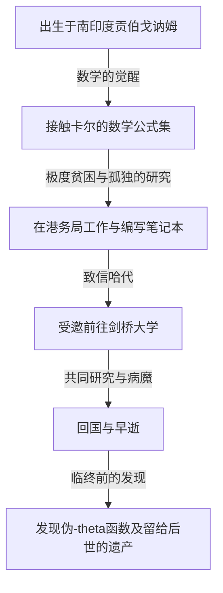
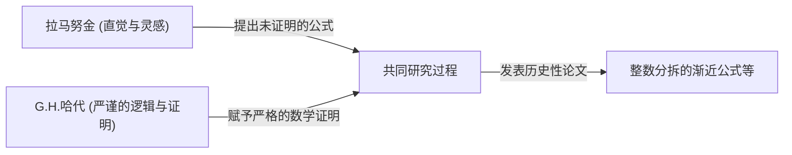

# 斯里尼瓦瑟·拉马努金：编织直觉与无限的印度魔术师

## 1. 引言：降临数学界的“奇点”

回顾数学的历史，每个时代都会涌现出伟大的天才，通过逻辑的积累构建新的理论。然而，在漫长的历史长河中，有这样一个人，他不被任何常识或现有框架所束缚，宛如直接得到神的启示一般写下真理。他就是被誉为“印度魔术师”的斯里尼瓦瑟·拉马努金（Srinivasa Ramanujan, 1887-1920）。

他的一生如同电影般跌宕起伏：出身极度贫困，通过自学触及数学的深渊，最终远渡重洋来到英国剑桥大学。他留下的数千个公式和定理不仅让当时的数学家们感到震惊，而且在一个多世纪后的今天，仍继续被应用于黑洞物理学和弦理论等最前沿的科学领域。

本文将深入探讨拉马努金的一生、他与G.H.哈代的历史性合作研究，以及他留给现代科学的不可估量的遗产。

---

## 2. 出身与童年：数学的觉醒

拉马努金于1887年12月22日出生在南印度泰米尔纳德邦的埃罗德，家境贫寒，属于婆罗门阶层。他从小就展现出超凡的记忆力和计算能力，在学校的成绩非常优异。

决定他命运的是在15岁时遇到的乔治·舒布里奇·卡尔（George Shoobridge Carr）的著作《纯粹数学与应用数学基本结果提要》（Synopsis of Elementary Results in Pure and Applied Mathematics）。这本书仅仅是没有证明地罗列了数千个数学定理和公式，可以说是备考用的公式集。然而，对拉马努金来说，这本书却成了最好的教科书。他开始通过自学尝试证明这些公式，并且自己不断发现新的定理，记录在自己的笔记本上。

然而，对数学近乎痴迷的投入也给他的生活蒙上了阴影。尽管获得了大学奖学金，但他对数学以外的科目毫无兴趣，导致屡次不及格，最终被迫退学。此后，他频繁更换工作，在极度贫困中日复一日地独自面对数学公式。

---

## 3. 在港务局工作与命运之信

为了维持生计，拉马努金开始在马德拉斯港务局担任职员。他的上司纳拉亚纳·艾耶（Narayana Iyer）也是一位数学爱好者，注意到了拉马努金异乎寻常的才华。在周围人的鼓励下，拉马努金开始将自己研究成果总结成信件，寄给英国著名的数学家们。

当时，一封来自不知名印度青年的信被许多数学家视为“疯子的胡言乱语”而遭到无视。然而，只有一位天才数学家看出了这封信的真正价值。他就是剑桥大学的戈弗雷·哈罗德·哈代（G.H. Hardy）。

1913年，寄到哈代手中的信里密密麻麻地写着100多个复杂的数学公式，没有任何证明。起初，哈代以为这是个恶作剧，但在仔细推敲这些公式后，他震惊了。哈代曾说：“这些公式必定是正确的，因为如果它们不正确，任何人都不可能拥有如此强大的想象力来捏造出它们。”

---

## 4. 剑桥岁月：直觉与逻辑的融合

1914年，在哈代的努力下，拉马努金远渡重洋，受邀进入剑桥大学三一学院。从此，数学史上堪称奇迹的合作研究拉开了序幕。

拉马努金和哈代拥有截然相反的特质，简直就像水和油一样。

哈代是一位注重严谨逻辑和证明的正统数学家。而拉马努金则是仅凭直觉和灵感就能得出结论的天才。据拉马努金所说，这些公式是“娜玛吉莉女神在梦中写在他的舌头上”的，他本身对“证明”这个概念并没有充分的理解。

哈代在不扼杀拉马努金直觉的前提下，教导他现代数学严谨的证明方法，这是一项非常微妙的工作。两人的合作研究非常高产，接连发表了重要的论文。

---

## 5. 拉马努金的主要成就

拉马努金留下的成就涉及许多领域，特别是在数论和无穷级数领域最为显著。

### 5.1 整数分拆 (Partitions) 的渐近公式
将一个正整数表示为正整数之和的方法数被称为“分拆数”。例如，4的分拆方式有 (4), (3+1), (2+2), (2+1+1), (1+1+1+1)，共5种。当数字变大时，分拆数会爆炸性增长。拉马努金和哈代开发了“圆法（Circle Method）”，能够以极高的精度近似计算巨大数字 $n$ 的分拆数 $p(n)$，并推导出了渐近公式。这是解析数论中具有里程碑意义的成就。

### 5.2 圆周率的无穷级数
拉马努金发现了许多收敛速度惊人的、用于计算圆周率 $\pi$ 的无穷级数。他的公式复杂而奇特，但至今仍被用作计算机计算圆周率算法的基础。

### 5.3 拉马努金的 $\tau$ 函数
在模形式的研究中，拉马努金定义了一个名为 $\tau(n)$ 的函数，并提出了几个猜想。这些猜想（拉马努金猜想）后来被数学家们证明，并对代数几何和表示论等广泛的现代数学领域产生了深远影响。

---

## 6. 病魔、早逝以及失落的笔记本

第一次世界大战期间的英国生活，对严格素食主义者拉马努金来说异常艰难。食物短缺、寒冷的气候和繁重的工作摧毁了他的身体，使他患上了结核病（也有说法认为是严重的维生素缺乏症或肝阿米巴病）。

哈代在探望病倒的拉马努金时，发生过一段著名的轶事。哈代抱怨说：“我乘坐的出租车车牌号是1729，这是个很无聊的数字。”拉马努金立刻回答道：“不，它是一个非常有趣的数字。它是可以用两种不同的方式表示为两个立方数之和的最小数字（$1^3 + 12^3 = 9^3 + 10^3$）。”从这个故事开始，1729被称为“出租车数（Taxicab number）”。

虽然他在1919年回到了印度，但在次年（1920年），拉马努金便英年早逝，年仅32岁。

直到临终前，他依然躺在病床上不断写下数学公式。他在那里写下的笔记本（失落的笔记本）在离开他之后，曾下落不明数十年，直到1976年才被乔治·安德鲁斯（George Andrews）在宾夕法尼亚大学的图书馆中发现。

### 伪-theta函数 (Mock Theta Functions)
这本在临终病床上写下的笔记本包含了一种被称为“伪-theta函数”的全新函数理论。当时没有人理解它的含义，但进入21世纪后，人们发现这与计算黑洞熵的弦理论模型有直接联系。拉马努金在弥留之际，已经预见了最前沿的宇宙物理学方程。

---

## 7. 结语：名为直觉的神之馈赠

斯里尼瓦瑟·拉马努金留下的笔记本，至今仍是数学家们取之不尽的灵感源泉。他发现的许多公式现在已经被证明和体系化，但“他是如何凭直觉想到这些公式的”这个最大的谜团，将永远无法解开。

拉马努金的一生告诉我们：“人类的思考和直觉仍然蕴藏着深不可测的可能性。”他在遭受极度贫困和疾病折磨的同时，依然纯粹地追求真理，他的这种热情和留下的遗产，将继续作为照亮科学前沿的光芒。
