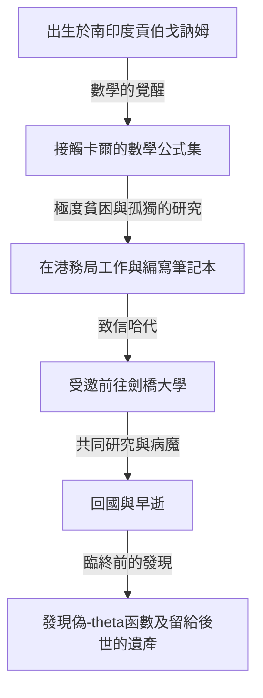
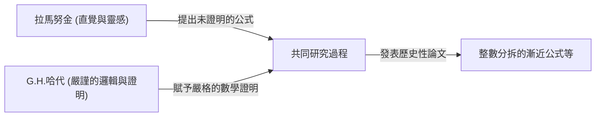

# 斯里尼瓦瑟·拉馬努金：編織直覺與無限的印度魔術師

## 1. 引言：降臨數學界的「奇異點」

回顧數學的歷史，每個時代都會湧現出偉大的天才，透過邏輯的積累構建新的理論。然而，在漫長的歷史長河中，有這樣一個人，他不被任何常識或現有框架所束縛，宛如直接得到神的啟示一般寫下真理。他就是被譽為「印度魔術師」的斯里尼瓦瑟·拉馬努金（Srinivasa Ramanujan, 1887-1920）。

他的一生如同電影般跌宕起伏：出身極度貧困，透過自學觸及數學的深淵，最終遠渡重洋來到英國劍橋大學。他留下的數千個公式和定理不僅讓當時的數學家們感到震驚，而且在一個多世紀後的今天，仍繼續被應用於黑洞物理學和弦理論等最前沿的科學領域。

本文將深入探討拉馬努金的一生、他與G.H.哈代的歷史性合作研究，以及他留給現代科學的不可估量的遺產。

---

## 2. 出身與童年：數學的覺醒

拉馬努金於1887年12月22日出生在南印度泰米爾納德邦的埃羅德，家境貧寒，屬於婆羅門階層。他從小就展現出超凡的記憶力和計算能力，在學校的成績非常優異。

決定他命運的是在15歲時遇到的喬治·舒布里奇·卡爾（George Shoobridge Carr）的著作《純粹數學與應用數學基本結果提要》（Synopsis of Elementary Results in Pure and Applied Mathematics）。這本書僅僅是沒有證明地羅列了數千個數學定理和公式，可以說是備考用的公式集。然而，對拉馬努金來說，這本書卻成了最好的教科書。他開始透過自學嘗試證明這些公式，並且自己不斷發現新的定理，記錄在自己的筆記本上。

然而，對數學近乎癡迷的投入也給他的生活蒙上了陰影。儘管獲得了大學獎學金，但他對數學以外的科目毫無興趣，導致屢次不及格，最終被迫退學。此後，他頻繁更換工作，在極度貧困中日復一日地獨自面對數學公式。

---

## 3. 在港務局工作與命運之信

為了維持生計，拉馬努金開始在馬德拉斯港務局擔任職員。他的上司納拉亞納·艾耶（Narayana Iyer）也是一位數學愛好者，注意到了拉馬努金異乎尋常的才華。在周圍人的鼓勵下，拉馬努金開始將自己研究成果總結成信件，寄給英國著名的數學家們。

當時，一封來自不知名印度青年的信被許多數學家視為「瘋子的胡言亂語」而遭到無視。然而，只有一位天才數學家看出了這封信的真正價值。他就是劍橋大學的戈弗雷·哈羅德·哈代（G.H. Hardy）。

1913年，寄到哈代手中的信裡密密麻麻地寫著100多個複雜的數學公式，沒有任何證明。起初，哈代以為這是個惡作劇，但在仔細推敲這些公式後，他震驚了。哈代曾說：「這些公式必定是正確的，因為如果它們不正確，任何人都不可能擁有如此強大的想像力來捏造出它們。」

---

## 4. 劍橋歲月：直覺與邏輯的融合

1914年，在哈代的努力下，拉馬努金遠渡重洋，受邀進入劍橋大學三一學院。從此，數學史上堪稱奇蹟的合作研究拉開了序幕。

拉馬努金和哈代擁有截然相反的特質，簡直就像水和油一樣。

哈代是一位注重嚴謹邏輯和證明的正統數學家。而拉馬努金則是僅憑直覺和靈感就能得出結論的天才。據拉馬努金所說，這些公式是「娜瑪吉莉女神在夢中寫在他的舌頭上」的，他本身對「證明」這個概念並沒有充分的理解。

哈代在不扼殺拉馬努金直覺的前提下，教導他現代數學嚴謹的證明方法，這是一項非常微妙的工作。兩人的合作研究非常高產，接連發表了重要的論文。

---

## 5. 拉馬努金的主要成就

拉馬努金留下的成就涉及許多領域，特別是在數論和無窮級數領域最為顯著。

### 5.1 整數分拆 (Partitions) 的漸近公式
將一個正整數表示為正整數之和的方法數被稱為「分拆數」。例如，4的分拆方式有 (4), (3+1), (2+2), (2+1+1), (1+1+1+1)，共5種。當數字變大時，分拆數會爆炸性增長。拉馬努金和哈代開發了「圓法（Circle Method）」，能夠以極高的精度近似計算巨大數字 $n$ 的分拆數 $p(n)$，並推導出了漸近公式。這是解析數論中具有里程碑意義的成就。

### 5.2 圓周率的無窮級數
拉馬努金發現了許多收斂速度驚人的、用於計算圓周率 $\pi$ 的無窮級數。他的公式複雜而奇特，但至今仍被用作計算機計算圓周率演算法的基礎。

### 5.3 拉馬努金的 $\tau$ 函數
在模形式的研究中，拉馬努金定義了一個名為 $\tau(n)$ 的函數，並提出了幾個猜想。這些猜想（拉馬努金猜想）後來被數學家們證明，並對代數幾何和表示論等廣泛的現代數學領域產生了深遠影響。

---

## 6. 病魔、早逝以及失落的筆記本

第一次世界大戰期間的英國生活，對嚴格素食主義者拉馬努金來說異常艱難。食物短缺、寒冷的氣候和繁重的工作摧毀了他的身體，使他患上了結核病（也有說法認為是嚴重的維生素缺乏症或肝阿米巴病）。

哈代在探望病倒的拉馬努金時，發生過一段著名的軼事。哈代抱怨說：「我乘坐的出租車車牌號是1729，這是個很無聊的數字。」拉馬努金立刻回答道：「不，它是一個非常有趣的數字。它是可以用兩種不同的方式表示為兩個立方數之和的最小數字（$1^3 + 12^3 = 9^3 + 10^3$）。」從這個故事開始，1729被稱為「計程車數（Taxicab number）」。

雖然他在1919年回到了印度，但在次年（1920年），拉馬努金便英年早逝，年僅32歲。

直到臨終前，他依然躺在病床上不斷寫下數學公式。他在那裡寫下的筆記本（失落的筆記本）在離開他之後，曾下落不明數十年，直到1976年才被喬治·安德魯斯（George Andrews）在賓夕法尼亞大學的圖書館中發現。

### 偽-theta函數 (Mock Theta Functions)
這本在臨終病床上寫下的筆記本包含了一種被稱為「偽-theta函數」的全新函數理論。當時沒有人理解它的含義，但進入21世紀後，人們發現這與計算黑洞熵的弦理論模型有直接聯繫。拉馬努金在彌留之際，已經預見了最前沿的宇宙物理學方程式。

---

## 7. 結語：名為直覺的神之饋贈

斯里尼瓦瑟·拉馬努金留下的筆記本，至今仍是數學家們取之不盡的靈感泉源。他發現的許多公式現在已經被證明和體系化，但「他是如何憑直覺想到這些公式的」這個最大的謎團，將永遠無法解開。

拉馬努金的一生告訴我們：「人類的思考和直覺仍然蘊藏著深不可測的可能性。」他在遭受極度貧困和疾病折磨的同時，依然純粹地追求真理，他的這種熱情和留下的遺產，將繼續作為照亮科學前沿的光芒。
