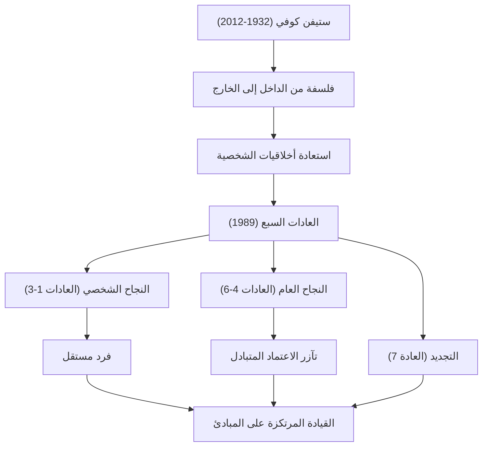

إذا أردنا أن نذكر أحد أكثر الشخصيات تأثيراً في مجال الأعمال وتطوير الذات في العصر الحديث، فلا شك أن اسم الدكتور ستيفن ر. كوفي (Stephen R. Covey) سيبرز بقوة. كتابه "العادات السبع للناس الأكثر فعالية" (The 7 Habits of Highly Effective People) بيع منه عشرات الملايين من النسخ حول العالم، وتجاوز كونه مجرد كتاب أعمال ليصبح "دليلاً للحياة" يقرأه الكثيرون بشغف. في هذا المقال، سنتعمق في حياة الدكتور كوفي، والفلسفة التي تكمن في صميم أعماله، والتأثير الهائل الذي تركه للأجيال القادمة.

## الحياة والخلفية: من باحث أكاديمي إلى قائد عالمي

ولد ستيفن ريتشاردز كوفي في 24 أكتوبر 1932، في مدينة سولت ليك بولاية يوتا، الولايات المتحدة الأمريكية. نشأ في عائلة مسيحية متدينة، وكان صبيًا نشطًا يحب الرياضة منذ صغره، لكنه عانى من انزلاق مشاش رأس الفخذ في مرحلة المراهقة، مما اضطره إلى استخدام العكازات لفترة طويلة. ويقال إن هذه التجربة دفعته إلى تحويل شغفه بالرياضة إلى الأكاديميات والنقاشات، مما جعله يدرك أهمية صقل ذكائه الداخلي.

بعد دراسة إدارة الأعمال في جامعة يوتا، حصل على ماجستير إدارة الأعمال من كلية هارفارد للأعمال. وعلاوة على ذلك، حصل على درجة الدكتوراه في التربية الدينية من جامعة بريغام يونغ (BYU). استمر في التدريس كأستاذ في جامعة بريغام يونغ، حيث بدأ في تدريس السلوك التنظيمي وإدارة الأعمال. كانت محاضراته تحظى بشعبية كبيرة، وانجذب العديد من الطلاب إلى منهجه في "العيش المرتكز على المبادئ".

بعد ذلك، ومن أجل نشر تعاليمه على نطاق أوسع، نشر رائعته "العادات السبع" في عام 1989. مع تحول هذا الكتاب إلى أحد أفضل الكتب مبيعاً عالمياً، تجاوز دوره كأستاذ جامعي وبدأ مسيرته كمستشار قيادي عالمي. في وقت لاحق، ومن خلال اندماج مع شركة فرانكلين كويست، أسس "شركة فرانكلين كوفي"، وبدأ في تقديم تدريب على القيادة للعديد من الشركات والمنظمات. في عام 2012، توفي عن عمر يناهز 79 عامًا بسبب مضاعفات حادث دراجة، لكن تعاليمه لا تزال حية حتى اليوم.

## فلسفة كوفي: "أخلاقيات الشخصية" و"من الداخل إلى الخارج"

يكمن جوهر فلسفة الدكتور كوفي في استعادة "أخلاقيات الشخصية" (Character Ethic). عندما قام ببحث في الأدبيات المتعلقة بالنجاح منذ تأسيس الولايات المتحدة، لاحظ أن أدبيات الـ 150 عامًا الماضية كانت تؤكد على "الشخصية" الداخلية للإنسان مثل النزاهة والتواضع والشجاعة، في حين أن أدبيات الـ 50 عامًا الأخيرة التي تلت الحرب العالمية الأولى كانت تميل نحو "أخلاقيات السلوك" (Personality Ethic)، التي تركز على التقنيات السطحية ومهارات العلاقات الإنسانية.

جادل بأنه من أجل تحقيق النجاح الحقيقي والسعادة المستدامة، من الضروري بناء شخصية تستند إلى "مبادئ" (Principle) ثابتة بدلاً من التقنيات السطحية. وهذا هو أساس "العادات السبع".

بالإضافة إلى ذلك، فإن أحد مفاهيمه المهمة هو نهج "من الداخل إلى الخارج" (Inside-Out). وهو نهج يقوم على فكرة أنه قبل محاولة تغيير العالم أو الآخرين، يجب على المرء أولاً فحص داخله (النماذج الفكرية والشخصية)، ومن خلال تغيير الذات، سينعكس ذلك إيجاباً على البيئة الخارجية والعلاقات الإنسانية كنتيجة لذلك.

يرسم كتاب "العادات السبع" عملية منهجية وعالمية: العادات الثلاث الأولى التي تقود من حالة الاعتماد إلى "النجاح الشخصي" (الاستقلال)، والعادات الثلاث التالية التي تقود الفرد المستقل للتعاون مع الآخرين للوصول إلى "النجاح العام" (الاعتماد المتبادل)، وعادة "التجديد" (العادة السابعة) للحفاظ عليها وتطويرها.

## التأثير على الأجيال القادمة: "المبادئ" التي تحرك العالم

لا تقتصر إنجازات الدكتور كوفي على النجاح القياسي في صناعة النشر. لقد أثرت فلسفته على جميع شرائح المجتمع، من الرؤساء التنفيذيين للشركات العملاقة المدرجة في قائمة فورتشن 500، إلى رؤساء الدول، والمعلمين في المدارس، والآباء الذين يبنون أسرهم.

في مجال الأعمال، ومع إعادة النظر في السعي وراء الأرباح قصيرة الأجل والتنافسية المفرطة، أصبحت أفكار الاعتماد المتبادل التي دعا إليها كوفي، مثل "تفكير المنفعة المتبادلة (الفوز/الفوز)" (العادة الرابعة) و"السعي للفهم أولاً، ثم السعي للتفاهم" (العادة الخامسة)، إطار عمل لا غنى عنه في بناء الثقافة التنظيمية وبناء فرق العمل.

وفي مجال التعليم أيضًا، تم تقديم برنامج للمدارس يُسمى "القيادة في داخلي" (Leader in Me) في جميع أنحاء العالم، والذي أصبح أساسًا للأطفال لتعلم المسؤولية الشخصية وتحديد الأهداف والتعاون منذ سن مبكرة.

قال الدكتور كوفي: "بما أننا بشر، فنحن دائمًا محكومون بالمبادئ". مهما تغيرت العصور وتطورت التكنولوجيا، فإن "المبادئ" التي تدعم الجوهر البشري والازدهار الحقيقي لا تتغير. حياة ستيفن كوفي وتعاليمه في مجتمعنا الحديث المليء بالاضطرابات، ستستمر في إضاءة حياة الكثيرين كـ "نجم القطب" الذي يجب أن نعود إليه دائمًا.
