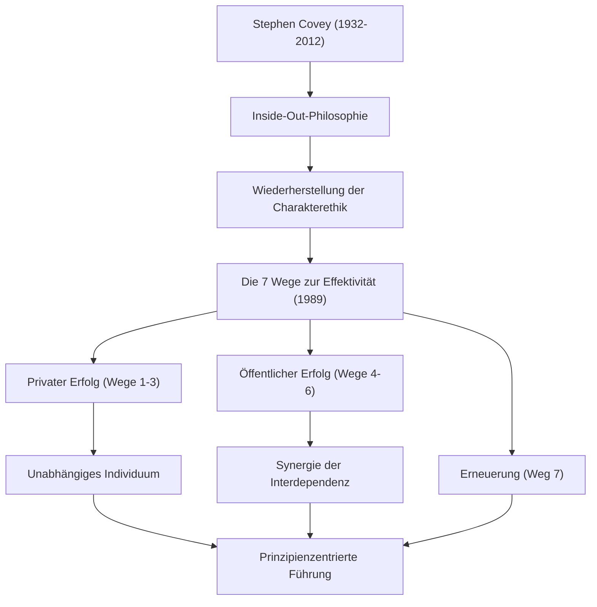

Wenn man eine der einflussreichsten Persönlichkeiten in der modernen Wirtschaft und Selbstentwicklung nennen sollte, würde der Name Dr. Stephen R. Covey zweifellos fallen. Sein Buch "Die 7 Wege zur Effektivität" (The 7 Habits of Highly Effective People) wurde weltweit zweistellige Millionen Male verkauft und wird von vielen Menschen nicht nur als Geschäftsbuch, sondern als "Lebenskompass" geschätzt. In diesem Artikel werden wir tief in das Leben von Dr. Covey, die seiner Arbeit zugrunde liegende Philosophie und den unermesslichen Einfluss, den er der Nachwelt hinterlassen hat, eintauchen.

## Leben und Hintergrund: Vom Gelehrten zum globalen Führer

Stephen Richards Covey wurde am 24. Oktober 1932 in Salt Lake City, Utah, USA, geboren. In einer frommen christlichen Familie aufgewachsen, war er von klein auf ein aktiver Junge, der Sport liebte, litt aber in der Pubertät an einer Epiphyseolysis capitis femoris (Hüftkopfabrutsch) und war gezwungen, lange Zeit auf Krücken zu leben. Diese Erfahrung soll seine Leidenschaft für den Sport in Richtung Akademiker und Debatten gelenkt haben, wobei er die Wichtigkeit der inneren intellektuellen Entwicklung erkannte.

Nach seinem Studium der Betriebswirtschaftslehre an der University of Utah erwarb er einen MBA an der Harvard Business School. Weiterhin erhielt er einen Doktortitel in Religionspädagogik von der Brigham Young University (BYU). Er blieb als Professor an der BYU und begann, Organisationsverhalten und Unternehmensführung zu lehren. Seine Vorlesungen waren sehr beliebt und viele Studenten fühlten sich von seiner "prinzipienzentrierten Lebensweise" angezogen.

Um seine Lehren weiter zu verbreiten, veröffentlichte er 1989 sein Meisterwerk "Die 7 Wege zur Effektivität". Als dieses Buch zu einem weltweiten Mega-Bestseller wurde, ging er über den Rahmen eines Universitätsprofessors hinaus und begann seinen Weg als globaler Führungsberater. Später fusionierte er mit Franklin Quest zu "FranklinCovey" und begann, Führungsschulungen für zahlreiche Unternehmen und Organisationen anzubieten. 2012 verstarb er im Alter von 79 Jahren an den Folgen eines Fahrradunfalls, aber seine Lehren leben bis heute weiter.

## Coveys Philosophie: Die "Charakterethik" und "Von innen nach außen" (Inside-Out)

Der Kern von Dr. Coveys Philosophie liegt in der Wiederherstellung der "Charakterethik" (Character Ethic). Bei der Untersuchung der Literatur zum Thema Erfolg seit der Gründung der USA stellte er fest, dass in der Literatur der vergangenen 150 Jahre die innere "Persönlichkeit" (Charakter) des Menschen wie Integrität, Demut und Mut im Mittelpunkt stand, während sich die Literatur der letzten 50 Jahre nach dem Ersten Weltkrieg in Richtung "Persönlichkeitsethik" (Personality Ethic) verschoben hatte, die oberflächliche Techniken und Fähigkeiten in zwischenmenschlichen Beziehungen betont.

Er argumentierte, dass wirkliche Erfolge und dauerhaftes Glück nicht durch oberflächliche Techniken, sondern durch den Aufbau eines Charakters erreicht werden, der auf unerschütterlichen "Prinzipien" (Principles) beruht. Dies bildet die Grundlage von "Die 7 Wege zur Effektivität".

Ein weiteres wichtiges Konzept ist der Ansatz "Von innen nach außen" (Inside-Out). Dieser Ansatz besagt, dass man, bevor man versucht, die Welt oder andere zu verändern, zuerst sein eigenes Inneres (Paradigma und Charakter) betrachten und sich selbst verändern muss, was sich dann wiederum positiv auf die äußere Umgebung und die menschlichen Beziehungen auswirkt.

"Die 7 Wege zur Effektivität" skizziert einen systematischen und universellen Prozess: Die ersten drei Wege führen von der Abhängigkeit zum "privaten Erfolg" (Unabhängigkeit), die nächsten drei Wege führen das unabhängige Individuum in Zusammenarbeit mit anderen zum "öffentlichen Erfolg" (Interdependenz), und der siebte Weg dient der Erhaltung und Entwicklung dieser durch "Erneuerung".

## Einfluss auf die Nachwelt: "Prinzipien", die die Welt bewegen

Die Errungenschaften, die Dr. Covey hinterließ, beschränken sich nicht nur auf einen Rekordhit in der Verlagsbranche. Seine Philosophie hat alle Ebenen beeinflusst, von CEOs von Fortune-500-Unternehmen über Staatsoberhäupter und Lehrer im Bildungswesen bis hin zu Eltern, die eine Familie gründen.

Im Geschäftsbereich, in dem kurzfristige Gewinnorientierung und Wettbewerbsfähigkeit zunehmend kritisch hinterfragt werden, haben sich Coveys Ideen der Interdependenz, wie "Denken in Win-Win" (4. Weg) und "Erst verstehen, dann verstanden werden" (5. Weg), als unverzichtbare Rahmenbedingungen für den Aufbau der Organisationskultur und das Teambuilding etabliert.

Auch im Bildungsbereich wird ein Schulprogramm namens "The Leader in Me" weltweit eingeführt und dient als Grundlage für Kinder, um schon in jungen Jahren Eigenverantwortung, Zielsetzung und Teamarbeit zu lernen.

Dr. Covey sagte: "Solange wir Menschen sind, werden wir immer von Prinzipien beherrscht." Egal wie sich die Zeiten ändern und wie sehr sich die Technologie entwickelt, die "Prinzipien", die das Wesen des Menschen und den wahren Reichtum unterstützen, bleiben unverändert. Das Leben und die Lehren von Stephen Covey werden weiterhin als "Polarstern", zu dem wir zurückkehren sollten, das Leben zahlreicher Menschen in der heute so chaotischen Gesellschaft erhellen.
