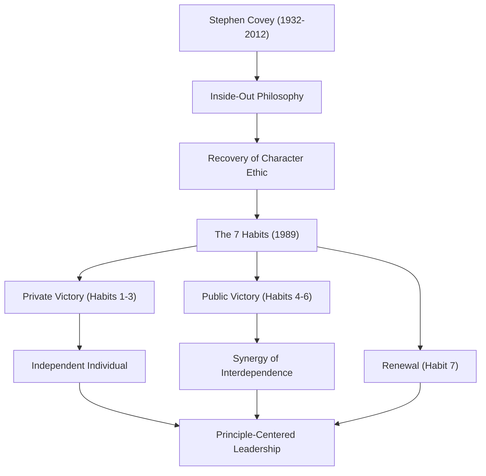

If one were to name one of the most influential figures in modern business and self-help, Dr. Stephen R. Covey's name would undoubtedly come up. His book, "The 7 Habits of Highly Effective People," has sold tens of millions of copies worldwide and is widely read by many as a "guide to life" rather than just a business book. In this article, we will delve deeply into Dr. Covey's life, his underlying philosophy, and the immeasurable impact he left on future generations.

## Life and Background: From Academic to Global Leader

Stephen Richards Covey was born on October 24, 1932, in Salt Lake City, Utah, USA. Raised in a devout Christian family, he was an active boy who loved sports from a young age, but in adolescence, he suffered from slipped capital femoral epiphysis, which forced him to live on crutches for a long time. It is said that this experience led him to redirect his passion for sports toward academics and debate, realizing the importance of cultivating internal intellect.

After studying business administration at the University of Utah, he earned an MBA from Harvard Business School. He further obtained a doctorate in religious education from Brigham Young University (BYU). He then continued at BYU as a professor, teaching organizational behavior and business management. His lectures were extremely popular, and many students were attracted to his "principle-centered way of life."

Later, to spread his teachings more widely, he published his masterpiece "The 7 Habits" in 1989. As this book became a massive global bestseller, he stepped beyond the boundaries of a university professor and began walking the path of a global leadership consultant. After merging with Franklin Quest to form "FranklinCovey," he began providing leadership training to numerous companies and organizations. He passed away in 2012 at the age of 79 due to complications from a bicycle accident, but his teachings live on today.

## Covey's Philosophy: "Character Ethic" and "Inside-Out"

The core of Dr. Covey's philosophy lies in the recovery of the "Character Ethic." When he researched literature on success since the founding of the United States, he noticed that while the literature of the past 150 years emphasized internal human "character" such as integrity, humility, and courage, the literature of the recent 50 years after World War I was skewed toward a "Personality Ethic" that emphasized superficial techniques and human relations skills.

He argued that to achieve true success and lasting happiness, one must build character based on unwavering "Principles" rather than superficial techniques. This forms the foundation of "The 7 Habits."

Another important concept of his is "Inside-Out." This is an approach where, before trying to change the world or others, one first reflects on their own inner self (paradigms and character), and by changing oneself, consequently exerts a positive influence on the external environment and human relationships.

"The 7 Habits" delineates a systematic and universal process: the first three habits leading from dependence to "Private Victory (Independence)," the next three habits where independent individuals cooperate with others to achieve "Public Victory (Interdependence)," and the habit of "Renewal" (the 7th habit) to maintain and develop them.

## Impact on Future Generations: "Principles" That Move the World

The achievements left by Dr. Covey do not stop at record-breaking mega-hits in the publishing industry. His philosophy has influenced people across all strata, from CEOs of Fortune 500 giant corporations and heads of state to teachers in educational settings and parents building families.

In the business realm, amidst the reconsideration of short-term profit-seeking and supremacy of competition, his proposed interdependent concepts such as "Think Win-Win (Habit 4)" and "Seek First to Understand, Then to Be Understood (Habit 5)" have become established as essential frameworks in building organizational culture and team building.

In the field of education, a school program called "The Leader in Me" has been introduced worldwide, serving as a foundation for children to learn self-responsibility, goal setting, and cooperation from a young age.

Dr. Covey said, "As long as we are human, we are always governed by principles." No matter how times change or how much technology evolves, the "Principles" that support human essence and true richness will not change. In this deeply confusing modern society, Stephen Covey's life and teachings will continue to illuminate the lives of countless people as a "North Star" to which we should return.
