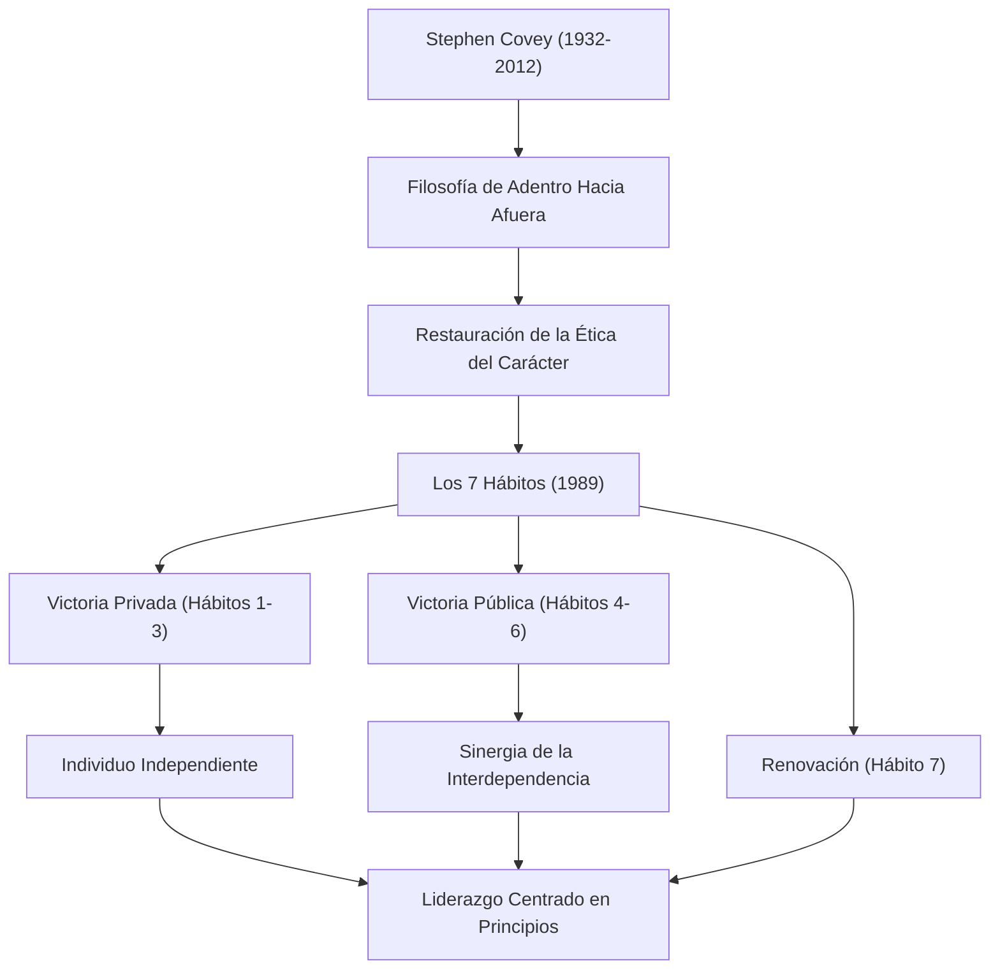

Si tuviéramos que mencionar a una de las personas más influyentes en los negocios modernos y el desarrollo personal, sin duda surgiría el nombre del Dr. Stephen R. Covey. Su libro "Los 7 hábitos de la gente altamente efectiva" (The 7 Habits of Highly Effective People) ha vendido decenas de millones de copias en todo el mundo, superando la categoría de un simple libro de negocios para ser leído por muchos como una "guía de vida". En este artículo, profundizaremos en la vida del Dr. Covey, la filosofía subyacente y el inmenso impacto que dejó para la posteridad.

## Vida y Antecedentes: De Académico a Líder Mundial

Stephen Richards Covey nació el 24 de octubre de 1932 en Salt Lake City, Utah, Estados Unidos. Criado en un devoto hogar cristiano, fue un niño activo y amante de los deportes desde una edad temprana, pero durante la adolescencia sufrió de epifisiólisis de la cabeza femoral, lo que lo obligó a usar muletas durante un largo período. Se dice que esta experiencia hizo que redirigiera su pasión por los deportes hacia lo académico y el debate, dándose cuenta de la importancia de cultivar el intelecto interno.

Después de estudiar administración de empresas en la Universidad de Utah, obtuvo un MBA en la Escuela de Negocios de Harvard. Además, obtuvo un doctorado en educación religiosa en la Universidad Brigham Young (BYU). Luego comenzó a enseñar como profesor en BYU, impartiendo clases sobre comportamiento organizacional y gestión empresarial. Sus clases eran inmensamente populares y muchos estudiantes se sintieron atraídos por su "estilo de vida centrado en principios".

Posteriormente, con el objetivo de difundir más ampliamente sus enseñanzas, publicó su obra maestra "Los 7 hábitos de la gente altamente efectiva" en 1989. El éxito masivo del libro a nivel mundial lo llevó a trascender los límites de ser un profesor universitario para embarcarse en un camino como consultor global de liderazgo. Más tarde, a través de una fusión con Franklin Quest, fundó "FranklinCovey", brindando capacitación en liderazgo a numerosas empresas y organizaciones. En 2012, falleció a los 79 años debido a complicaciones de un accidente de bicicleta, pero sus enseñanzas siguen vivas en la actualidad.

## La Filosofía de Covey: "La Ética del Carácter" y "De Adentro hacia Afuera"

El núcleo de la filosofía del Dr. Covey radica en la restauración de la "Ética del Carácter" (Character Ethic). Al investigar la literatura sobre el éxito desde la fundación de Estados Unidos, notó que mientras la literatura de los últimos 150 años enfatizaba rasgos del "carácter" interno como la integridad, la humildad y el coraje, la literatura de los últimos 50 años posteriores a la Primera Guerra Mundial se inclinaba hacia una "Ética de la Personalidad" (Personality Ethic), enfocándose en técnicas superficiales y habilidades de relaciones públicas.

Argumentó que para lograr el verdadero éxito y la felicidad duradera, uno no debe depender de técnicas superficiales, sino que debe construir un carácter basado en "Principios" (Principles) inquebrantables. Esta es la base de "Los 7 Hábitos".

Además, uno de sus conceptos más importantes es el enfoque "De Adentro Hacia Afuera" (Inside-Out). Antes de intentar cambiar el mundo o a los demás, uno debe examinar su propio interior (paradigmas y carácter) y, al cambiarse a sí mismo, influir positivamente en el entorno externo y en las relaciones humanas.

"Los 7 Hábitos" describen un proceso sistemático y universal desde un estado de dependencia hasta la "Victoria Privada" (independencia) a través de los primeros tres hábitos, seguido de los próximos tres hábitos donde el individuo independiente coopera con otros para lograr la "Victoria Pública" (interdependencia), y finalmente el hábito de "Renovación" (el séptimo hábito) para mantenerlos y desarrollarlos.

## Impacto en la Posteridad: "Principios" que Mueven el Mundo

El legado del Dr. Covey no se limita a un éxito de ventas sin precedentes en la industria editorial. Su filosofía ha impactado en todos los niveles, desde CEOs de grandes corporaciones de Fortune 500 hasta jefes de estado, maestros en las escuelas y padres de familia.

En el ámbito empresarial, en medio de la reconsideración de la búsqueda de ganancias a corto plazo y la supremacía de la competencia, los conceptos de interdependencia defendidos por Covey, como "Pensar en Ganar-Ganar" (Hábito 4) y "Buscar primero entender, luego ser entendido" (Hábito 5), se han establecido como marcos esenciales para la construcción de la cultura organizacional y el trabajo en equipo.

En el campo de la educación, el programa escolar llamado "El Líder en Mí" (The Leader in Me) se ha introducido en todo el mundo, proporcionando una base para que los niños aprendan la responsabilidad personal, el establecimiento de metas y la cooperación desde una edad temprana.

El Dr. Covey dijo que "como seres humanos, siempre estamos gobernados por principios". No importa cuánto cambien los tiempos o cuánto avance la tecnología, los "principios" que sustentan la naturaleza humana y la verdadera abundancia permanecen inalterables. La vida y las enseñanzas de Stephen Covey continuarán iluminando la vida de muchas personas como una "Estrella Polar" a la que debemos regresar en esta sociedad moderna tan confusa.
