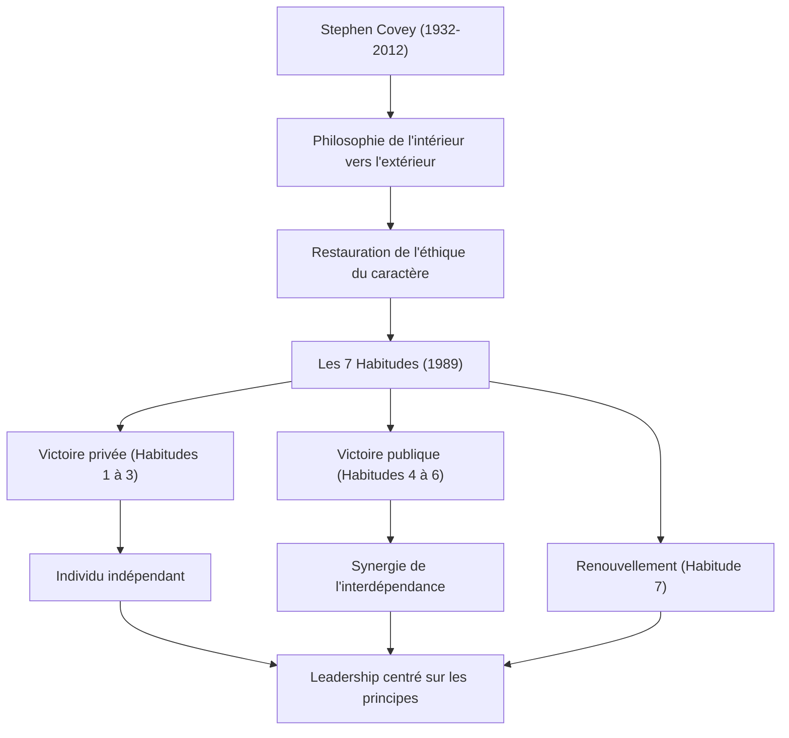

Si l'on devait citer l'une des personnes ayant eu la plus grande influence sur les affaires et le développement personnel modernes, le nom du Dr Stephen R. Covey serait sans aucun doute mentionné. Son livre « Les 7 Habitudes de ceux qui réalisent tout ce qu'ils entreprennent (The 7 Habits of Highly Effective People) » s'est vendu à des dizaines de millions d'exemplaires dans le monde entier, et il est lu par beaucoup non seulement comme un livre de business, mais aussi comme un « guide de vie ». Dans cet article, nous explorerons en profondeur la vie du Dr Covey, la philosophie qui la sous-tend et l'impact incommensurable qu'il a laissé à la postérité.

## La vie et le contexte : De l'étudiant au leader mondial

Stephen Richards Covey est né le 24 octobre 1932 à Salt Lake City, dans l'Utah, aux États-Unis. Élevé dans une famille chrétienne pieuse, il était un garçon actif qui aimait le sport dès son plus jeune âge, mais à l'adolescence, il a souffert d'un glissement de l'épiphyse fémorale supérieure et a été contraint de vivre avec des béquilles pendant une longue période. On dit que cette expérience l'a amené à réorienter sa passion pour le sport vers les études et les débats, et à réaliser l'importance de cultiver l'intellect intérieur.

Après avoir étudié l'administration des affaires à l'Université de l'Utah, il a obtenu un MBA à la Harvard Business School. Il a ensuite obtenu un doctorat en éducation religieuse à l'Université Brigham Young (BYU). Il y est resté pour enseigner en tant que professeur, donnant des cours sur le comportement organisationnel et la gestion d'entreprise. Ses cours étaient extrêmement populaires, et de nombreux étudiants étaient attirés par son mode de vie « centré sur les principes ».

Par la suite, pour diffuser plus largement ses enseignements, il a publié son célèbre livre « Les 7 Habitudes » en 1989. Ce livre est devenu un énorme best-seller mondial, ce qui lui a permis de dépasser son rôle de professeur d'université et d'entamer une carrière de consultant mondial en leadership. Plus tard, après une fusion avec Franklin Quest, il a fondé la société « FranklinCovey » et a commencé à proposer des formations en leadership à de nombreuses entreprises et organisations. Bien qu'il soit décédé en 2012 à l'âge de 79 ans des suites de complications d'un accident de vélo, ses enseignements restent toujours vivants.

## La philosophie de Covey : « L'éthique du caractère » et « De l'intérieur vers l'extérieur »

Le cœur de la philosophie du Dr Covey réside dans la restauration de « l'éthique du caractère (Character Ethic) ». Lorsqu'il a examiné la littérature sur le succès depuis la fondation des États-Unis, il a remarqué que les ouvrages des 150 premières années mettaient l'accent sur le « caractère » intérieur humain tel que l'intégrité, l'humilité et le courage, tandis que la littérature des 50 dernières années, après la Première Guerre mondiale, penchait vers « l'éthique de la personnalité (Personality Ethic) », qui met l'accent sur les techniques superficielles et les compétences en relations humaines.

Il soutenait que pour obtenir un succès véritable et un bonheur durable, il est nécessaire de construire un caractère basé sur des « principes (Principle) » inébranlables plutôt que sur des techniques superficielles. C'est le fondement des « 7 Habitudes ».

De plus, l'un de ses concepts importants est l'approche « De l'intérieur vers l'extérieur (Inside-Out) ». Avant d'essayer de changer le monde ou les autres, on examine d'abord sa propre intériorité (ses paradigmes et son caractère), et en se changeant soi-même, on finit par avoir un impact positif sur l'environnement extérieur et les relations avec les autres.

« Les 7 Habitudes » décrivent un processus systématique et universel, passant de l'état de dépendance à la « victoire privée (indépendance) » à travers les trois premières habitudes, puis les trois habitudes suivantes où l'individu indépendant coopère avec d'autres pour atteindre la « victoire publique (interdépendance) », et enfin l'habitude de « renouvellement » (la 7e habitude) pour les maintenir et les développer.

## Impact pour la postérité : Les « principes » qui font bouger le monde

Les réalisations laissées par le Dr Covey ne se limitent pas à un énorme succès éditorial. Sa philosophie a influencé tous les niveaux de la société, des PDG des gigantesques entreprises du classement Fortune 500 aux chefs d'État, en passant par les enseignants dans le domaine de l'éducation et les parents construisant une famille.

Dans le domaine des affaires, alors que la recherche de profits à court terme et le principe de la compétition à tout prix sont remis en question, les concepts d'interdépendance proposés par Covey, tels que « Penser Gagnant-Gagnant (4e Habitude) » et « Chercher d'abord à comprendre, ensuite à être compris (5e Habitude) », se sont imposés comme des cadres indispensables pour construire la culture organisationnelle et l'esprit d'équipe.

Dans le domaine de l'éducation également, un programme destiné aux écoles appelé « Leader in Me » a été introduit dans le monde entier, servant de base pour apprendre aux enfants, dès leur plus jeune âge, la responsabilité personnelle, la définition d'objectifs et la coopération.

Le Dr Covey a déclaré : « En tant qu'êtres humains, nous sommes toujours régis par des principes. » Peu importe l'évolution de l'époque ou les progrès technologiques, les « principes » qui soutiennent la nature humaine et la véritable abondance ne changent pas. La vie et les enseignements de Stephen Covey continueront d'éclairer la vie de nombreuses personnes en tant qu'« étoile polaire » vers laquelle nous devons nous tourner dans notre société moderne hautement chaotique.
