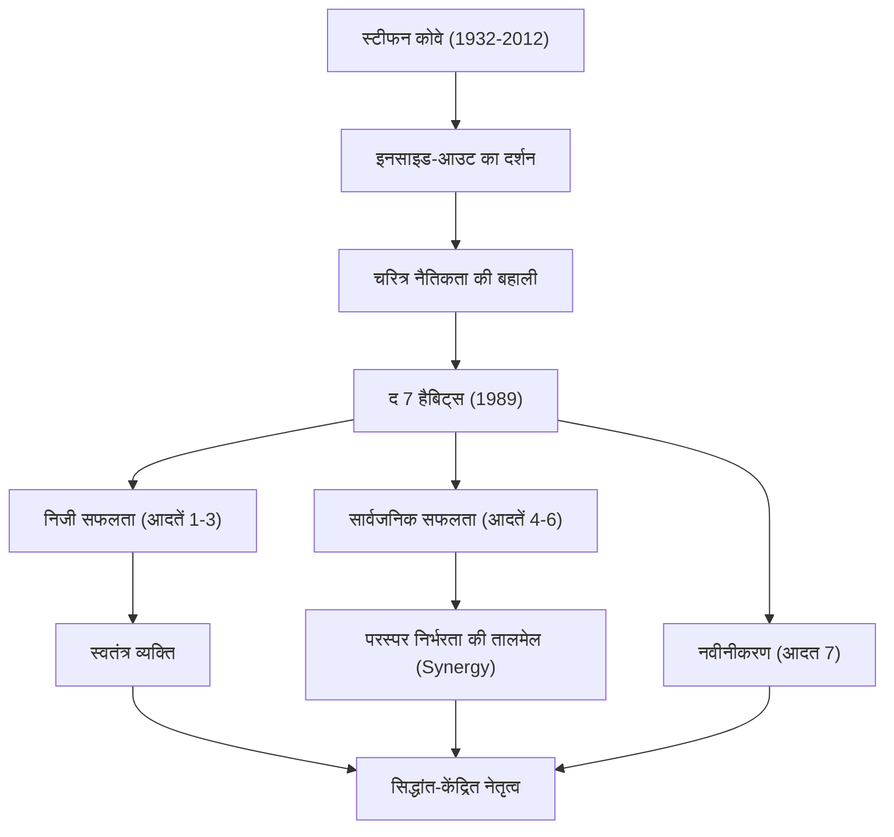

आधुनिक व्यवसाय और आत्म-विकास के क्षेत्र में सबसे प्रभावशाली हस्तियों में से किसी एक का नाम लिया जाए, तो वह निस्संदेह डॉ. स्टीफन आर. कोवे (Stephen R. Covey) होंगे। उनकी पुस्तक 'द 7 हैबिट्स ऑफ हाईली इफेक्टिव पीपल' (The 7 Habits of Highly Effective People) की दुनिया भर में करोड़ों प्रतियां बिक चुकी हैं, और इसे सिर्फ एक व्यावसायिक पुस्तक से बढ़कर 'जीवन के मार्गदर्शक' के रूप में कई लोगों द्वारा पढ़ा जाता है। इस लेख में, हम डॉ. कोवे के जीवन, उनके दर्शन के मूल आधार, और भावी पीढ़ियों पर उनके द्वारा छोड़े गए अपार प्रभाव की गहराई से पड़ताल करेंगे।

## जीवन और पृष्ठभूमि: एक विद्वान से वैश्विक नेता तक

स्टीफन रिचर्ड्स कोवे का जन्म 24 अक्टूबर 1932 को साल्ट लेक सिटी, यूटा, संयुक्त राज्य अमेरिका में हुआ था। एक धार्मिक ईसाई परिवार में पले-बढ़े, वह बचपन से ही खेलों से प्यार करने वाले एक सक्रिय लड़के थे। हालांकि, किशोरावस्था में उन्हें फीमर हड्डी की समस्या (slipped capital femoral epiphysis) हो गई, जिसके कारण उन्हें लंबे समय तक बैसाखी के सहारे रहना पड़ा। ऐसा माना जाता है कि इस अनुभव ने खेलों के प्रति उनके जुनून को शिक्षा और वाद-विवाद की ओर मोड़ दिया, जिससे उन्हें आंतरिक बुद्धिमत्ता को निखारने के महत्व का एहसास हुआ।

यूटा विश्वविद्यालय (University of Utah) से व्यवसाय प्रशासन (Business Administration) की पढ़ाई करने के बाद, उन्होंने हार्वर्ड बिजनेस स्कूल (Harvard Business School) से एमबीए (MBA) की डिग्री हासिल की। इसके बाद, उन्होंने ब्रिघम यंग यूनिवर्सिटी (BYU) से धार्मिक शिक्षा में डॉक्टरेट की उपाधि प्राप्त की। उन्होंने BYU में एक प्रोफेसर के रूप में पढ़ाना शुरू किया, जहां वे संगठनात्मक व्यवहार (Organizational Behavior) और व्यवसाय प्रबंधन (Business Management) सिखाते थे। उनके व्याख्यान अत्यधिक लोकप्रिय थे, और कई छात्र उनके "सिद्धांत-केंद्रित जीवन" (principle-centered living) से आकर्षित हुए।

बाद में, अपनी शिक्षाओं को अधिक व्यापक रूप से फैलाने के लिए, उन्होंने 1989 में अपनी प्रसिद्ध पुस्तक 'द 7 हैबिट्स' प्रकाशित की। जब यह पुस्तक विश्व स्तर पर बेस्टसेलर बन गई, तो वे एक विश्वविद्यालय के प्रोफेसर की सीमाओं को पार करते हुए एक वैश्विक नेतृत्व सलाहकार (global leadership consultant) बन गए। बाद में, फ्रैंकलिन क्वेस्ट (Franklin Quest) के साथ विलय के माध्यम से, उन्होंने 'फ्रैंकलिन कोवे' (FranklinCovey) कंपनी की स्थापना की और कई कंपनियों और संगठनों को नेतृत्व प्रशिक्षण प्रदान करना शुरू किया। 2012 में 79 वर्ष की आयु में एक साइकिल दुर्घटना की जटिलताओं के कारण उनका निधन हो गया, लेकिन उनकी शिक्षाएं आज भी जीवित हैं।

## कोवे का दर्शन: "चरित्र नैतिकता" (Character Ethic) और "इनसाइड-आउट" (Inside-Out)

डॉ. कोवे के दर्शन का मूल "चरित्र नैतिकता" (Character Ethic) की बहाली में निहित है। जब उन्होंने अमेरिका की स्थापना के बाद से सफलता पर साहित्य का अध्ययन किया, तो उन्होंने पाया कि पिछले 150 वर्षों के साहित्य में ईमानदारी, विनम्रता और साहस जैसे मानवीय "चरित्र" के आंतरिक गुणों पर जोर दिया गया था। इसके विपरीत, प्रथम विश्व युद्ध के बाद के 50 वर्षों के साहित्य में "व्यक्तित्व नैतिकता" (Personality Ethic) की ओर झुकाव था, जो सतही तकनीकों और मानवीय संबंधों के कौशल पर केंद्रित था।

उन्होंने तर्क दिया कि सच्ची सफलता और स्थायी खुशी प्राप्त करने के लिए, सतही तकनीकों के बजाय अटूट "सिद्धांतों" (Principles) पर आधारित चरित्र का निर्माण करना आवश्यक है। यही 'द 7 हैबिट्स' की नींव है।

इसके अलावा, उनकी एक और महत्वपूर्ण अवधारणा "इनसाइड-आउट" (अंदर से बाहर) है। यह एक ऐसा दृष्टिकोण है जिसमें दुनिया या दूसरों को बदलने की कोशिश करने से पहले, आपको अपनी आंतरिक स्थिति (प्रतिमान और चरित्र) को देखना चाहिए। खुद को बदलकर, आप बाहरी परिवेश और मानवीय संबंधों पर सकारात्मक प्रभाव डाल सकते हैं।

'द 7 हैबिट्स' एक व्यवस्थित और सार्वभौमिक प्रक्रिया को दर्शाती है: निर्भरता से "निजी सफलता" (स्वतंत्रता) की ओर ले जाने वाली पहली तीन आदतें, एक स्वतंत्र व्यक्ति जो दूसरों के साथ सहयोग करके "सार्वजनिक सफलता" (परस्पर निर्भरता) की ओर बढ़ता है, उसकी अगली तीन आदतें, और उन्हें बनाए रखने व विकसित करने के लिए "नवीनीकरण" (सातवीं आदत)।

## भावी पीढ़ियों पर प्रभाव: "सिद्धांत" जो दुनिया को चलाते हैं

डॉ. कोवे द्वारा छोड़ी गई विरासत प्रकाशन उद्योग में एक रिकॉर्ड तोड़ सफलता से कहीं अधिक है। उनके दर्शन ने फॉर्च्यून 500 में शामिल विशाल कंपनियों के सीईओ से लेकर राष्ट्राध्यक्षों, शिक्षा के क्षेत्र में शिक्षकों और यहां तक कि परिवार बनाने वाले माता-पिता तक सभी स्तरों के लोगों को प्रभावित किया।

व्यापार के क्षेत्र में, जहां अल्पकालिक लाभ की खोज और प्रतिस्पर्धा को सर्वोच्च माना जाता था, कोवे द्वारा प्रस्तुत "विन-विन सोचें (Win-Win)" (चौथी आदत) और "पहले समझने की कोशिश करें, फिर समझे जाने की (Seek First to Understand, Then to Be Understood)" (पांचवीं आदत) जैसे परस्पर निर्भरता के विचारों को संगठनात्मक संस्कृति के निर्माण और टीम निर्माण में आवश्यक ढांचे के रूप में स्थापित किया गया है।

शिक्षा के क्षेत्र में भी, "लीडर इन मी" (The Leader in Me) नामक एक स्कूल कार्यक्रम दुनिया भर में पेश किया गया है, जो बच्चों को कम उम्र से ही व्यक्तिगत जिम्मेदारी, लक्ष्य निर्धारण और सहयोग सीखने का आधार प्रदान करता है।

डॉ. कोवे ने कहा था, "चूंकि हम इंसान हैं, इसलिए हम हमेशा सिद्धांतों द्वारा शासित होते हैं।" चाहे युग कितनी भी तेजी से बदलें, या तकनीक कितनी भी उन्नत हो जाए, मनुष्य की प्रकृति और सच्ची समृद्धि का समर्थन करने वाले "सिद्धांत" कभी नहीं बदलते। जटिल और भ्रमित आधुनिक समाज में, स्टीफन कोवे का जीवन और शिक्षाएं अनगिनत लोगों के जीवन को एक "ध्रुव तारे" के रूप में रोशन करती रहेंगी, जिसकी ओर हमें हमेशा लौटना चाहिए।
