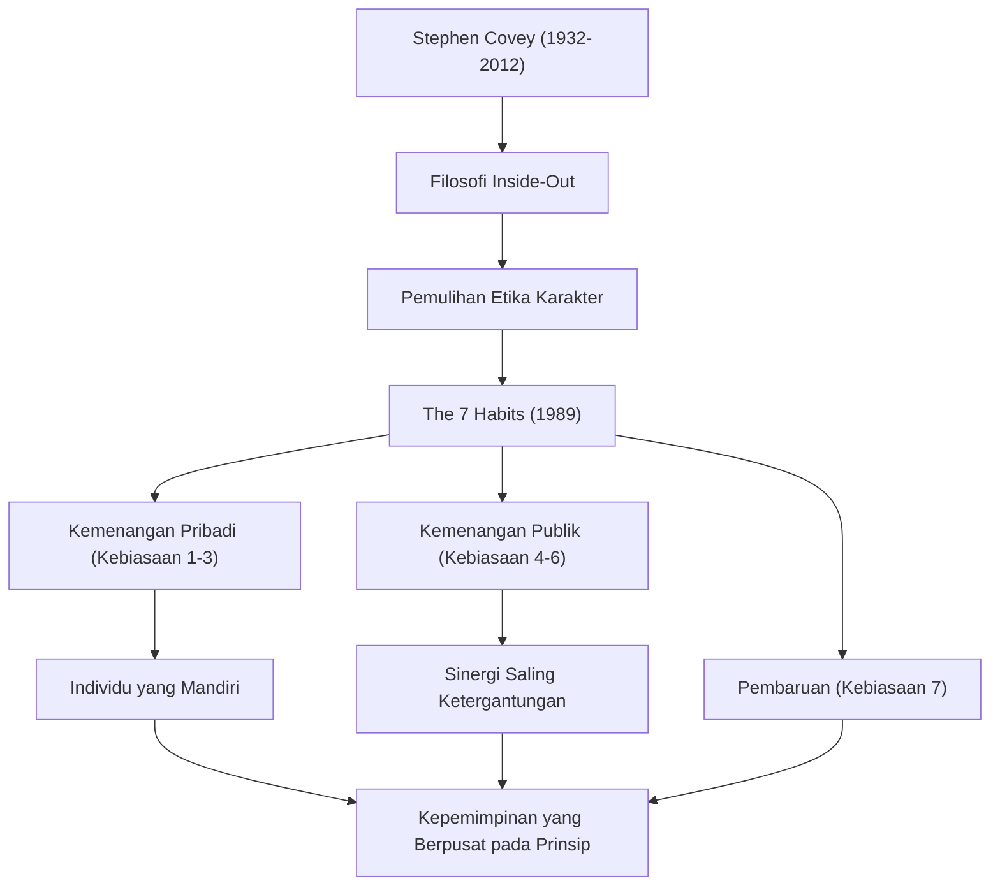

Jika kita harus menyebutkan salah satu tokoh yang memberikan pengaruh paling besar dalam bisnis modern dan pengembangan diri, nama Dr. Stephen R. Covey pasti akan muncul. Bukunya, "The 7 Habits of Highly Effective People" ("7 Kebiasaan Manusia yang Sangat Efektif"), telah terjual puluhan juta eksemplar di seluruh dunia, melampaui sekadar buku bisnis dan dibaca oleh banyak orang sebagai "pedoman hidup". Dalam artikel ini, kita akan menggali lebih dalam tentang kehidupan Dr. Covey, filosofi yang mendasarinya, serta pengaruh tak ternilai yang ditinggalkannya untuk generasi mendatang.

## Kehidupan dan Latar Belakang: Dari Akademisi Menjadi Pemimpin Global

Stephen Richards Covey lahir pada 24 Oktober 1932, di Salt Lake City, Utah, Amerika Serikat. Dibesarkan dalam keluarga Kristen yang taat, ia adalah anak yang aktif dan mencintai olahraga sejak usia dini. Namun, pada masa remajanya ia menderita penyakit pergeseran tulang paha, yang memaksanya untuk menggunakan kruk selama jangka waktu yang lama. Dari pengalaman ini, ia mengalihkan hasratnya dari olahraga ke bidang akademik dan debat, dan menyadari pentingnya mengasah kecerdasan batin.

Setelah belajar administrasi bisnis di Universitas Utah, ia memperoleh gelar MBA dari Harvard Business School. Ia kemudian mendapatkan gelar doktor dalam pendidikan agama dari Universitas Brigham Young (BYU). Ia mulai mengajar sebagai profesor di BYU, mengajarkan perilaku organisasi dan manajemen bisnis. Kuliah-kuliahnya sangat populer, dan banyak siswa tertarik pada gaya hidupnya yang "berpusat pada prinsip".

Kemudian, untuk menyebarkan ajarannya lebih luas, ia menerbitkan mahakarya "The 7 Habits" pada tahun 1989. Buku ini menjadi buku terlaris internasional, yang mendorongnya melampaui batas sebagai seorang profesor universitas dan memulai jalur sebagai konsultan kepemimpinan global. Kemudian, melalui merger dengan Franklin Quest, ia mendirikan "FranklinCovey" dan mulai memberikan pelatihan kepemimpinan kepada berbagai perusahaan dan organisasi. Pada tahun 2012, ia meninggal dunia pada usia 79 tahun karena komplikasi dari kecelakaan sepeda, namun ajarannya tetap hidup hingga saat ini.

## Filosofi Covey: "Etika Karakter" dan "Inside-Out"

Inti dari filosofi Dr. Covey terletak pada pemulihan "Etika Karakter" (Character Ethic). Ketika ia meneliti literatur tentang kesuksesan sejak berdirinya Amerika Serikat, ia menyadari bahwa literatur selama 150 tahun terakhir menekankan "karakter" internal manusia seperti integritas, kerendahan hati, dan keberanian. Sebaliknya, literatur dari 50 tahun terakhir pasca Perang Dunia I condong ke arah "Etika Kepribadian" (Personality Ethic), yang berfokus pada teknik superfisial dan keterampilan hubungan masyarakat.

Ia berpendapat bahwa untuk mencapai kesuksesan sejati dan kebahagiaan yang berkelanjutan, seseorang harus membangun karakter berdasarkan "Prinsip" (Principle) yang tak tergoyahkan, bukan sekadar teknik superfisial. Inilah yang menjadi fondasi dari "The 7 Habits".

Selain itu, salah satu konsep pentingnya adalah "Inside-Out" (Dari Dalam ke Luar). Sebelum mencoba mengubah dunia atau orang lain, seseorang harus terlebih dahulu merefleksikan diri bagian dalam (paradigma dan karakter), dan dengan mengubah diri sendiri, pada akhirnya akan memberikan dampak positif pada lingkungan eksternal dan hubungan antarmanusia.

"The 7 Habits" menggambarkan proses yang sistematis dan universal: tiga kebiasaan pertama untuk beralih dari keadaan ketergantungan menuju "Kemenangan Pribadi" (kemandirian), tiga kebiasaan berikutnya di mana individu yang mandiri bekerja sama dengan orang lain menuju "Kemenangan Publik" (saling ketergantungan), dan kebiasaan "Pembaruan" (Kebiasaan ke-7) untuk memelihara dan mengembangkannya.

## Pengaruh bagi Generasi Mendatang: "Prinsip" yang Menggerakkan Dunia

Pencapaian Dr. Covey tidak terbatas pada kesuksesan rekor di industri penerbitan. Filosofinya telah memengaruhi semua lapisan masyarakat, mulai dari CEO perusahaan Fortune 500, kepala negara, guru di bidang pendidikan, hingga orang tua yang membangun keluarga.

Dalam ranah bisnis, ketika pengejaran keuntungan jangka pendek dan supremasi kompetitif sedang ditinjau ulang, konsep saling ketergantungan yang diajukan oleh Covey, seperti "Berpikir Menang-Menang (Kebiasaan 4)" dan "Berusaha Mengerti Terlebih Dahulu Baru Dimengerti (Kebiasaan 5)", telah mapan sebagai kerangka kerja yang esensial dalam membangun budaya organisasi dan pembentukan tim.

Dalam bidang pendidikan juga, program untuk sekolah yang disebut "The Leader in Me" telah diperkenalkan di seluruh dunia, yang menjadi fondasi bagi anak-anak untuk mempelajari tanggung jawab pribadi, penetapan tujuan, dan kerja sama sejak usia dini.

Dr. Covey pernah berkata, "Sebagai manusia, kita selalu dikendalikan oleh prinsip-prinsip." Tidak peduli bagaimana zaman berubah atau seberapa banyak teknologi berkembang, "prinsip" yang mendukung esensi kemanusiaan dan kekayaan sejati tidak akan pernah berubah. Kehidupan dan ajaran Stephen Covey akan terus menerangi kehidupan banyak orang sebagai "Bintang Utara" yang menjadi panduan kita di tengah masyarakat modern yang penuh kebingungan.
