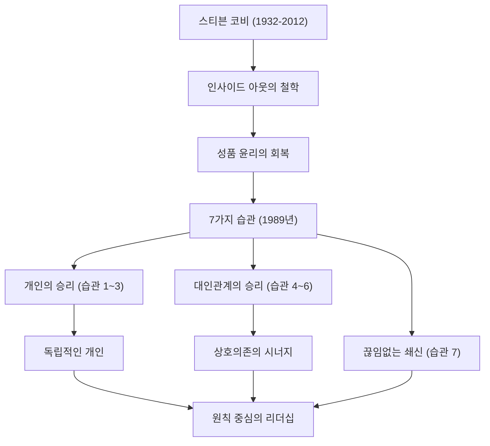

현대 비즈니스와 자기계발에 있어 가장 큰 영향을 미친 인물 중 한 명을 꼽자면, 의심할 여지 없이 스티븐 R. 코비 박사(Stephen R. Covey)의 이름이 거론될 것입니다. 그의 저서 『성공하는 사람들의 7가지 습관(The 7 Habits of Highly Effective People)』은 전 세계적으로 수천만 부가 팔렸으며, 단순한 비즈니스 서적을 넘어 '인생의 지침서'로서 많은 사람들에게 애독되고 있습니다. 본 기사에서는 코비 박사의 생애, 그 기저에 흐르는 철학, 그리고 후세에 남긴 헤아릴 수 없는 영향에 대해 깊이 파헤쳐 보겠습니다.

## 생애와 배경: 학구열에 불타는 학생에서 세계적인 리더로

스티븐 리처즈 코비는 1932년 10월 24일, 미국 유타주 솔트레이크시티에서 태어났습니다. 독실한 기독교 가정에서 자란 그는 어릴 적부터 스포츠를 사랑하는 활발한 소년이었지만, 사춘기에 대퇴골두 골단 분리증을 앓아 장기간 목발에 의지하는 생활을 피할 수 없었습니다. 이 경험을 통해 그는 스포츠에 대한 열정을 학문과 토론으로 돌렸고, 내면적인 지성을 기르는 것의 중요성을 깨닫게 되었다고 합니다.

유타 대학교에서 경영학을 공부한 후, 하버드 비즈니스 스쿨에서 MBA를 취득했습니다. 또한 브리검영 대학교(BYU)에서 종교교육 박사 학위를 취득했습니다. 그는 그대로 BYU에서 교수로 교편을 잡고 조직 행동학과 경영 관리에 대해 가르치기 시작합니다. 그의 강의는 매우 인기가 있었고, 많은 학생들이 그의 '원칙 중심의 삶'에 이끌렸습니다.

이후 자신의 가르침을 더 널리 전하기 위해 1989년에 명저 『성공하는 사람들의 7가지 습관』을 출판합니다. 이 책이 세계적인 대형 베스트셀러가 되면서, 그는 대학교수라는 틀을 넘어 세계적인 리더십 컨설턴트로서의 길을 걷기 시작합니다. 훗날 프랭클린 퀘스트사와의 합병을 거쳐 '프랭클린 코비사'를 설립하고, 수많은 기업과 조직을 대상으로 리더십 연수를 제공하게 되었습니다. 2012년, 자전거 사고의 합병증으로 인해 79세의 나이로 세상을 떠났지만, 그의 가르침은 오늘날까지도 살아 숨쉬고 있습니다.

## 코비의 철학: '성품 윤리'와 '인사이드 아웃'

코비 박사의 철학의 핵심은 '성품 윤리(Character Ethic)'의 회복에 있습니다. 그가 미국 건국 이래 성공에 관한 문헌들을 조사한 결과, 과거 150년간의 문헌은 성실성, 겸손, 용기 같은 인간 내면의 '성품'을 중시했던 반면, 제1차 세계대전 이후 최근 50년간의 문헌은 표면적인 테크닉이나 인간관계 스킬을 중시하는 '성격 윤리(Personality Ethic)'에 편중되어 있다는 사실을 깨달았습니다.

그는 진정한 성공과 지속적인 행복을 얻기 위해서는 표면적인 테크닉이 아니라 흔들림 없는 '원칙(Principle)'에 기반한 성품을 길러야 한다고 주장했습니다. 이것이 『성공하는 사람들의 7가지 습관』의 토대가 되었습니다.

또한, 그의 중요한 개념 중 하나로 '인사이드 아웃(내면에서 외부로)'이 있습니다. 세상이나 타인을 바꾸려 하기 전에, 먼저 자기 자신의 내면(패러다임이나 성품)을 되돌아보고, 자기 자신이 변함으로써 결과적으로 외부 환경이나 인간관계에도 좋은 영향을 미쳐간다는 접근 방식입니다.

『성공하는 사람들의 7가지 습관』은 의존적인 상태에서 '개인의 승리(독립)'에 이르는 처음 3가지 습관, 독립적인 개인이 타인과 협력하여 '대인관계의 승리(상호의존)'에 이르는 다음 3가지 습관, 그리고 그것들을 유지 및 발전시키기 위한 '끊임없는 쇄신'의 습관(제7의 습관)이라는 체계적이고 보편적인 과정을 그려내고 있습니다.

## 후세에 미친 영향: 세상을 움직이는 '원칙'

코비 박사가 남긴 업적은 출판계의 기록적인 대히트에 머물지 않습니다. 그의 철학은 포춘 500에 이름을 올린 거대 기업의 CEO부터 국가 원수, 교육 현장의 교사, 그리고 가정을 꾸리는 부모들에 이르기까지 모든 계층에 영향을 미쳤습니다.

비즈니스 영역에서는 단기적인 이익 추구나 경쟁 지상주의가 재검토되는 가운데, 코비가 제창하는 '승-승을 생각하라(제4의 습관)'나 '먼저 이해하고 다음에 이해시켜라(제5의 습관)' 같은 상호의존적인 사고방식이 조직 문화 구축과 팀 빌딩에 있어 필수불가결한 프레임워크로 자리 잡았습니다.

교육 분야에서도 '리더 인 미(Leader in Me)'라고 불리는 학교 대상 프로그램이 전 세계적으로 도입되어, 아이들이 어린 나이부터 자기 책임감이나 목표 설정, 협동심을 배우기 위한 기반이 되고 있습니다.

코비 박사는 "우리는 인간인 이상 항상 원칙에 지배받는다"고 말했습니다. 시대가 변하고 기술이 아무리 발전하더라도 인간의 본질이나 진정한 풍요로움을 지탱하는 '원칙'은 변하지 않습니다. 스티븐 코비의 생애와 가르침은 혼란스러운 현대 사회에서 우리가 돌아가야 할 '북극성'으로서 앞으로도 수많은 사람들의 인생을 계속해서 비춰줄 것입니다.
