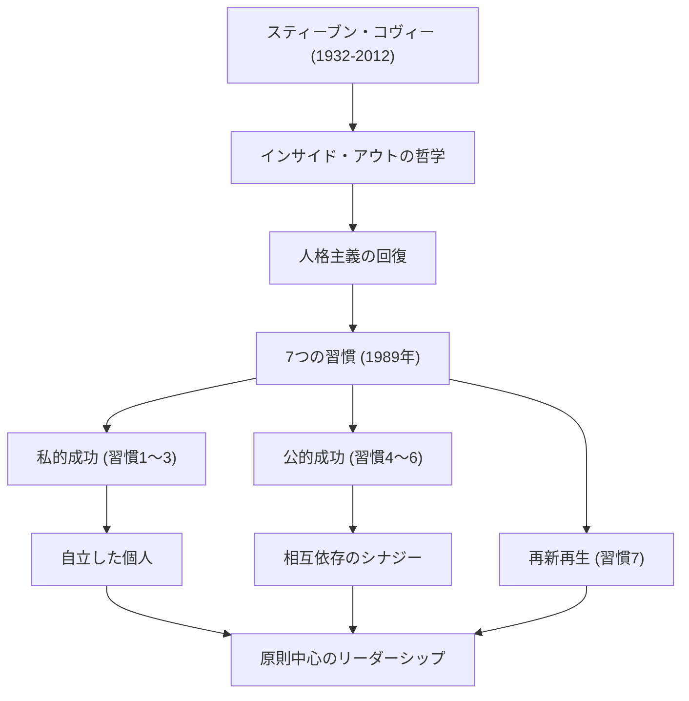

現代のビジネスや自己啓発において、最も多大な影響を与えた人物の一人を挙げるとすれば、間違いなくスティーブン・R・コヴィー博士（Stephen R. Covey）の名前が挙がるでしょう。彼の著書『7つの習慣（The 7 Habits of Highly Effective People）』は世界中で数千万部を売り上げ、単なるビジネス書を超えて「人生の指針」として多くの人々に愛読されています。本記事では、コヴィー博士の生涯、その根底に流れる哲学、そして後世に遺した計り知れない影響について深く掘り下げていきます。

## 生涯と背景：学究の徒から世界的リーダーへ

スティーブン・リチャーズ・コヴィーは、1932年10月24日、アメリカ合衆国ユタ州のソルトレイクシティで生まれました。敬虔なクリスチャンの家庭に育った彼は、幼い頃からスポーツを愛する活発な少年でしたが、思春期に大腿骨すべり症を患い、長期間松葉杖での生活を余儀なくされました。この経験から彼はスポーツへの情熱を学問や討論へと向け、内面的な知性を磨くことの重要性に気づいたとされています。

ユタ大学で経営学を学んだ後、ハーバード・ビジネス・スクールでMBAを取得。さらにブリガムヤング大学（BYU）で宗教教育の博士号を取得しました。彼はそのままBYUで教授として教鞭を執り、組織行動学や経営管理について教え始めます。彼の講義は非常に人気があり、多くの学生たちが彼の「原則を中心とした生き方」に惹きつけられました。

その後、自身の教えをより広く伝えるため、1989年に名著『7つの習慣』を出版。この本が世界的な大ベストセラーとなったことで、彼は大学教授という枠を超え、世界的なリーダーシップ・コンサルタントとしての道を歩み始めます。後にフランクリン・クエスト社との合併を経て「フランクリン・コヴィー社」を設立し、数多くの企業や組織に向けてリーダーシップ研修を提供するようになりました。2012年、自転車事故の合併症により79歳でこの世を去りましたが、彼の教えは今なお生き続けています。

## コヴィーの哲学：「人格主義」と「インサイド・アウト」

コヴィー博士の哲学の核心は、「人格主義（Character Ethic）」の回復にあります。彼がアメリカ建国以来の成功に関する文献を調査したところ、過去150年間の文献は誠実さ、謙虚さ、勇気といった人間の内面的な「人格」を重視していたのに対し、第一次世界大戦後の直近50年間の文献は、表面的なテクニックや人間関係のスキルを重視する「個性主義（Personality Ethic）」に偏っていることに気づきました。

彼は、真の成功と持続的な幸福を得るためには、表面的なテクニックではなく、揺るぎない「原則（Principle）」に基づいた人格を築く必要があると主張しました。これが『7つの習慣』の土台となっています。

また、彼の重要な概念に「インサイド・アウト（内から外へ）」があります。世界や他人を変えようとする前に、まずは自分自身の内面（パラダイムや人格）を見つめ直し、自分自身が変わることで、結果として外部の環境や人間関係にも良い影響を与えていくというアプローチです。

『7つの習慣』は、依存状態から「私的成功（自立）」へと至る最初の3つの習慣、自立した個人が他者と協力して「公的成功（相互依存）」へと至る次の3つの習慣、そしてそれらを維持・発展させるための「再新再生」の習慣（第7の習慣）という、体系的かつ普遍的なプロセスを描き出しています。

## 後世への影響：世界を動かす「原則」

コヴィー博士が遺した功績は、出版業界における記録的な大ヒットに留まりません。彼の哲学は、フォーチュン500に名を連ねる巨大企業のCEOから、国家元首、教育現場の教師、そして家庭を築く親たちに至るまで、あらゆる層に影響を与えました。

ビジネスの領域においては、短期的な利益追求や競争至上主義が見直される中、コヴィーの提唱する「Win-Winを考える（第4の習慣）」や「理解してから理解される（第5の習慣）」といった相互依存の考え方が、組織文化の構築やチームビルディングにおいて不可欠なフレームワークとして定着しています。

教育の分野でも、「リーダー・イン・ミー」と呼ばれる学校向けプログラムが世界中で導入されており、子どもたちが若いうちから自己責任や目標設定、協調性を学ぶための基盤となっています。

コヴィー博士は、「私たちは人間である以上、常に原則に支配されている」と語りました。時代が移り変わり、テクノロジーがどれほど進化しようとも、人間の本質や真の豊かさを支える「原則」は変わりません。スティーブン・コヴィーの生涯と教えは、混迷を極める現代社会において、私たちが立ち返るべき「北極星」として、これからも数多くの人々の人生を照らし続けることでしょう。
