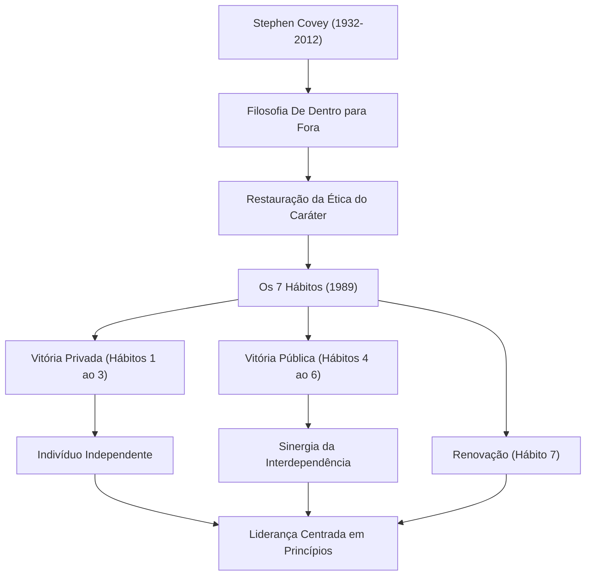

Se fôssemos nomear uma das pessoas que mais influenciaram os negócios modernos e o autodesenvolvimento, o nome do Dr. Stephen R. Covey sem dúvida estaria na lista. Seu livro, "Os 7 Hábitos das Pessoas Altamente Eficazes", vendeu dezenas de milhões de cópias em todo o mundo, transcendendo os livros de negócios comuns para se tornar um "guia para a vida" lido por muitos. Neste artigo, aprofundaremos a vida do Dr. Covey, a filosofia subjacente e o imensurável impacto que ele deixou para as gerações futuras.

## Vida e Formação: De Estudioso a Líder Global

Stephen Richards Covey nasceu em 24 de outubro de 1932, em Salt Lake City, Utah, EUA. Criado em uma família cristã devota, ele era um garoto ativo que adorava esportes desde cedo, mas durante a adolescência, sofreu de epifisiólise femoral proximal (escorregamento da epífise da cabeça do fêmur) e foi forçado a viver de muletas por um longo período. Diz-se que essa experiência o fez redirecionar sua paixão pelos esportes para os estudos e debates, percebendo a importância de cultivar o intelecto interior.

Após estudar administração de empresas na Universidade de Utah, ele obteve seu MBA na Harvard Business School. Ele também obteve um doutorado em educação religiosa pela Universidade Brigham Young (BYU). Ele começou a lecionar como professor na BYU, ensinando comportamento organizacional e gestão de negócios. Suas palestras eram muito populares, e muitos alunos foram atraídos por seu "modo de vida centrado em princípios".

Mais tarde, para divulgar seus ensinamentos de forma mais ampla, publicou a obra-prima "Os 7 Hábitos" em 1989. Como este livro se tornou um grande best-seller mundial, ele ultrapassou os limites de ser um professor universitário e iniciou sua jornada como um consultor de liderança global. Mais tarde, através de uma fusão com a Franklin Quest, ele fundou a "FranklinCovey" e começou a fornecer treinamento de liderança para inúmeras empresas e organizações. Embora tenha falecido aos 79 anos em 2012 devido a complicações de um acidente de bicicleta, seus ensinamentos continuam vivos hoje.

## A Filosofia de Covey: "Ética do Caráter" e "De Dentro para Fora"

O cerne da filosofia do Dr. Covey reside na restauração da "Ética do Caráter (Character Ethic)". Quando ele pesquisou literatura sobre sucesso desde a fundação dos Estados Unidos, ele percebeu que enquanto a literatura dos últimos 150 anos enfatizava o "caráter" interior humano, como integridade, humildade e coragem, a literatura dos últimos 50 anos (pós-Primeira Guerra Mundial) era tendenciosa para a "Ética da Personalidade (Personality Ethic)", que enfatizava técnicas superficiais e habilidades de relações humanas.

Ele argumentou que, para alcançar o verdadeiro sucesso e a felicidade duradoura, é necessário construir um caráter baseado em "Princípios (Principles)" inabaláveis, em vez de técnicas superficiais. Esta é a base de "Os 7 Hábitos".

Além disso, um de seus conceitos importantes é "De Dentro para Fora (Inside-Out)". É a abordagem de que, antes de tentar mudar o mundo ou os outros, você deve primeiro olhar para o seu próprio eu interior (paradigmas e caráter), e ao mudar a si mesmo, você consequentemente terá uma influência positiva no ambiente externo e nos relacionamentos.

"Os 7 Hábitos" delineia um processo sistemático e universal: os três primeiros hábitos que levam da dependência à "Vitória Privada (independência)", os próximos três hábitos onde indivíduos independentes cooperam com outros para alcançar a "Vitória Pública (interdependência)" e o hábito da "Renovação" (o 7º Hábito) para mantê-los e desenvolvê-los.

## Impacto nas Gerações Futuras: "Princípios" que Movem o Mundo

As conquistas deixadas pelo Dr. Covey não se limitam a ser um sucesso recorde na indústria editorial. Sua filosofia influenciou todos os níveis da sociedade, de CEOs de gigantes da Fortune 500 a chefes de estado, professores na educação e pais construindo famílias.

No mundo dos negócios, à medida que a busca de lucros a curto prazo e a supremacia competitiva estão sendo reconsideradas, os conceitos de interdependência defendidos por Covey, como "Pense Ganha-Ganha (4º Hábito)" e "Procure Primeiro Compreender, Depois Ser Compreendido (5º Hábito)", estabeleceram-se como estruturas essenciais na construção da cultura organizacional e no team building.

No campo da educação, programas para escolas chamados "O Líder em Mim" foram introduzidos em todo o mundo, fornecendo uma base para as crianças aprenderem autorresponsabilidade, estabelecimento de metas e cooperação desde tenra idade.

O Dr. Covey disse que, "Como somos seres humanos, somos sempre governados por princípios". Não importa como os tempos mudem ou o quanto a tecnologia avance, os "princípios" que sustentam a essência humana e a verdadeira riqueza permanecem inalterados. No caótico mundo moderno, a vida e os ensinamentos de Stephen Covey sem dúvida continuarão a iluminar a vida de inúmeras pessoas como a "Estrela do Norte" à qual devemos retornar.
