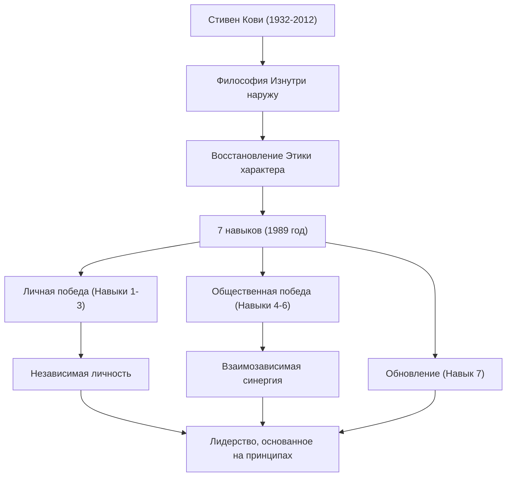

Если назвать одного из тех, кто оказал наибольшее влияние на современный бизнес и саморазвитие, без сомнения, будет упомянуто имя доктора Стивена Р. Кови (Stephen R. Covey). Его книга «7 навыков высокоэффективных людей» (The 7 Habits of Highly Effective People) была продана тиражом в десятки миллионов экземпляров по всему миру, став не просто книгой о бизнесе, а «жизненным ориентиром» для многих читателей. В этой статье мы углубимся в жизнь доктора Кови, философию, лежащую в её основе, и неизмеримое влияние, которое он оставил будущим поколениям.

## Жизнь и биография: От ученого к мировому лидеру

Стивен Ричардс Кови родился 24 октября 1932 года в Солт-Лейк-Сити, штат Юта, США. Выросший в набожной христианской семье, он с детства был активным мальчиком, любившим спорт, но в подростковом возрасте заболел эпифизеолизом головки бедренной кости, из-за чего ему пришлось долгое время передвигаться на костылях. Этот опыт заставил его перенаправить свою страсть к спорту на академическую учебу и дебаты, что, как считается, помогло ему осознать важность развития внутреннего интеллекта.

Изучив бизнес-администрирование в Университете Юты, он получил степень MBA в Гарвардской школе бизнеса. Затем он получил докторскую степень в области религиозного образования в Университете Бригама Янга (BYU). Он остался преподавать в BYU в качестве профессора, начав преподавать организационное поведение и бизнес-менеджмент. Его лекции были чрезвычайно популярны, и многих студентов привлекал его «образ жизни, ориентированный на принципы».

Позже, чтобы более широко распространить свое учение, он опубликовал в 1989 году шедевр «7 навыков высокоэффективных людей». Поскольку эта книга стала огромным мировым бестселлером, он вышел за рамки университетского профессора и начал свой путь в качестве глобального консультанта по лидерству. Позднее, после слияния с Franklin Quest, он основал компанию «FranklinCovey» и начал проводить обучение лидерству для множества компаний и организаций. В 2012 году он скончался в возрасте 79 лет от осложнений, вызванных аварией на велосипеде, но его учения живут до сих пор.

## Философия Кови: «Этика характера» и «Изнутри наружу»

Суть философии доктора Кови заключается в восстановлении «Этики характера» (Character Ethic). Изучая литературу об успехе с момента основания Америки, он заметил, что литература за последние 150 лет подчеркивала важность внутреннего «характера» человека, такого как честность, смирение и смелость, в то время как литература за последние 50 лет после Первой мировой войны была склонена в сторону «Этики личности» (Personality Ethic), которая делает упор на поверхностные методы и навыки человеческих отношений.

Он утверждал, что для достижения истинного успеха и длительного счастья необходимо строить характер на основе непоколебимых «принципов» (Principle), а не на поверхностных методах. Это составляет основу «7 навыков».

Также важной концепцией его учения является подход «Изнутри наружу» (Inside-Out). Прежде чем пытаться изменить мир или других, сначала нужно посмотреть на свой собственный внутренний мир (парадигмы и характер) и измениться самому, что в результате окажет положительное влияние на внешнюю среду и человеческие отношения.

«7 навыков» описывают систематический и универсальный процесс, который ведет от состояния зависимости к «личной победе» (независимости) через первые три навыка, затем к «общественной победе» (взаимозависимости), когда независимый человек сотрудничает с другими, через следующие три навыка, и, наконец, навык «обновления» (седьмой навык) для их поддержания и развития.

## Влияние на потомков: «Принципы», движущие миром

Достижения доктора Кови не ограничиваются рекордными хитами в издательской индустрии. Его философия оказала влияние на всех уровнях: от генеральных директоров гигантских компаний из списка Fortune 500, глав государств и учителей в сфере образования до родителей, строящих свои семьи.

В сфере бизнеса, по мере пересмотра стремления к краткосрочной прибыли и конкурентного превосходства, идеи взаимозависимости, такие как «Думайте в духе Выиграл/Выиграл» (Навык 4) и «Сначала стремитесь понять, потом — быть понятым» (Навык 5), предложенные Кови, утвердились как необходимые основы для построения организационной культуры и командообразования.

В сфере образования программа для школ под названием «Лидер во мне» (The Leader in Me) была внедрена по всему миру, став основой для того, чтобы дети с раннего возраста учились личной ответственности, постановке целей и сотрудничеству.

Доктор Кови говорил: «Поскольку мы люди, нами всегда управляют принципы». Независимо от того, как меняется время и насколько развиваются технологии, «принципы», поддерживающие сущность человека и истинное богатство, остаются неизменными. Жизнь и учения Стивена Кови будут продолжать освещать жизни многих людей как «Полярная звезда», к которой нам следует возвращаться в хаотичном современном обществе.
