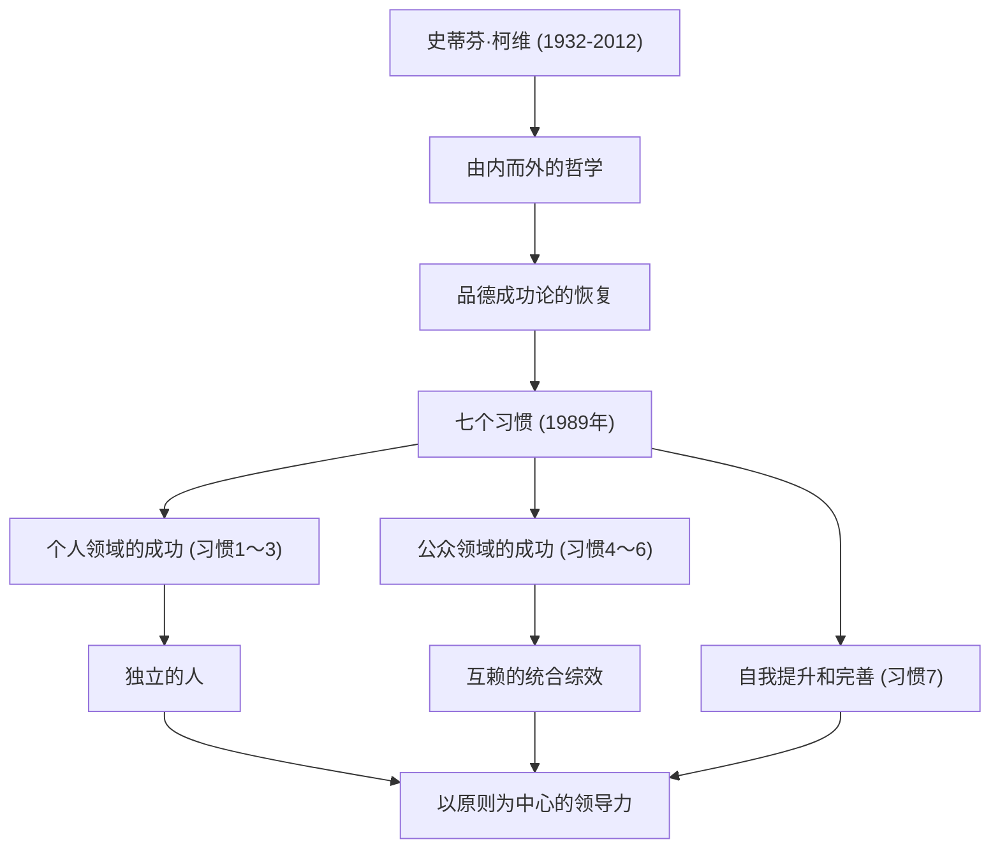

要说在现代商业和自我提升领域产生最深远影响的人物之一，史蒂芬·R·柯维（Stephen R. Covey）博士的名字绝对名列前茅。他的著作《高效能人士的七个习惯（The 7 Habits of Highly Effective People）》在世界各地售出数千万册，超越了单纯的商业书籍，作为许多人“人生的指南针”而被广泛阅读。在本文中，我们将深入探讨柯维博士的一生、其根基中的哲学，以及他留给后世的不可估量的影响。

## 生平与背景：从学者到世界级领导者

史蒂芬·理查兹·柯维于1932年10月24日出生于美国犹他州的盐湖城。在虔诚的基督教家庭中长大的他，从小就是一个热爱运动的活泼少年，但在青春期时患上了股骨头骨骺滑脱症，被迫经历了漫长的拄拐生活。据称，正是这段经历使他将对运动的热情转向了学术和辩论，并意识到了培养内在智慧的重要性。

在犹他大学学习工商管理后，他在哈佛商学院获得了MBA学位。此外，他还在杨百翰大学（BYU）获得了宗教教育博士学位。他顺理成章地在BYU担任教授，开始教授组织行为学和企业管理。他的讲座非常受欢迎，许多学生被他“以原则为中心的生活方式”所吸引。

此后，为了更广泛地传播自己的教诲，他于1989年出版了名著《高效能人士的七个习惯》。随着这本书成为全球超级畅销书，他跨越了大学教授的界限，开始了作为世界级领导力顾问的道路。后来，通过与富兰克林·奎斯特公司合并，成立了“富兰克林柯维公司”，开始为众多企业和组织提供领导力培训。2012年，他因自行车事故的并发症去世，享年79岁，但他的教诲至今依然生生不息。

## 柯维的哲学：“品德成功论”与“由内而外”

柯维博士哲学的核心在于恢复“品德成功论（Character Ethic）”。他在调查了自美国建国以来有关成功的文献后发现，过去150年的文献非常重视诚实、谦逊、勇气等人类内在的“品德”，而第一次世界大战后近50年的文献则偏向于重视表面技巧和人际关系技巧的“个人魅力论（Personality Ethic）”。

他主张，为了获得真正的成功和持久的幸福，不能依靠表面的技巧，而是必须建立基于不可动摇的“原则（Principle）”的品德。这就是《高效能人士的七个习惯》的基础。

此外，他的一个重要概念是“由内而外（Inside-Out）”。在试图改变世界或他人之前，首先要重新审视自己的内在（思维定式和品德），通过自身的改变，进而对外部环境和人际关系产生积极的影响。

《高效能人士的七个习惯》描绘了一个系统且普遍的过程：从依赖状态走向“个人领域的成功（独立）”的前三个习惯；独立的人与他人合作走向“公众领域的成功（互赖）”的后三个习惯；以及为了维持和发展这些习惯的“自我提升和完善”的习惯（第七个习惯）。

## 对后世的影响：驱动世界的“原则”

柯维博士留下的功绩，远不止于出版界创纪录的巨大成功。他的哲学影响了各个阶层，从名列《财富》500强的巨型企业CEO，到国家元首、教育前线的教师，再到建立家庭的父母。

在商业领域，随着人们对短期利润追求和竞争至上主义的反思，柯维提倡的“双赢思维（第四个习惯）”和“知彼解己（第五个习惯）”等互赖理念，已经成为构建组织文化和团队建设中不可或缺的框架。

在教育领域，被称为“自我领导力（Leader in Me）”的面向学校的项目已在世界各地引入，成为孩子们从年轻时就学习自我责任、目标设定和协作精神的基础。

柯维博士曾说：“既然我们是人类，就始终受原则的支配。”无论时代如何变迁，无论科技如何进化，支撑人类本质和真正富足的“原则”是不变的。在极其混乱的现代社会中，史蒂芬·柯维的一生和教诲，将继续作为我们应该回归的“北极星”，照亮无数人的人生。
