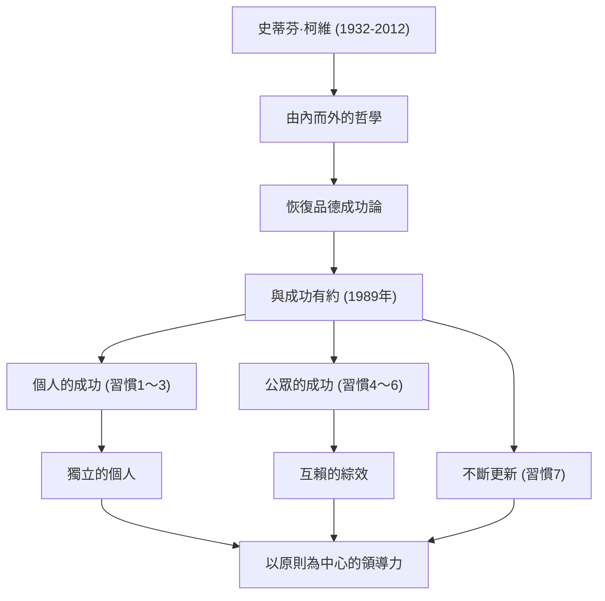

若要舉出在現代商業及自我啟發領域中帶來最深遠影響的人物之一，無疑會提到史蒂芬·R·柯維博士（Stephen R. Covey）的名字。他的著作《與成功有約：高效能人士的七個習慣（The 7 Habits of Highly Effective People）》在全世界銷量高達數千萬冊，超越了單純的商業書籍範疇，被許多人作為「人生指南」而愛不釋手。本篇文章將深入探討柯維博士的生平、其根基底層的哲學，以及他為後世留下的無可估量的影響。

## 生平與背景：從學究之士到世界級領導者

史蒂芬·理查茲·柯維於1932年10月24日出生在美國猶他州的鹽湖城。在虔誠的基督教家庭中長大，他從小就是一個熱愛運動、活潑好動的少年。然而，在青春期時他罹患了股骨頭骨骺滑脫症，被迫長時間拄著拐杖生活。據說正是這次經歷讓他將對運動的熱情轉向了學術和辯論，並意識到了磨練內在智慧的重要性。

在猶他大學學習企業管理後，他在哈佛商學院獲得了MBA學位。隨後又在楊百翰大學（BYU）獲得了宗教教育的博士學位。他直接留在BYU擔任教授，開始教授組織行為學與企業管理。他的課程非常受歡迎，許多學生被他「以原則為中心的生活方式」所吸引。

之後，為了更廣泛地傳播自己的教義，他在1989年出版了名著《與成功有約（七個習慣）》。隨著這本書成為全球超級暢銷書，他跨越了大學教授的界限，開始走上全球領導力顧問的道路。後來，經過與富蘭克林·奎斯特公司（Franklin Quest）的合併，成立了「富蘭克林柯維公司（FranklinCovey）」，為無數的企業和組織提供領導力培訓。2012年，他因自行車事故的併發症以79歲之齡辭世，但他的教誨至今依然長存。

## 柯維的哲學：「品德成功論」與「由內而外」

柯維博士哲學的核心在於恢復「品德成功論（Character Ethic）」。他對美國建國以來關於成功的文獻進行了調查，發現過去150年的文獻重視誠實、謙遜、勇氣等人類內在的「品德」，而第一次世界大戰後近50年的文獻則偏向於重視表面技巧與人際關係技巧的「個人魅力論（Personality Ethic）」。

他主張，為了獲得真正的成功與持續的幸福，必須建立在不可動搖的「原則（Principle）」之上的品德，而不是依賴表面技巧。這正是《與成功有約》的基礎。

此外，他還有一個重要概念是「由內而外（Inside-Out）」。在試圖改變世界或他人之前，首先要重新審視自己的內心（思維定式與品德），透過改變自己，進而對外部環境與人際關係產生良好影響的途徑。

《與成功有約》描繪了一個系統化且普遍的過程：從依賴狀態達到「個人的成功（獨立）」的前三個習慣，獨立的個人與他人合作達到「公眾的成功（互賴）」的接下來三個習慣，以及為了維持並發展這些成果的「不斷更新」習慣（第七個習慣）。

## 對後世的影響：推動世界的「原則」

柯維博士留下的功績不僅限於出版界的破紀錄暢銷。他的哲學影響了從名列財富500強的巨型企業CEO、國家元首、教育現場的教師，甚至到建立家庭的父母等各個階層。

在商業領域，隨著對追求短期利益與競爭至上的反思，柯維提倡的「雙贏思維（第四個習慣）」與「知彼解己（第五個習慣）」等互賴的理念，已成為建立組織文化與團隊建設中不可或缺的框架並深植人心。

在教育領域，一項名為「自我領導力教育（Leader in Me）」的學校計畫也被引進世界各地，成為孩子們從小學習自我負責、設定目標與團隊合作的基礎。

柯維博士曾說過：「只要我們是人類，就始終受原則支配。」無論時代如何變遷，科技如何發展，支撐人類本質與真正富足的「原則」是不會改變的。史蒂芬·柯維的生平與教誨，在這個極度混亂的現代社會中，將作為我們應該回歸的「北極星」，繼續照亮無數人的人生。
