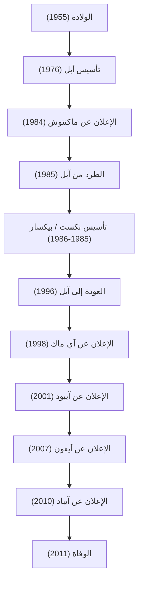

في مجتمعنا الرقمي الحديث، ليس من المبالغة القول بأن قدرتنا على استخدام الهواتف الذكية كأمر مسلم به، وكتابة النصوص بخطوط جميلة، وحمل الموسيقى في جيوبنا، يعود الفضل فيه إلى رائد أعمال واحد يتمتع بالكاريزما. ستيف جوبز - المؤسس المشارك لشركة آبل (Apple)، والرجل الذي وقف دائماً عند تقاطع التكنولوجيا والفن. كانت حياته مليئة بتطورات دراماتيكية لا تكفي كلمة "متقلبة" لوصفها، وبفلسفة راسخة.

في هذا المقال، سنتعمق في حياة جوبز والفلسفة التي تكمن في جذورها، بالإضافة إلى التأثير الذي لا يُحصى الذي تركه على المجتمع الحديث.

## 1. البداية وتأسيس آبل: "ابق جائعاً، ابق أحمق"

وُلد ستيف جوبز في سان فرانسيسكو عام 1955، ونشأ في كنف والديه بالتبني. منذ طفولته، أظهر اهتماماً قوياً بالأجهزة الإلكترونية، وعمل بدوام جزئي في مصنع هوليت-باكارد (Hewlett-Packard)، ونشأ وهو يشعر بأجواء فجر وادي السيليكون وتطور التكنولوجيا. التحق بكلية ريد، لكنه لم يهتم بالمواد الإلزامية وترك الدراسة بعد نصف عام. ومع ذلك، فإن حضوره غير الرسمي لدروس فن الخط (الكاليجرافي)، والذي أدى لاحقاً إلى الطباعة الجميلة في حواسيب ماكنتوش (Macintosh)، أصبح نقطة الانطلاق لفلسفته في الحياة حول "ربط النقاط" (Connecting the dots).

في عام 1976، أسس جوبز مع صديقه المقرب ستيف وزنياك شركة آبل كمبيوتر (Apple Computer) في مرآب منزل عائلته. بفضل النجاح الكبير لجهازي "Apple I" ثم "Apple II"، فتح الاثنان سوقاً جديداً للحواسيب الشخصية. لقد حولوا الكمبيوتر، الذي كان مجرد آلة حاسبة، إلى "أداة شخصية" يمكن لأي شخص استخدامها في المنزل.

## 2. المجد، الطرد، ثم العودة

بدت آبل وكأنها تسير بسلاسة، ولكن بعد الإعلان عن "Macintosh" في عام 1984، طُرد جوبز من الشركة التي أسسها بنفسه بسبب صراعات السياسة الداخلية. ومع ذلك، فإن هذه الانتكاسة زادت من شحذ إبداعه.

أسس جوبز على الفور شركة "NeXT" لتطوير محطات عمل متقدمة لسوق التعليم. علاوة على ذلك، اشترى قسم رسومات الكمبيوتر من جورج لوكاس وأسس شركة "Pixar". أعادت بيكسار كتابة تاريخ أفلام الرسوم المتحركة من خلال النجاح العالمي لفيلم "حكاية لعبة" (Toy Story).

من ناحية أخرى، وقعت شركة آبل في غياب جوبز في أزمة إدارية خطيرة. بعد أن وصلت آبل إلى طريق مسدود في تطوير نظام التشغيل التالي، احتاجت إلى تقنية نظام تشغيل NeXT، واشترت شركة NeXT في عام 1996. وهكذا، حقق جوبز عودة معجزة إلى آبل.

## 3. ثورة i: الابتكار الذي أعاد تعريف العالم

بعد عودته، قام جوبز بإعادة تنظيم شاملة لخطوط المنتجات لإنقاذ آبل التي كانت على وشك الإفلاس. وفي عام 1998، أعلن عن جهاز "iMac" شبه الشفاف والملون، مما أحدث ثورة في المكاتب والمنازل حول العالم.

من هنا، بدأ تقدم جوبز السريع.
أدى ظهور "iPod" ومتجر iTunes Store في عام 2001 إلى تدمير نموذج أعمال صناعة الموسيقى من جذوره، وغيّر طريقة استماعنا للموسيقى بالكامل. وفي عام 2007، وُلد الجهاز الذي غيّر التاريخ: "iPhone". بدمج الهاتف، ومتصفح الإنترنت، وجهاز آيبود في جهاز واحد، واعتماد واجهة اللمس المتعدد، أعاد الآيفون تعريف كل شيء، من تواصل الناس إلى أسلوب حياتهم. وفي عام 2010، أعلن عن "iPad"، مما أسس سوقاً جديداً للأجهزة اللوحية.

## 4. تقاطع التكنولوجيا والفنون الليبرالية: فلسفة جوبز

ما رفع جوبز ليكون أكثر من مجرد مدير تنفيذي لشركة تكنولوجيا هو "سعيه للكمال" و"جمالياته" الصارمة. إن إعطاء الأولوية القصوى لـ "تجربة المستخدم" (UX)، والإصرار حتى على جمال الأسلاك في اللوحات الإلكترونية، أدى أحياناً إلى صراعات عنيفة مع من حوله. ولكن، بفضل هذا السعي الدؤوب دون مساومة، تجاوزت منتجات آبل كونها مجرد منتجات صناعية لتصبح أجهزة ساحرة تخاطب مشاعر الناس.

كان كثيراً ما يستخدم عبارة "تقاطع التكنولوجيا والفنون الليبرالية (العلوم الإنسانية)". إن النتيجة التي ترتبت على التساؤل المستمر ليس فقط عن المواصفات التقنية، ولكن أيضاً عن كيفية إثراء هذه التكنولوجيا لحياة الإنسان، وما هو التصميم الذي يمكن استخدامه بشكل بديهي، أصبحت هي هوية آبل.

## 5. التأثير على الأجيال القادمة والإرث الخالد

في 5 أكتوبر 2011، توفي ستيف جوبز عن عمر يناهز 56 عاماً بعد صراع طويل مع سرطان البنكرياس. ومع ذلك، فإن الفلسفة التي تركها لا تزال متألقة حتى يومنا هذا.

الهواتف الذكية التي نخرجها من جيوبنا كل يوم، والبيانات المتزامنة عبر السحابة، والتشغيل باللمس البديهي. كل هذه الأمور تعتبر امتداداً للرؤية التي تصورها جوبز. لم يكتفِ بصنع منتجات ممتازة فحسب، بل أثبت بحياته أن "المستقبل يمكن صنعه بأيدينا".

"ابق جائعاً، ابق أحمق (Stay hungry, stay foolish)".
هذه الكلمات التي قيلت في خطابه الأسطوري في حفل تخرج جامعة ستانفورد، لا تزال محفورة في قلوب رواد الأعمال والمبدعين حول العالم. سيظل شغفه ورؤيته اللذان لا يقبلان المساومة منارة تضيء طريق صناعة التكنولوجيا وتقدم البشرية في المستقبل.
