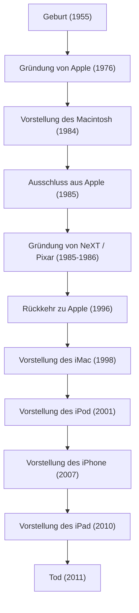

In der heutigen digitalen Gesellschaft, in der wir wie selbstverständlich unsere Smartphones berühren, Texte in schönen Schriftarten tippen und unsere Musik in der Tasche bei uns tragen, ist es keine Übertreibung zu sagen, dass dies alles einem einzigen charismatischen Unternehmer zu verdanken ist: Steve Jobs – Mitbegründer von Apple und der Mann, der stets an der Schnittstelle von Technologie und Kunst stand. Sein Leben war voller so dramatischer Entwicklungen und unerschütterlicher Philosophien, dass das Wort "bewegt" bei weitem nicht ausreicht, um es zu beschreiben.

In diesem Artikel werden wir tief in das Leben von Jobs, die zugrunde liegende Philosophie und den unermesslichen Einfluss eintauchen, den er auf die moderne Gesellschaft hinterlassen hat.

## 1. Die Ursprünge und die Geburt von Apple: „Stay hungry, stay foolish“

Steve Jobs, geboren 1955 in San Francisco, wuchs bei Adoptiveltern auf. Schon als Junge interessierte er sich stark für Elektronik, arbeitete nebenbei in einer Fabrik von Hewlett-Packard und wuchs auf, während er die Atmosphäre der frühen Tage des Silicon Valley und die Entwicklung der Technologie hautnah miterlebte. Er besuchte das Reed College, brach das Studium jedoch nach einem halben Jahr ab, da er kein Interesse an den Pflichtfächern fand. Der Kalligraphiekurs (westliche Schönschrift), in den er sich jedoch heimlich schlich, führte später zur wunderschönen Typografie des Macintosh und wurde zum Ursprung seiner Lebensphilosophie, die „Punkte zu verbinden“ (Connecting the dots).

1976 gründete Jobs zusammen mit seinem guten Freund Steve Wozniak in der Garage seiner Eltern Apple Computer. Mit dem großen Erfolg des „Apple I“ und „Apple II“ eröffneten die beiden einen neuen Markt für Personal Computer. Sie verwandelten den Computer von einer bloßen Rechenmaschine in ein „Werkzeug für das Individuum“, das jeder zu Hause nutzen konnte.

## 2. Ruhm, Verbannung und Rückkehr

Apple schien auf Erfolgskurs zu sein, doch nach der Ankündigung des „Macintosh“ im Jahr 1984 wurde Jobs aufgrund interner Machtkämpfe aus der Firma gedrängt, die er selbst gegründet hatte. Doch dieser Rückschlag schärfte seine Kreativität nur noch weiter.

Jobs gründete umgehend „NeXT“, um fortschrittliche Workstations für den Bildungsmarkt zu entwickeln. Darüber hinaus kaufte er die Computergrafik-Abteilung von George Lucas und gründete „Pixar“. Pixar schrieb mit dem weltweiten Hit „Toy Story“ die Geschichte der Animationsfilme neu.

Währenddessen befand sich Apple ohne Jobs in einer schweren Führungskrise. Da Apple bei der Entwicklung seines nächsten Betriebssystems in einer Sackgasse steckte, brauchten sie die OS-Technologie von NeXT und kauften NeXT 1996. So feierte Jobs seine wundersame Rückkehr zu Apple.

## 3. Die i-Revolution: Innovationen, die die Welt neu definierten

Nach seiner Rückkehr räumte Jobs die Produktpalette radikal auf, um das kurz vor dem Bankrott stehende Unternehmen Apple wieder auf Kurs zu bringen. 1998 stellte er den durchscheinenden und farbenfrohen „iMac“ vor, der eine Revolution in den Büros und Haushalten auf der ganzen Welt auslöste.

Von hier aus begann Jobs' Siegeszug.
Die Einführung des „iPod“ und des iTunes Store im Jahr 2001 zerstörte das Geschäftsmodell der Musikindustrie von Grund auf und veränderte die Art und Weise, wie Menschen Musik hören. Und im Jahr 2007 wurde das iPhone geboren, ein Gerät, das die Geschichte veränderte. Durch die Integration von Telefon, Internetbrowser und iPod in einem einzigen Gerät und die Einführung einer Multi-Touch-Oberfläche definierte das iPhone alles neu, von der menschlichen Kommunikation bis hin zu unserem Lebensstil. Im Jahr 2010 folgte das „iPad“, das einen völlig neuen Markt für Tablet-Geräte etablierte.

## 4. Die Schnittstelle zwischen Technologie und Geisteswissenschaften: Jobs' Philosophie

Was Jobs zu mehr als nur einem Manager eines Technologieunternehmens machte, war sein kompromissloser „Perfektionismus“ und seine „Ästhetik“. Seine Haltung, der „Benutzererfahrung (UX)“ oberste Priorität einzuräumen und selbst auf die Schönheit der Verkabelung auf einer Platine zu achten, führte manchmal zu heftigen Konflikten mit seinem Umfeld. Doch gerade dieses kompromisslose Streben machte Apple-Produkte zu mehr als nur Industrieprodukten – es machte sie zu geradezu magischen Geräten, die die Emotionen der Menschen ansprachen.

Er benutzte oft den Begriff „die Schnittstelle von Technologie und Geisteswissenschaften (Liberal Arts)“. Das Ergebnis seines ständigen Hinterfragens nicht nur des Strebens nach technischen Spezifikationen, sondern auch der Frage, wie diese das menschliche Leben bereichern und was intuitives Design ausmacht, ist die Identität von Apple.

## 5. Einfluss auf die Nachwelt und ewiges Vermächtnis

Am 5. Oktober 2011 verstarb Steve Jobs nach langem Kampf gegen Bauchspeicheldrüsenkrebs im Alter von 56 Jahren. Doch die Philosophie, die er hinterlassen hat, ist auch heute noch lebendig.

Das Smartphone, das wir jeden Tag aus der Tasche holen, die in der Cloud synchronisierten Daten, die intuitive Touch-Bedienung. All das liegt auf der Verlängerung der Vision, die Jobs sich vorgestellt hatte. Er hat nicht nur hervorragende Produkte geschaffen, sondern mit seinem Leben auch bewiesen, dass „wir die Zukunft mit unseren eigenen Händen erschaffen können“.

„Bleibt hungrig, bleibt töricht (Stay hungry, stay foolish).“
Diese Worte aus seiner legendären Abschlussrede an der Stanford University sind den Unternehmern und Schöpfern auf der ganzen Welt bis heute ins Gedächtnis eingebrannt. Seine kompromisslose Leidenschaft und Vision werden weiterhin ein Wegweiser für die Technologiebranche und den Fortschritt der Menschheit sein.
