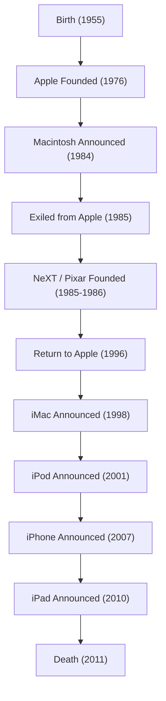

In today's modern digital society, it is no exaggeration to say that we owe our ability to casually touch smartphones, type texts in beautiful fonts, and carry music in our pockets to a single charismatic entrepreneur. Steve Jobs—Apple's co-founder and the man who consistently stood at the intersection of technology and art. His life was filled with dramatic developments that the word "turbulent" could barely cover, and an unwavering philosophy.

In this article, we will delve deeply into Jobs's life, the philosophy flowing beneath it, and the immeasurable impact he left on modern society.

## 1. The Origin and the Birth of Apple: "Stay hungry, stay foolish"

Born in San Francisco in 1955, Steve Jobs was raised by his adoptive parents. With a strong interest in electronics from his boyhood, he grew up feeling the atmosphere of Silicon Valley's dawn and the evolution of technology firsthand, such as working part-time at a Hewlett-Packard factory. Although he advanced to Reed College, he dropped out after six months as he couldn't find interest in the required courses. However, the calligraphy class he audited would later connect to the beautiful typography of the Macintosh, becoming the origin of his life theory of "connecting the dots."

In 1976, Jobs founded Apple Computer in his parents' garage with his sworn friend Steve Wozniak. With the massive success of the "Apple I" and then the "Apple II," the two carved out a new market called personal computers. They transformed the computer, which had merely been a calculator, into a "tool for individuals" that anyone could use at home.

## 2. Glory, Exile, and Resurrection

Apple seemed to be smooth sailing, but after the announcement of the "Macintosh" in 1984, Jobs was ousted from the very company he had built due to internal political conflicts. However, this setback would further hone his creativity.

Jobs immediately founded "NeXT" to develop an advanced workstation for the education market. Furthermore, he bought the computer graphics division from George Lucas and launched "Pixar." Pixar rewrote the history of animated films with the global hit of "Toy Story."

Meanwhile, Apple without Jobs had fallen into a severe management crisis. Hitting a dead end in the development of its next OS, Apple needed NeXT's OS technology and acquired NeXT in 1996. Thus, Jobs achieved a miraculous return to Apple.

## 3. The i-Revolution: Innovations That Redefined the World

After returning, Jobs thoroughly streamlined the product lineup to rebuild the near-bankrupt Apple. Then, in 1998, he announced the translucent, colorful "iMac," causing a revolution on office and home desks worldwide.

From here, Jobs's rapid advance began.
The appearance of the "iPod" and iTunes Store in 2001 fundamentally destroyed the business model of the music industry and completely transformed how we listen to music. Then in 2007, the history-changing device, the "iPhone," was born. Integrating a phone, internet browser, and iPod into a single device and adopting a multi-touch interface, the iPhone redefined everything from human communication to lifestyles. Following in 2010, he announced the "iPad," establishing a new market for tablet devices.

## 4. The Intersection of Technology and Liberal Arts: Jobs's Philosophy

What elevated Jobs to more than just a tech company executive was his thorough "perfectionism" and "aesthetics." Prioritizing the "User Experience (UX)" above all else and obsessing over even the beauty of circuit board wiring sometimes caused fierce clashes with those around him. However, precisely because of that uncompromising pursuit, Apple products could transcend mere industrial products and become magical devices that appeal to human emotions.

He frequently used the phrase "the intersection of technology and liberal arts." The result of constantly questioning not only the pursuit of technical specs but also how it enriches human life and what an intuitively usable design is, has become Apple's identity.

## 5. Impact on Posterity and Eternal Legacy

On October 5, 2011, Steve Jobs passed away at the age of 56 after a long battle with pancreatic cancer. However, the philosophy he left behind has not faded to this day.

The smartphones we take out of our pockets every day, the data synchronized in the cloud, the intuitive touch controls. These are all extensions of the vision Jobs envisioned. He didn't merely create excellent products; he proved with his life that "the future can be created with one's own hands."

"Stay hungry, stay foolish."
These words, spoken in his legendary commencement speech at Stanford University, remain engraved in the hearts of entrepreneurs and creators around the world. His uncompromising passion and vision will continue to be a guidepost illuminating the technology industry and human progress.
