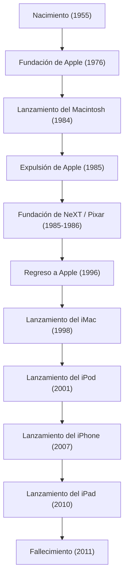

En la sociedad digital actual, el hecho de que interactuemos con teléfonos inteligentes como si fuera lo más natural del mundo, escribamos textos con hermosas fuentes y llevemos nuestra música en el bolsillo se lo debemos, sin exagerar, a un emprendedor carismático. Steve Jobs, cofundador de Apple y el hombre que se mantuvo en la intersección entre la tecnología y el arte. Su vida estuvo llena de un desarrollo tan dramático que la palabra "tumultuosa" se queda corta, y de una filosofía inquebrantable.

En este artículo, profundizaremos en la vida de Jobs, la filosofía que la sustentaba y el incalculable impacto que dejó en la sociedad moderna.

## 1. Los orígenes y el nacimiento de Apple: "Stay hungry, stay foolish"

Nacido en San Francisco en 1955, Steve Jobs creció con sus padres adoptivos. Desde su infancia, mostró un gran interés por la electrónica, trabajando a tiempo parcial en una fábrica de Hewlett-Packard y creciendo mientras sentía en su propia piel la atmósfera de los albores de Silicon Valley y la evolución de la tecnología. Ingresó en el Reed College, pero lo abandonó a los seis meses al no interesarle las asignaturas obligatorias. Sin embargo, las clases de caligrafía a las que asistió como oyente lo llevaron más tarde a la hermosa tipografía del Macintosh, convirtiéndose en el punto de partida de su filosofía de vida de "conectar los puntos" (Connecting the dots).

En 1976, Jobs fundó Apple Computer en el garaje de su familia junto a su amigo y aliado Steve Wozniak. Con el gran éxito del "Apple I" y luego del "Apple II", los dos abrieron un nuevo mercado para los ordenadores personales. Transformaron el ordenador, que no era más que una simple calculadora, en una "herramienta personal" que cualquiera podía usar en casa.

## 2. Gloria, expulsión y resurrección

Aunque Apple parecía navegar viento en popa, tras el anuncio del "Macintosh" en 1984, Jobs fue expulsado de la empresa que él mismo había fundado debido a conflictos políticos internos. Sin embargo, este fracaso agudizó aún más su creatividad.

Jobs fundó inmediatamente "NeXT", desarrollando estaciones de trabajo avanzadas para el mercado educativo. Además, compró la división de gráficos por ordenador a George Lucas y fundó "Pixar". Pixar reescribió la historia del cine de animación con el éxito mundial de Toy Story.

Por otro lado, la Apple sin Jobs había caído en una grave crisis financiera. Al quedarse atascada en el desarrollo de su próximo sistema operativo (OS), Apple necesitó la tecnología del OS de NeXT y adquirió la empresa en 1996. De esta forma, Jobs logró su milagroso regreso a Apple.

## 3. La revolución de la 'i': Innovaciones que redefinieron el mundo

Tras su regreso, Jobs reorganizó drásticamente la línea de productos para reconstruir una Apple que estaba al borde de la bancarrota. Y en 1998, anunció el "iMac", translúcido y colorido, revolucionando las oficinas y los escritorios de los hogares de todo el mundo.

A partir de aquí, comenzó la imparable racha de éxitos de Jobs.
La aparición del "iPod" y la iTunes Store en 2001 destruyó de raíz el modelo de negocio de la industria musical y transformó por completo la forma de escuchar música. Luego, en 2007, nació el dispositivo que cambiaría la historia: el "iPhone". Integrando un teléfono, un navegador de internet y un iPod en un solo dispositivo, y adoptando una interfaz multitáctil, el iPhone redefinió todo, desde la comunicación entre las personas hasta nuestro estilo de vida. A esto le siguió el anuncio del "iPad" en 2010, estableciendo el nuevo mercado de las tabletas.

## 4. La intersección de la tecnología y las artes liberales: La filosofía de Jobs

Lo que elevó a Jobs a ser algo más que el mero director de una empresa tecnológica fue su estricto "perfeccionismo" y su "estética". Su actitud de dar la máxima prioridad a la "experiencia del usuario (UX)" por encima de todo, obsesionándose hasta con la belleza del cableado en las placas de circuitos, provocó a veces fuertes choques con su entorno. Sin embargo, fue gracias a esa búsqueda sin concesiones que los productos de Apple pudieron trascender de simples productos industriales a dispositivos mágicos que apelan a las emociones humanas.

A menudo utilizaba la expresión "la intersección entre la tecnología y las artes liberales (humanidades)". El resultado de preguntarse constantemente no solo por las especificaciones técnicas, sino por cómo estas enriquecen la vida humana y qué constituye un diseño de uso intuitivo, se ha convertido en la identidad de Apple.

## 5. El impacto en las generaciones futuras y su legado eterno

El 5 de octubre de 2011, Steve Jobs falleció a los 56 años tras una larga batalla contra el cáncer de páncreas. Sin embargo, la filosofía que dejó atrás sigue sin desvanecerse.

Los teléfonos inteligentes que sacamos del bolsillo todos los días, los datos sincronizados en la nube, las operaciones táctiles intuitivas. Todo esto se encuentra en la extensión de la visión que Jobs imaginó. No solo creó productos excelentes, sino que también demostró con su vida que "el futuro se puede crear con nuestras propias manos".

"Mantente hambriento, mantente alocado (Stay hungry, stay foolish)".
Estas palabras, pronunciadas en su legendario discurso de graduación en la Universidad de Stanford, siguen grabadas en los corazones de emprendedores y creadores de todo el mundo. Su inquebrantable pasión y visión continuarán siendo, sin duda, un faro que iluminará el camino de la industria tecnológica y el progreso de la humanidad.
