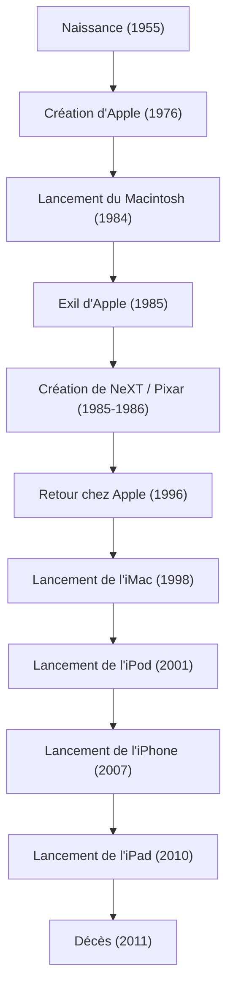

Dans la société numérique moderne, il n'est pas exagéré de dire que c'est grâce à un entrepreneur charismatique que nous utilisons des smartphones comme une évidence, tapons des textes avec de belles polices de caractères et transportons de la musique dans nos poches. Steve Jobs — cofondateur d'Apple et un homme qui s'est toujours tenu à l'intersection de la technologie et de l'art. Sa vie a été remplie de développements si dramatiques que le terme de "mouvementée" ne suffirait pas à la décrire, ainsi que d'une philosophie inébranlable.

Dans cet article, nous explorerons en profondeur la vie de Jobs, la philosophie sous-jacente à celle-ci, et l'impact incommensurable qu'il a laissé sur la société moderne.

## 1. Origines et naissance d'Apple : "Stay hungry, stay foolish"

Né à San Francisco en 1955, Steve Jobs a été élevé par ses parents adoptifs. Dès son enfance, il a développé un vif intérêt pour l'électronique, travaillant à temps partiel dans une usine de Hewlett-Packard, grandissant en ressentant l'atmosphère des débuts de la Silicon Valley et l'évolution de la technologie. Bien qu'il soit entré au Reed College, il a perdu tout intérêt pour les matières obligatoires et a abandonné ses études au bout de six mois. Cependant, les cours de calligraphie (calligraphie occidentale) auxquels il assistait officieusement ont plus tard conduit à la magnifique typographie du Macintosh, devenant ainsi l'origine de sa théorie de la vie sur le fait de "relier les points" (Connecting the dots).

En 1976, Jobs a fondé Apple Computer avec son ami Steve Wozniak dans le garage de ses parents. Grâce au succès retentissant de l'"Apple I" puis de l'"Apple II", les deux hommes ont ouvert un nouveau marché pour les ordinateurs personnels. Ils ont transformé l'ordinateur, qui n'était qu'une simple calculatrice, en un "outil personnel" que tout le monde pouvait utiliser chez soi.

## 2. Gloire, exil et résurrection

Bien qu'Apple semblait avoir le vent en poupe, après le lancement du "Macintosh" en 1984, Jobs a été évincé de l'entreprise qu'il avait fondée en raison de conflits politiques internes. Cependant, ce revers a encore plus affiné sa créativité.

Jobs a immédiatement fondé "NeXT", développant des stations de travail avancées pour le marché de l'éducation. De plus, il a acheté la division d'infographie de George Lucas et a lancé "Pixar". Pixar a réécrit l'histoire des films d'animation avec le succès mondial de "Toy Story".

Pendant ce temps, Apple, sans Jobs, était tombée dans une grave crise financière. Enlisée dans le développement de son prochain système d'exploitation, Apple a eu besoin de la technologie OS de NeXT et a racheté NeXT en 1996. Ainsi, Jobs a accompli son retour miraculeux chez Apple.

## 3. La révolution du "i" : l'innovation qui a redéfini le monde

Après son retour, Jobs a radicalement restructuré la gamme de produits pour sauver Apple, qui était au bord de la faillite. Puis, en 1998, il a annoncé l'"iMac" translucide et coloré, révolutionnant les bureaux et les foyers du monde entier.

C'est là que l'avancée rapide de Jobs a commencé.
L'introduction de l'"iPod" et de l'iTunes Store en 2001 a fondamentalement détruit le modèle économique de l'industrie de la musique et a complètement changé la façon dont nous écoutons la musique. Puis, en 2007, l'"iPhone", un appareil qui a changé l'histoire, est né. Combinant un téléphone, un navigateur Internet et un iPod dans un seul appareil doté d'une interface multi-touch, l'iPhone a redéfini tous les aspects de la communication humaine et des modes de vie. Par la suite, l'"iPad" a été annoncé en 2010, établissant le nouveau marché des tablettes.

## 4. À la croisée de la technologie et des arts libéraux : la philosophie de Jobs

Ce qui a élevé Jobs au-delà du simple statut de dirigeant d'une entreprise technologique, c'est son "perfectionnisme" absolu et son sens de l'"esthétique". Donner la priorité absolue à l'"expérience utilisateur" (UX) et être pointilleux jusqu'à la beauté du câblage de la carte de circuit imprimé a parfois provoqué de violents conflits avec son entourage. Cependant, c'est grâce à cette quête intransigeante que les produits Apple ont transcendé les simples produits industriels pour devenir des appareils magiques qui font appel aux émotions des gens.

Il utilisait souvent l'expression "l'intersection de la technologie et des arts libéraux (humanités)". Le résultat de la remise en question constante non seulement des spécifications techniques, mais aussi de la façon dont elles enrichissent la vie humaine et de ce qui constitue un design intuitif, est devenu l'identité d'Apple.

## 5. Son influence sur les générations futures et son héritage éternel

Le 5 octobre 2011, Steve Jobs est décédé à l'âge de 56 ans après une longue bataille contre le cancer du pancréas. Cependant, la philosophie qu'il a laissée derrière lui ne s'est pas estompée.

Les smartphones que nous sortons de nos poches tous les jours, les données synchronisées dans le cloud, et les opérations tactiles intuitives. Tous ces éléments sont le prolongement de la vision de Jobs. Il n'a pas seulement créé d'excellents produits ; il a prouvé par sa vie que "l'avenir peut être créé de nos propres mains".

"Restez insatiables, restez fous" (Stay hungry, stay foolish).
Ces mots, prononcés lors de son discours de remise des diplômes légendaire à l'Université de Stanford, sont encore gravés dans l'esprit des entrepreneurs et des créateurs du monde entier aujourd'hui. Sa passion et sa vision sans compromis continueront d'être un phare pour l'industrie technologique et le progrès de l'humanité.
