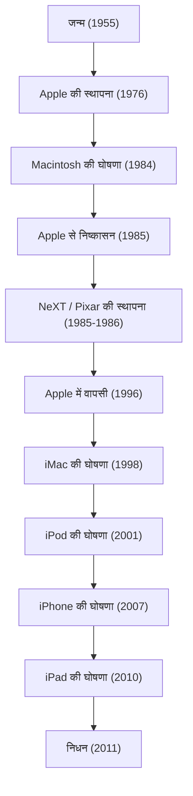

आधुनिक डिजिटल समाज में, हम जिस तरह से स्मार्टफोन को अपनी रोजमर्रा की जिंदगी का हिस्सा मानते हैं, खूबसूरत फोंट में लिखते हैं, और अपनी जेब में संगीत लेकर चलते हैं, यह कहना गलत नहीं होगा कि यह सब एक करिश्माई उद्यमी की बदौलत है। स्टीव जॉब्स - Apple के सह-संस्थापक और एक ऐसे व्यक्ति जो हमेशा तकनीक और कला के चौराहे पर खड़े रहे। उनका जीवन केवल उतार-चढ़ाव से भरा हुआ कहना काफी नहीं होगा, बल्कि यह नाटकीय घटनाओं और दृढ़ दर्शन से परिपूर्ण था।

इस लेख में, हम जॉब्स के जीवन, उनके अंतर्निहित दर्शन, और आधुनिक समाज पर उनके छोड़े गए अथाह प्रभाव की गहराई से पड़ताल करेंगे।

## 1. शुरुआत और Apple का जन्म: "Stay hungry, stay foolish"

1955 में सैन फ्रांसिस्को में जन्मे, स्टीव जॉब्स की परवरिश उनके दत्तक माता-पिता ने की थी। बचपन से ही इलेक्ट्रॉनिक उपकरणों में उनकी गहरी रुचि थी, और उन्होंने हेवलेट-पैकर्ड (Hewlett-Packard) कारखाने में अंशकालिक काम किया, जहाँ वे सिलिकॉन वैली के शुरुआती दिनों के माहौल और तकनीक के विकास का अनुभव करते हुए बड़े हुए। हालांकि उन्होंने रीड कॉलेज में प्रवेश लिया, लेकिन अनिवार्य विषयों में उनकी कोई दिलचस्पी नहीं थी और छह महीने के भीतर ही उन्होंने कॉलेज छोड़ दिया। फिर भी, उन्होंने चुपके से कैलीग्राफी (पश्चिमी सुलेख) की कक्षाओं में भाग लिया, जो बाद में मैकिन्टोश (Macintosh) की खूबसूरत टाइपोग्राफी का आधार बना। यही उनके "बिंदुओं को जोड़ने (Connecting the dots)" के जीवन दर्शन की शुरुआत थी।

1976 में, जॉब्स ने अपने करीबी दोस्त स्टीव वोज्नियाक के साथ मिलकर अपने माता-पिता के गैरेज में Apple Computer की स्थापना की। "Apple I" और फिर "Apple II" की भारी सफलता के साथ, दोनों ने पर्सनल कंप्यूटर का एक नया बाजार तैयार किया। उन्होंने कंप्यूटर को, जो केवल एक गणना करने वाली मशीन थी, "व्यक्तिगत उपयोग के उपकरण" में बदल दिया, जिसे कोई भी अपने घर में इस्तेमाल कर सकता था।

## 2. महिमा, निष्कासन, और फिर से वापसी

Apple का सफर हालांकि सफल दिख रहा था, लेकिन 1984 में "Macintosh" के लॉन्च के बाद, आंतरिक कॉर्पोरेट राजनीति के कारण जॉब्स को अपनी ही बनाई कंपनी से बाहर कर दिया गया। हालांकि, इस झटके ने उनकी रचनात्मकता को और भी निखार दिया।

जобс ने तुरंत "NeXT" की स्थापना की, जो शिक्षा बाजार के लिए उन्नत वर्कस्टेशन विकसित करती थी। इसके अलावा, उन्होंने जॉर्ज लुकास से कंप्यूटर ग्राफिक्स डिवीजन खरीदा और "Pixar" की शुरुआत की। Pixar ने 'टॉय स्टोरी' (Toy Story) की वैश्विक सफलता के साथ एनीमेशन फिल्मों के इतिहास को फिर से लिखा।

इस बीच, जॉब्स के बिना Apple गंभीर वित्तीय संकट में घिर गया था। अपने अगले OS के विकास में फंसी Apple को NeXT की OS तकनीक की जरूरत थी, और 1996 में उसने NeXT का अधिग्रहण कर लिया। इस तरह जॉब्स की Apple में चमत्कारिक वापसी हुई।

## 3. i की क्रांति: वो इनोवेशन जिसने दुनिया को फिर से परिभाषित किया

अपनी वापसी के बाद, जॉब्स ने दिवालिया होने के कगार पर खड़ी Apple को फिर से खड़ा करने के लिए कंपनी के उत्पादों की लाइनअप को पूरी तरह से व्यवस्थित किया। 1998 में, उन्होंने पारदर्शी और रंगीन "iMac" की घोषणा की, जिसने दुनिया भर के कार्यालयों और घरों के डेस्क पर क्रांति ला दी।

यहाँ से जॉब्स की तेज प्रगति शुरू हुई।
2001 में "iPod" और iTunes Store के आने से संगीत उद्योग के बिजनेस मॉडल को पूरी तरह से नष्ट कर दिया गया, जिससे लोगों के संगीत सुनने के तरीके में भारी बदलाव आया। फिर 2007 में, इतिहास बदलने वाला उपकरण "iPhone" पैदा हुआ। एक ही डिवाइस में फोन, इंटरनेट ब्राउजर और iPod को एकीकृत करते हुए और मल्टी-टच इंटरफेस को अपनाते हुए, iPhone ने संचार से लेकर हमारी जीवनशैली तक सब कुछ फिर से परिभाषित कर दिया। इसके बाद 2010 में "iPad" की घोषणा हुई, जिसने टैबलेट उपकरणों का एक नया बाजार स्थापित किया।

## 4. तकनीक और उदार कलाओं (Liberal Arts) का चौराहा: जॉब्स का दर्शन

जобс को केवल एक तकनीकी कंपनी के सीईओ से कहीं अधिक ऊंचे मुकाम पर पहुँचाने वाली बात उनकी "पूर्णतावाद" (Perfectionism) और "सौंदर्यशास्त्र" (Aesthetics) की गहरी भावना थी। "उपयोगकर्ता अनुभव (UX)" को सर्वोपरि रखना और सर्किट बोर्ड के तारों की सुंदरता तक पर ध्यान देना जैसी उनकी आदतें कभी-कभी दूसरों के साथ उनके तीव्र टकराव का कारण बनती थीं। हालांकि, उनके इस बिना समझौते वाले रवैये के कारण ही, Apple के उत्पाद केवल औद्योगिक उपकरण न होकर लोगों की भावनाओं को छूने वाले जादुई उपकरण बन सके।

वे अक्सर "तकनीक और उदार कलाओं (Liberal Arts) का चौराहा" वाक्यांश का उपयोग करते थे। न केवल तकनीकी विशिष्टताओं का पीछा करना, बल्कि यह हमेशा सवाल करना कि यह मानव जीवन को कैसे समृद्ध करेगा, और एक सहज डिजाइन क्या है - यही सोच Apple की पहचान बन गई है।

## 5. भविष्य की पीढ़ियों पर प्रभाव और एक शाश्वत विरासत

5 अक्टूबर, 2011 को, अग्नाशय के कैंसर के साथ लंबी लड़ाई के बाद, 56 वर्ष की आयु में स्टीव जॉब्स का निधन हो गया। हालांकि, उनके द्वारा छोड़ा गया दर्शन आज भी प्रासंगिक है।

स्मार्टफोन जिसे हम रोज़ अपनी जेब से निकालते हैं, क्लाउड में सिंक किया गया डेटा, और सहज टच नियंत्रण - ये सभी उस विजन का विस्तार हैं जिसकी कल्पना जॉब्स ने की थी। उन्होंने न केवल उत्कृष्ट उत्पाद बनाए, बल्कि अपने जीवन के माध्यम से यह भी साबित किया कि "भविष्य आपके अपने हाथों से बनाया जा सकता है।"

"Stay hungry, stay foolish" (भूखे रहो, मूर्ख रहो)।
स्टैनफोर्ड यूनिवर्सिटी के उनके प्रसिद्ध दीक्षांत समारोह के भाषण में कहे गए ये शब्द आज भी दुनिया भर के उद्यमियों और रचनाकारों के दिलों में बसे हुए हैं। उनका बिना समझौते वाला जुनून और विजन तकनीक उद्योग और मानवता की प्रगति के लिए हमेशा मार्गदर्शक बना रहेगा।
