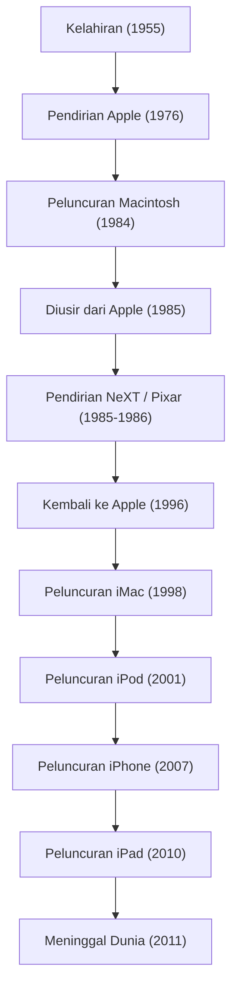

Dalam masyarakat digital modern, tidak berlebihan untuk mengatakan bahwa fakta kita dapat menyentuh ponsel cerdas, mengetik kalimat dengan font yang indah, dan membawa musik di dalam saku sebagai sesuatu yang biasa, adalah berkat seorang pengusaha karismatik. Steve Jobs——salah satu pendiri Apple dan pria yang terus berdiri di persimpangan antara teknologi dan seni. Kehidupannya dipenuhi dengan perkembangan dramatis yang tidak cukup digambarkan dengan kata penuh gejolak, serta filosofi yang teguh.

Dalam artikel ini, kita akan menggali lebih dalam tentang kehidupan Jobs dan filosofi yang mendasarinya, serta pengaruh tak terukur yang ia tinggalkan pada masyarakat modern.

## 1. Titik Awal dan Lahirnya Apple: "Stay hungry, stay foolish"

Lahir di San Francisco pada tahun 1955, Steve Jobs dibesarkan oleh orang tua angkatnya. Sejak kecil, ia memiliki minat yang kuat pada perangkat elektronik dan tumbuh sambil merasakan suasana awal Silicon Valley serta evolusi teknologi, seperti saat bekerja paruh waktu di pabrik Hewlett-Packard. Meskipun ia masuk Reed College, ia tidak tertarik pada mata kuliah wajib dan putus kuliah setelah setengah tahun. Namun, kelas kaligrafi (seni menulis Barat) yang ia ikuti secara diam-diam kemudian mengarah pada tipografi Macintosh yang indah, menjadi titik awal dari filosofi hidupnya tentang "menghubungkan titik-titik (Connecting the dots)".

Pada tahun 1976, Jobs bersama sahabatnya Steve Wozniak mendirikan Apple Computer di garasi rumah orang tuanya. Dengan kesuksesan besar "Apple I" dan kemudian "Apple II", keduanya membuka pasar baru yang disebut komputer pribadi. Mereka mengubah komputer, yang tadinya hanya sekadar mesin hitung, menjadi "alat untuk individu" yang dapat digunakan siapa saja di rumah.

## 2. Kejayaan, Pengusiran, dan Kebangkitan

Meskipun Apple tampak berjalan mulus, setelah peluncuran "Macintosh" pada tahun 1984, konflik politik internal menyebabkan Jobs diusir dari perusahaan yang ia dirikan sendiri. Namun, kegagalan ini justru semakin menajamkan kreativitasnya.

Jobs segera mendirikan "NeXT" yang mengembangkan workstation canggih untuk pasar pendidikan. Selain itu, ia membeli divisi grafik komputer dari George Lucas dan mendirikan "Pixar". Pixar mengubah sejarah film animasi melalui kesuksesan global "Toy Story".

Di sisi lain, Apple yang tanpa Jobs jatuh ke dalam krisis manajemen yang parah. Menemui jalan buntu dalam pengembangan OS generasi berikutnya, Apple membutuhkan teknologi OS dari NeXT dan mengakuisisi NeXT pada tahun 1996. Dengan demikian, Jobs berhasil melakukan kebangkitan ajaib kembali ke Apple.

## 3. Revolusi i: Inovasi yang Mendefinisikan Ulang Dunia

Setelah kembali, Jobs merampingkan lini produk secara menyeluruh untuk menyelamatkan Apple yang berada di ambang kebangkrutan. Kemudian pada tahun 1998, ia mengumumkan "iMac" yang tembus pandang dan berwarna-warni, menciptakan revolusi di kantor dan meja rumah di seluruh dunia.

Dari sinilah, kemajuan pesat Jobs dimulai.
Kemunculan "iPod" dan iTunes Store pada tahun 2001 menghancurkan model bisnis industri musik dari akarnya dan mengubah total cara mendengarkan musik. Lalu pada tahun 2007, "iPhone", perangkat yang mengubah sejarah, lahir. Menggabungkan telepon, peramban internet, dan iPod ke dalam satu perangkat serta mengadopsi antarmuka multi-sentuh, iPhone mendefinisikan ulang segala hal mulai dari cara orang berkomunikasi hingga gaya hidup mereka. Selanjutnya pada tahun 2010, ia meluncurkan "iPad", mengukuhkan pasar baru untuk perangkat tablet.

## 4. Persimpangan Teknologi dan Seni Liberal: Filosofi Jobs

Hal yang mengangkat Jobs menjadi lebih dari sekadar pemimpin perusahaan teknologi adalah "perfeksionisme" dan "estetika"-nya yang menyeluruh. Mengutamakan "pengalaman pengguna (UX)" di atas segalanya, serta obsesinya bahkan terhadap keindahan kabel di papan sirkuit, terkadang memicu konflik sengit dengan orang-orang di sekitarnya. Namun, berkat pencariannya yang tanpa kompromi itulah produk Apple melampaui sekadar produk industri dan mampu menjadi perangkat ajaib yang menyentuh emosi orang-orang.

Ia sering menggunakan frasa "persimpangan teknologi dan seni liberal (humaniora)". Tidak hanya mengejar spesifikasi teknis, tetapi terus mempertanyakan bagaimana hal itu dapat memperkaya kehidupan manusia dan apa itu desain yang dapat digunakan secara intuitif, hasilnya telah menjadi identitas Apple.

## 5. Pengaruh pada Generasi Mendatang dan Warisan Abadi

Pada tanggal 5 Oktober 2011, Steve Jobs meninggal dunia pada usia 56 tahun setelah perjuangan panjang melawan kanker pankreas. Namun, filosofi yang ditinggalkannya tidak pernah pudar hingga saat ini.

Ponsel cerdas yang kita keluarkan dari saku setiap hari, data yang disinkronkan di cloud, operasi sentuh yang intuitif. Semua ini merupakan perpanjangan dari visi yang dibayangkan Jobs. Ia tidak hanya menciptakan produk unggulan, tetapi juga membuktikan melalui hidupnya bahwa "masa depan dapat diciptakan dengan tangan kita sendiri".

"Tetaplah merasa lapar, tetaplah merasa bodoh (Stay hungry, stay foolish)".
Kata-kata yang diucapkan dalam pidato kelulusan legendaris di Universitas Stanford ini masih terukir di hati para pengusaha dan pencipta di seluruh dunia. Semangat dan visinya yang tanpa kompromi akan terus menjadi mercusuar yang menerangi industri teknologi dan kemajuan umat manusia.
