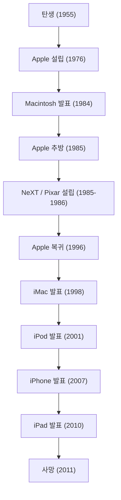

현대 디지털 사회에서 우리가 당연하게 스마트폰을 만지고, 아름다운 폰트로 글을 치고, 음악을 주머니에 넣어 다닐 수 있는 것은 한 카리스마적인 기업가 덕분이라고 해도 과언이 아닙니다. 스티브 잡스——Apple의 공동 창업자이자 기술과 예술의 교차로에 계속 서 있었던 남자. 그의 생애는 파란만장이라는 말로는 도저히 부족할 정도의 극적인 전개와 확고한 철학으로 가득 차 있었습니다.

본 기사에서는 잡스의 생애와 그 밑바탕에 흐르는 철학, 그리고 그가 현대 사회에 남긴 헤아릴 수 없는 영향에 대해 깊이 파고들어 보겠습니다.

## 1. 원점과 Apple의 탄생: 「Stay hungry, stay foolish」

1955년 샌프란시스코에서 태어난 스티브 잡스는 양부모 밑에서 자랐습니다. 어린 시절부터 전자 기기에 강한 관심을 품고, 휴렛 팩커드 공장에서 아르바이트를 하는 등 실리콘밸리 여명기의 분위기와 기술 진화를 피부로 느끼며 성장합니다. 리드 대학교에 진학했지만, 필수 과목에 흥미를 느끼지 못하고 반년 만에 중퇴. 그러나 청강으로 잠입한 캘리그래피(서양 서예) 수업이 훗날 Macintosh의 아름다운 타이포그래피로 이어지는 등, 그의 "점과 점을 연결하는(Connecting the dots)" 인생론의 원점이 되었습니다.

1976년, 잡스는 맹우 스티브 워즈니악과 함께 본가의 차고에서 Apple Computer를 창업합니다. 「Apple I」 그리고 「Apple II」의 대성공으로 두 사람은 개인용 컴퓨터라는 새로운 시장을 개척했습니다. 단순한 계산기였던 컴퓨터를 누구나 집에서 사용할 수 있는 '개인을 위한 도구'로 변혁시킨 것입니다.

## 2. 영광, 추방, 그리고 부활

순풍에 돛을 단 듯 보였던 Apple이었지만, 1984년 「Macintosh」 발표 후 사내 정치의 대립으로 인해 잡스는 자신이 세운 회사에서 추방당하고 맙니다. 그러나 이 좌절이 그의 크리에이티비티를 더욱 날카롭게 벼려내게 됩니다.

잡스는 즉시 교육 시장을 위한 고도의 워크스테이션을 개발하는 「NeXT」를 설립합니다. 또한 조지 루카스로부터 컴퓨터 그래픽스 부문을 인수하여 「Pixar」를 설립합니다. Pixar는 『토이 스토리』의 세계적인 히트로 애니메이션 영화의 역사를 다시 썼습니다.

한편, 잡스가 부재한 Apple은 심각한 경영 위기에 빠져 있었습니다. 차기 OS 개발에 난항을 겪던 Apple은 NeXT의 OS 기술을 필요로 했고, 1996년에 NeXT를 인수합니다. 이렇게 해서 잡스는 기적적인 Apple 복귀를 완수했던 것입니다.

## 3. i의 혁명: 세상을 재정의한 이노베이션

복귀 후의 잡스는 도산 직전이었던 Apple을 재건하기 위해 제품 라인업을 철저하게 정리합니다. 그리고 1998년, 반투명하고 컬러풀한 「iMac」을 발표하여 전 세계의 사무실과 가정의 책상에 혁명을 일으켰습니다.

여기서부터 잡스의 쾌진격이 시작됩니다.
2001년 「iPod」와 iTunes Store의 등장은 음악 산업의 비즈니스 모델을 근본부터 파괴하고, 음악을 듣는 방식을 일변시켰습니다. 그리고 2007년, 역사를 바꾸는 디바이스 「iPhone」이 탄생합니다. 전화, 인터넷 브라우저, iPod을 하나의 디바이스로 통합하고 멀티 터치 인터페이스를 채용한 iPhone은 사람들의 커뮤니케이션부터 생활 양식까지 모든 것을 재정의했습니다. 이어진 2010년에는 「iPad」를 발표하며 태블릿 단말기라는 새로운 시장을 확립했습니다.

## 4. 기술과 인문학의 교차로: 잡스의 철학

잡스를 단순한 기술 기업의 경영자 이상의 존재로 밀어 올린 것은 그의 철저한 '완벽주의'와 '미학'입니다. '사용자 경험(UX)'을 무엇보다 최우선시하고, 기판 배선의 아름다움까지 고집하는 자세는 때로 주변과의 격렬한 충돌을 낳았습니다. 그러나 그 타협 없는 추구가 있었기에 Apple 제품은 단순한 공업 제품을 초월하여 사람들의 감정에 호소하는 마법 같은 디바이스가 될 수 있었던 것입니다.

그는 자주 "기술과 인문학(리버럴 아츠)의 교차로"라는 말을 사용했습니다. 기술적인 스펙의 추구뿐만 아니라, 그것이 인간의 생활을 어떻게 풍요롭게 할 것인가, 직관적으로 사용할 수 있는 디자인이란 무엇인가를 끊임없이 질문한 결과가 Apple의 아이덴티티가 되었습니다.

## 5. 후세에 미친 영향과 영원한 유산

2011년 10월 5일, 스티브 잡스는 췌장암과의 긴 투병 끝에 56세의 나이로 세상을 떠났습니다. 그러나 그가 남긴 철학은 지금도 여전히 빛을 잃지 않고 있습니다.

우리가 매일 주머니에서 꺼내는 스마트폰, 클라우드로 동기화되는 데이터, 직관적인 터치 조작. 이것들은 모두 잡스가 그렸던 비전의 연장선상에 있습니다. 그는 단순히 뛰어난 제품을 만들었을 뿐만 아니라, "미래는 자신의 손으로 만들어낼 수 있다"는 것을 그 생애를 통해 증명했습니다.

"계속 갈망하라, 여전히 우직하게(Stay hungry, stay foolish)."
스탠퍼드 대학교의 전설적인 졸업식 연설에서 남긴 이 말은 지금도 전 세계의 기업가와 크리에이터들의 가슴에 새겨져 있습니다. 그의 타협 없는 열정과 비전은 앞으로도 기술 업계, 그리고 인류의 진보를 비추는 이정표로 계속 남을 것입니다.
