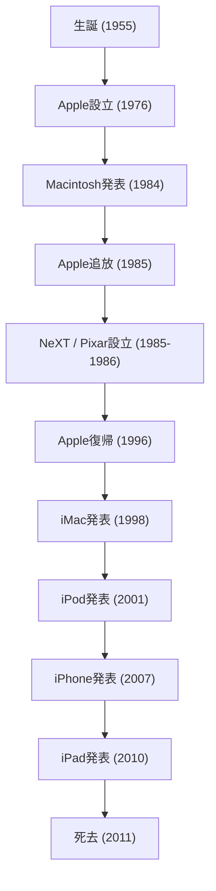

現代のデジタル社会において、私たちが当たり前のようにスマートフォンに触れ、美しいフォントで文章を打ち、音楽をポケットに入れて持ち運べるのは、一人のカリスマ的な起業家のおかげと言っても過言ではありません。スティーブ・ジョブズ——Appleの共同創業者であり、テクノロジーと芸術の交差点に立ち続けた男。彼の生涯は、波乱万丈という言葉では到底足りないほどの劇的な展開と、確固たる哲学に満ちていました。

本記事では、ジョブズの生涯とその根底に流れる哲学、そして彼が現代社会に残した計り知れない影響について深く掘り下げていきます。

## 1. 原点とAppleの誕生：「Stay hungry, stay foolish」

1955年、サンフランシスコで生まれたスティーブ・ジョブズは、養父母のもとで育ちました。少年時代から電子機器に強い関心を抱き、ヒューレット・パッカードの工場でアルバイトをするなど、シリコンバレーの黎明期の空気とテクノロジーの進化を肌で感じながら成長します。リード大学に進学するも、必修科目に興味を持てず半年で中退。しかし、モグリで潜り込んだカリグラフィー（西洋書道）の授業が、後にMacintoshの美しいタイポグラフィへと繋がるなど、彼の「点と点を繋ぐ（Connecting the dots）」人生論の原点となりました。

1976年、ジョブズは盟友スティーブ・ウォズニアックと共に、実家のガレージでApple Computerを創業します。「Apple I」そして「Apple II」の大成功により、二人はパーソナルコンピュータという新たな市場を切り拓きました。単なる計算機だったコンピュータを、誰もが自宅で使える「個人のためのツール」へと変革したのです。

## 2. 栄光、追放、そして復活

順風満帆に見えたAppleでしたが、1984年の「Macintosh」発表後、社内政治の対立からジョブズは自らが立ち上げた会社を追放されてしまいます。しかし、この挫折が彼のクリエイティビティをさらに研ぎ澄ますことになります。

ジョブズは直ちに教育市場向けの高度なワークステーションを開発する「NeXT」を設立。さらに、ジョージ・ルーカスからコンピュータ・グラフィックス部門を買収し、「Pixar」を立ち上げます。Pixarは『トイ・ストーリー』の世界的ヒットにより、アニメーション映画の歴史を塗り替えました。

一方、ジョブズ不在のAppleは深刻な経営危機に陥っていました。次期OSの開発に行き詰まったAppleは、NeXTのOS技術を必要とし、1996年にNeXTを買収。こうしてジョブズは、奇跡的なAppleへの復帰を果たしたのです。

## 3. iの革命：世界を再定義したイノベーション

復帰後のジョブズは、倒産寸前だったAppleを立て直すため、製品ラインナップを徹底的に整理します。そして1998年、半透明でカラフルな「iMac」を発表し、世界中のオフィスや家庭のデスクに革命を起こしました。

ここから、ジョブズの快進撃が始まります。
2001年の「iPod」とiTunes Storeの登場は、音楽業界のビジネスモデルを根本から破壊し、音楽の聴き方を一変させました。そして2007年、歴史を変えるデバイス「iPhone」が誕生します。電話、インターネットブラウザ、iPodを一つのデバイスに統合し、マルチタッチインターフェースを採用したiPhoneは、人々のコミュニケーションから生活様式まで、あらゆるものを再定義しました。続く2010年には「iPad」を発表し、タブレット端末という新たな市場を確立しました。

## 4. テクノロジーとリベラルアーツの交差点：ジョブズの哲学

ジョブズを単なるテクノロジー企業の経営者以上の存在に押し上げたのは、彼の徹底した「完璧主義」と「美学」です。「ユーザー体験（UX）」を何よりも最優先し、基板の配線の美しさにまでこだわる姿勢は、時に周囲との激しい衝突を生みました。しかし、その妥協なき追求があったからこそ、Apple製品は単なる工業製品を超越し、人々の感情に訴えかける魔法のようなデバイスとなり得たのです。

彼はよく「テクノロジーとリベラルアーツ（人文科学）の交差点」という言葉を用いました。技術的なスペックの追求だけでなく、それが人間の生活をどう豊かにするのか、直感的に使えるデザインとは何かを常に問い続けた結果が、Appleのアイデンティティとなっています。

## 5. 後世への影響と永遠の遺産

2011年10月5日、スティーブ・ジョブズは膵臓がんとの長い闘いの末、56歳でこの世を去りました。しかし、彼の遺した哲学は今もなお色褪せていません。

私たちが日々ポケットから取り出すスマートフォン、クラウドで同期されるデータ、直感的なタッチ操作。これらはすべて、ジョブズが思い描いたビジョンの延長線上にあります。彼は単に優れた製品を作っただけでなく、「未来は自らの手で創り出せる」ということを、その生涯をもって証明しました。

「ハングリーであれ、愚かであれ（Stay hungry, stay foolish）」。
スタンフォード大学での伝説的な卒業式スピーチで語られたこの言葉は、今もなお世界中の起業家やクリエイターたちの胸に刻まれています。彼の妥協なき情熱とビジョンは、これからもテクノロジー業界、そして人類の進歩を照らす道標であり続けるでしょう。
