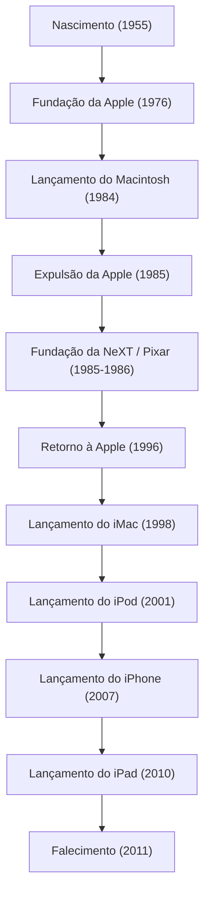

Na sociedade digital moderna, o fato de tocarmos naturalmente em nossos smartphones, digitarmos textos com fontes belas e carregarmos música no bolso se deve, sem exagero, a um único empreendedor carismático. Steve Jobs — cofundador da Apple e o homem que esteve constantemente na intersecção entre tecnologia e arte. Sua vida foi repleta de reviravoltas dramáticas, para as quais a palavra turbulenta não é suficiente, e de uma filosofia inabalável.

Neste artigo, vamos explorar profundamente a vida de Jobs, a filosofia que permeava sua essência e o imensurável impacto que ele deixou na sociedade moderna.

## 1. Origens e o Nascimento da Apple: "Stay hungry, stay foolish"

Nascido em São Francisco em 1955, Steve Jobs foi criado por pais adotivos. Desde menino, ele tinha um forte interesse por eletrônica, trabalhando em meio período em uma fábrica da Hewlett-Packard e crescendo enquanto sentia na pele a atmosfera dos primórdios do Vale do Silício e a evolução da tecnologia. Embora tenha ingressado no Reed College, não conseguiu se interessar pelas disciplinas obrigatórias e abandonou os estudos após seis meses. No entanto, as aulas de caligrafia que ele frequentou como ouvinte posteriormente se conectaram à bela tipografia do Macintosh, tornando-se a origem de sua teoria de vida de "conectar os pontos" (Connecting the dots).

Em 1976, Jobs, junto com seu amigo Steve Wozniak, fundou a Apple Computer na garagem de seus pais. Com o grande sucesso do "Apple I" e do "Apple II", os dois abriram um novo mercado de computadores pessoais. Eles transformaram o computador, que era uma mera máquina de calcular, em uma "ferramenta pessoal" que qualquer pessoa poderia usar em casa.

## 2. Glória, Expulsão e Ressurreição

A Apple parecia estar indo de vento em popa, mas após o anúncio do "Macintosh" em 1984, Jobs foi expulso da empresa que ele mesmo fundou devido a conflitos políticos internos. No entanto, esse revés acabou refinando ainda mais sua criatividade.

Jobs imediatamente fundou a "NeXT" para desenvolver estações de trabalho avançadas para o mercado educacional. Além disso, ele comprou a divisão de computação gráfica de George Lucas e lançou a "Pixar". A Pixar reescreveu a história dos filmes de animação com o sucesso mundial de "Toy Story".

Enquanto isso, a Apple, sem Jobs, encontrava-se em uma grave crise financeira. Presa no desenvolvimento de seu próximo sistema operacional, a Apple precisava da tecnologia de SO da NeXT e comprou a empresa em 1996. Assim, Jobs fez seu retorno milagroso à Apple.

## 3. A Revolução do 'i': Inovações que Redefiniram o Mundo

Após seu retorno, Jobs simplificou drasticamente a linha de produtos da Apple para salvar a empresa, que estava à beira da falência. Então, em 1998, ele anunciou o "iMac" translúcido e colorido, revolucionando as mesas de escritórios e lares ao redor do mundo.

A partir daí, começou o avanço implacável de Jobs.
O lançamento do "iPod" e da iTunes Store em 2001 destruiu fundamentalmente o modelo de negócios da indústria da música e mudou completamente a forma como as pessoas ouviam música. E em 2007, nasceu o "iPhone", um dispositivo que mudou a história. Integrando um telefone, um navegador de internet e um iPod em um único aparelho, com uma interface multitoque, o iPhone redefiniu tudo, desde a comunicação das pessoas até o estilo de vida. Em 2010, ele anunciou o "iPad", estabelecendo um novo mercado para tablets.

## 4. A Intersecção entre Tecnologia e Artes Liberais: A Filosofia de Jobs

O que elevou Jobs a mais do que apenas o líder de uma empresa de tecnologia foi seu extremo "perfeccionismo" e sua "estética". Colocando a "experiência do usuário (UX)" acima de tudo, e sendo meticuloso até mesmo sobre a beleza da fiação nas placas de circuito, sua atitude às vezes causava intensos conflitos com as pessoas ao seu redor. No entanto, foi por causa dessa busca intransigente que os produtos da Apple transcenderam meros bens industriais para se tornarem dispositivos mágicos que apelavam às emoções das pessoas.

Ele frequentemente usava a frase "a intersecção entre tecnologia e artes liberais (humanidades)". A identidade da Apple é o resultado não apenas de buscar especificações técnicas, mas de questionar constantemente como isso pode enriquecer a vida humana e o que é um design intuitivo de usar.

## 5. Impacto nas Gerações Futuras e Legado Eterno

Em 5 de outubro de 2011, Steve Jobs faleceu aos 56 anos, após uma longa batalha contra o câncer de pâncreas. No entanto, a filosofia que ele deixou não perdeu seu brilho.

Os smartphones que tiramos do bolso todos os dias, os dados sincronizados na nuvem, a operação intuitiva por toque. Tudo isso é uma extensão da visão que Jobs imaginou. Ele não apenas criou produtos excelentes; ele provou, através de sua vida, que "o futuro pode ser criado com nossas próprias mãos".

"Stay hungry, stay foolish" (Mantenham-se famintos, mantenham-se tolos).
Essas palavras de seu lendário discurso de formatura na Universidade de Stanford continuam gravadas nos corações de empreendedores e criadores de todo o mundo. Sua paixão e visão intransigentes continuarão a ser um farol iluminando a indústria de tecnologia e o progresso da humanidade.
