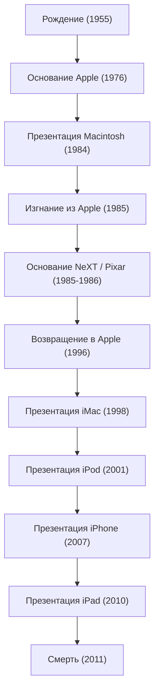

В современном цифровом обществе то, что мы как само собой разумеющееся пользуемся смартфонами, печатаем тексты красивыми шрифтами и носим музыку в кармане, без преувеличения, является заслугой одного харизматичного предпринимателя. Стив Джобс — сооснователь Apple и человек, который всегда стоял на стыке технологий и искусства. Его жизнь была полна драматических событий, для описания которых не хватит слов "бурная и непредсказуемая", и непоколебимой философии.

В этой статье мы глубоко погрузимся в жизнь Джобса, лежащую в ее основе философию и то неизмеримое влияние, которое он оказал на современное общество.

## 1. Истоки и рождение Apple: «Оставайтесь голодными, оставайтесь безрассудными» (Stay hungry, stay foolish)

Стив Джобс, родившийся в Сан-Франциско в 1955 году, воспитывался приемными родителями. С юных лет он проявлял сильный интерес к электронике и рос, впитывая атмосферу зарождающейся Кремниевой долины и эволюцию технологий, подрабатывая на заводе Hewlett-Packard. Поступив в Рид-колледж, он бросил его через полгода, не заинтересовавшись обязательными предметами. Однако занятия по каллиграфии, на которые он проникал нелегально, позже привели к созданию красивой типографики Macintosh и стали отправной точкой его жизненной философии «соединения точек» (Connecting the dots).

В 1976 году Джобс вместе со своим близким другом Стивом Возняком основал Apple Computer в гараже своих родителей. Благодаря огромному успеху «Apple I» и «Apple II» они открыли новый рынок персональных компьютеров. Они превратили компьютеры, которые были просто вычислительными машинами, в «инструменты для людей», которые каждый мог использовать дома.

## 2. Слава, изгнание и возвращение

Хотя казалось, что у Apple все идет гладко, после презентации «Macintosh» в 1984 году Джобс был изгнан из компании, которую он сам же и основал, из-за внутрикорпоративных политических конфликтов. Однако эта неудача лишь обострила его креативность.

Джобс немедленно основал компанию «NeXT» для разработки продвинутых рабочих станций для образовательного рынка. Кроме того, он купил подразделение компьютерной графики у Джорджа Лукаса и запустил «Pixar». Pixar переписала историю анимационных фильмов благодаря мировому успеху «Истории игрушек».

Тем временем Apple, оставшись без Джобса, погрузилась в глубокий финансовый кризис. Зайдя в тупик в разработке операционной системы следующего поколения, Apple понадобились технологии ОС от NeXT, и в 1996 году она приобрела эту компанию. Так Джобс совершил чудесное возвращение в Apple.

## 3. i-Революция: Инновации, переопределившие мир

После своего возвращения Джобс радикально сократил линейку продуктов, чтобы спасти Apple, находившуюся на грани банкротства. И в 1998 году он представил полупрозрачный и яркий «iMac», произведя революцию на столах в офисах и домах по всему миру.

С этого момента начинается стремительное восхождение Джобса.
Появление «iPod» и iTunes Store в 2001 году в корне разрушило бизнес-модель музыкальной индустрии и навсегда изменило способ прослушивания музыки. А в 2007 году на свет появилось устройство, изменившее ход истории — «iPhone». Объединив телефон, интернет-браузер и iPod в одном устройстве с мультисенсорным интерфейсом, iPhone переопределил всё: от того, как люди общаются, до их образа жизни. Затем, в 2010 году, он представил «iPad», создав новый рынок планшетных компьютеров.

## 4. На стыке технологий и гуманитарных наук: философия Джобса

То, что возвысило Джобса над обычными руководителями технологических компаний, — это его абсолютный «перфекционизм» и «эстетика». Его отношение, при котором «пользовательский опыт (UX)» ставился превыше всего, вплоть до одержимости красотой разводки на печатной плате, порой приводило к ожесточенным конфликтам с окружающими. Однако именно благодаря этому бескомпромиссному стремлению продукты Apple вышли за рамки простых промышленных товаров и стали волшебными устройствами, вызывающими эмоциональный отклик у людей.

Он часто использовал фразу «пересечение технологий и гуманитарных наук (либеральных искусств)». Идентичность Apple стала результатом не только стремления к техническим характеристикам, но и постоянных вопросов о том, как это может обогатить жизнь людей, и что такое интуитивно понятный дизайн.

## 5. Влияние на потомков и вечное наследие

5 октября 2011 года, после долгой борьбы с раком поджелудочной железы, Стив Джобс ушел из жизни в возрасте 56 лет. Однако его философия до сих пор не утратила своей актуальности.

Смартфоны, которые мы каждый день достаем из кармана, данные, синхронизируемые в облаке, интуитивно понятное сенсорное управление. Всё это является продолжением видения Джобса. Он не просто создавал отличные продукты, но и доказал всей своей жизнью, что «будущее можно создать своими руками».

«Оставайтесь голодными, оставайтесь безрассудными» (Stay hungry, stay foolish).
Эти слова, произнесенные в легендарной речи на выпускном в Стэнфордском университете, до сих пор врезаны в сердца предпринимателей и творцов по всему миру. Его бескомпромиссная страсть и видение будут продолжать служить путеводной звездой для технологической индустрии и прогресса человечества.
