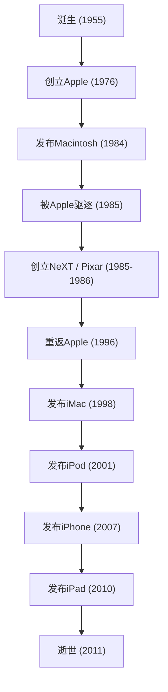

在当今数字社会中，我们能够理所当然地接触智能手机，用优美的字体打字，将音乐放在口袋里随身携带，这可以说都要归功于一位极具个人魅力的企业家。史蒂夫·乔布斯——苹果公司的联合创始人，一个始终站在科技与艺术交汇处的男人。他的一生充满了用“波澜壮阔”一词都远不足以形容的戏剧性展开，以及坚定不移的哲学。

本文将深入探讨乔布斯的一生及其根底中流淌的哲学，以及他给现代社会留下的不可估量的影响。

## 1. 原点与Apple的诞生：“求知若饥，虚心若愚” (Stay hungry, stay foolish)

1955年出生于旧金山的史蒂夫·乔布斯，在养父母的抚养下长大。他从少年时代起就对电子设备抱有浓厚的兴趣，曾在惠普工厂打工，在亲身感受硅谷黎明期氛围和科技进化的过程中成长。虽然进入了里德学院，但因对必修科目不感兴趣而在半年后辍学。然而，他旁听的书法课程，后来促成了Macintosh优美的排版，这也成为了他“将点点滴滴串连起来 (Connecting the dots)”人生观的原点。

1976年，乔布斯与挚友史蒂夫·沃兹尼亚克一起，在自家车库创立了Apple Computer。“Apple I”以及“Apple II”的巨大成功，使两人开辟了个人电脑这一全新市场。他们将仅仅是计算器的电脑，变成了任何人都能在家里使用的“个人工具”。

## 2. 荣耀、驱逐与复出

Apple的航程看似一帆风顺，但在1984年发布“Macintosh”后，由于公司内部政治冲突，乔布斯被自己创立的公司驱逐。然而，这次挫折反而进一步磨砺了他的创造力。

乔布斯立即创立了“NeXT”，开发面向教育市场的高级工作站。此外，他从乔治·卢卡斯手中收购了计算机图形部门，创立了“Pixar”。Pixar凭借《玩具总动员》的全球热映，改写了动画电影的历史。

另一方面，失去乔布斯的Apple陷入了严重的经营危机。在下一代操作系统开发上陷入僵局的Apple需要NeXT的OS技术，于1996年收购了NeXT。就这样，乔布斯奇迹般地重返了Apple。

## 3. i的革命：重新定义世界的创新

复出后的乔布斯，为了重振濒临破产的Apple，对产品线进行了彻底的精简。然后在1998年，发布了半透明且色彩缤纷的“iMac”，在全世界的办公室和家庭书桌上引发了革命。

从此，乔布斯势如破竹的进击开始了。
2001年“iPod”和iTunes Store的出现，从根本上颠覆了音乐产业的商业模式，彻底改变了人们听音乐的方式。接着在2007年，改变历史的设备“iPhone”诞生了。将电话、互联网浏览器和iPod整合到一个设备中，并采用多点触控界面的iPhone，从人们的沟通方式到生活方式，重新定义了一切。在随后的2010年，他发布了“iPad”，确立了平板电脑这一全新市场。

## 4. 科技与人文的交汇点：乔布斯的哲学

将乔布斯推向超越一家单纯科技企业经营者地位的，是他彻底的“完美主义”和“美学”。将“用户体验 (UX)”置于首位，甚至对电路板布线的美感都斤斤计较的态度，有时会引发与周围人的激烈冲突。然而，正因为有这种不妥协的追求，Apple产品才能超越单纯的工业产品，成为能够诉诸人们情感的魔法设备。

他经常使用“科技与人文的交汇点”这句话。不单纯追求技术规格，而是不断追问它将如何丰富人类生活、什么是直观易用的设计，其结果就构成了Apple的认同感。

## 5. 对后世的影响与永恒的遗产

2011年10月5日，史蒂夫·乔布斯在与胰腺癌长期抗争后离世，享年56岁。然而，他留下的哲学至今依然光彩夺目。

我们每天从口袋里掏出的智能手机、在云端同步的数据、直观的触控操作。这一切都是乔布斯所构想愿景的延伸。他不仅创造了卓越的产品，更用自己的一生证明了“未来可以由自己的双手创造”。

“求知若饥，虚心若愚 (Stay hungry, stay foolish)”。
这段在斯坦福大学传奇般的毕业典礼演讲中说出的话语，至今仍铭刻在全世界企业家和创作者的心中。他毫不妥协的热情和愿景，将继续成为照亮科技界以及人类进步之路的灯塔。
