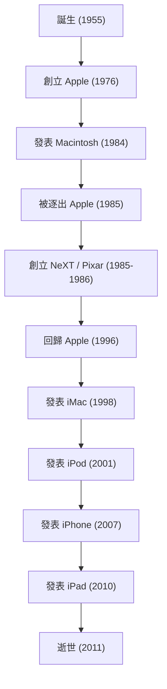

現代的數位社會中，我們之所以能理所當然地觸控智慧型手機、用優美的字體打字、將音樂放進口袋隨身攜帶，說這全都要歸功於一位極具魅力的企業家，一點也不為過。史蒂夫·賈伯斯——Apple 的共同創辦人，一位始終站在科技與藝術交會點的男人。他的一生，波瀾萬丈這個詞完全不足以形容其戲劇性的發展，且充滿了堅定的哲學。

本文將深入探討賈伯斯的一生及其底層流淌的哲學，以及他對現代社會留下的不可估量之影響。

## 1. 原點與 Apple 的誕生：「Stay hungry, stay foolish」

1955 年，出生於舊金山的史蒂夫·賈伯斯，在養父母的撫養下長大。從小就對電子設備抱有強烈興趣，曾在惠普（Hewlett-Packard）工廠打工等，在親身感受矽谷黎明期的氛圍與科技演進的環境中成長。儘管進入了里德學院（Reed College）就讀，卻對必修科目不感興趣而於半年後輟學。然而，他偷偷旁聽的西洋書法（Calligraphy）課程，日後卻連結到了 Macintosh 優美的排版字體等，這成為了他「把點連接起來（Connecting the dots）」人生觀的原點。

1976 年，賈伯斯與盟友史蒂夫·沃茲尼克（Steve Wozniak）一起，在老家的車庫創立了 Apple Computer。藉由「Apple I」以及「Apple II」的巨大成功，兩人開拓了個人電腦這個全新市場。他們將原本只是計算機的電腦，變革為人人都能在家使用的「為個人而生的工具」。

## 2. 榮耀、放逐，以及回歸

看似一帆風順的 Apple，在 1984 年發表「Macintosh」後，賈伯斯卻因公司內部的政治鬥爭，而被自己親手建立的公司放逐。然而，這次的挫折卻讓他的創造力變得更加銳利。

賈伯斯隨即創立了開發針對教育市場的高階工作站的「NeXT」。接著，又從喬治·盧卡斯手中收購了電腦動畫部門，成立了「Pixar」。Pixar 憑藉《玩具總動員》在世界各地的熱賣，改寫了動畫電影的歷史。

另一方面，沒有賈伯斯的 Apple 陷入了嚴重的經營危機。在次世代作業系統開發上陷入僵局的 Apple，需要 NeXT 的 OS 技術，並於 1996 年收購了 NeXT。就這樣，賈伯斯奇蹟似地達成了回歸 Apple 的壯舉。

## 3. i 的革命：重新定義世界的創新

回歸後的賈伯斯，為了重整瀕臨破產的 Apple，徹底整頓了產品線。接著在 1998 年，發表了半透明且色彩繽紛的「iMac」，在全世界的辦公室與家庭書桌上掀起了革命。

從此，賈伯斯的勢如破竹之勢展開了。
2001 年的「iPod」與 iTunes Store 的登場，從根本顛覆了音樂產業的商業模式，讓聽音樂的方式為之一變。接著在 2007 年，改變歷史的裝置「iPhone」誕生。將電話、網路瀏覽器、iPod 整合於單一裝置中，並採用多點觸控介面的 iPhone，從人們的溝通到生活方式，重新定義了一切事物。隨後在 2010 年發表了「iPad」，確立了平板電腦這個全新市場。

## 4. 科技與博雅教育的交會點：賈伯斯的哲學

將賈伯斯推向超越單純科技企業經營者存在的，是他徹底的「完美主義」與「美學」。將「使用者體驗（UX）」置於最優先，甚至講究電路板佈線之美的態度，有時會與周遭產生激烈的衝突。然而，正因為有那份不妥協的追求，Apple 的產品才能超越單純的工業產品，成為訴諸人們情感、宛如魔法般的裝置。

他經常使用「科技與博雅教育（人文科學）的交會點」這句話。不僅追求技術規格，還不斷叩問科技將如何豐富人類生活、何謂直覺式設計，其結果便成為了 Apple 的自我認同（Identity）。

## 5. 對後世的影響與永遠的遺產

2011 年 10 月 5 日，史蒂夫·賈伯斯在與胰臟癌長期抗爭後辭世，享年 56 歲。然而，他留下的哲學至今依然未曾褪色。

我們每天從口袋拿出的智慧型手機、在雲端同步的資料、直覺的觸控操作。這一切都在賈伯斯所描繪的願景之延長線上。他不僅僅是打造出優秀的產品，更以其一生證明了「未來是可以靠自己的雙手創造出來的」。

「求知若飢，虛心若愚（Stay hungry, stay foolish）」。
這句在史丹佛大學傳奇的畢業典禮演講中說出的話語，至今依然深深刻印在全世界創業者與創作者們的心中。他那不妥協的熱情與願景，未來也將繼續成為照亮科技產業以及人類進步的指標。
