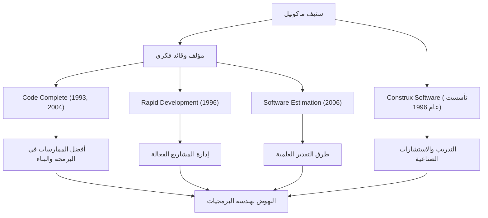

أي شخص يشارك في تطوير البرمجيات من المحتمل أن يكون قد صادف الكتاب الضخم والرائع بعنوان *Code Complete* (الشيفرة الكاملة). مؤلفه، ستيف ماكونيل، هو شخصية كرست حياتها لإحلال النظام في مهمة البرمجة الفوضوية وتأسيس "هندسة البرمجيات" (Software Engineering) بمعناها الحقيقي. يتعمق هذا المقال في حياته، وفلسفته الفريدة، والتأثير الهائل الذي يستمر في إحداثه على مشهد التطوير الحديث.

## مسيرة مهنية تسد الفجوة بين الأوساط الأكاديمية والميدان

بدأ ستيف ماكونيل حياته المهنية في عصر كانت فيه صناعة البرمجيات لا تزال تعتمد بشدة على "ثقافة الهاكرز" و "الحرفية". بعد حصوله على درجة الماجستير في هندسة البرمجيات من جامعة سياتل، عمل في مجموعة متنوعة من المشاريع في شركات التكنولوجيا العملاقة مثل مايكروسوفت وبوينغ، بدءًا من برامج سطح المكتب إلى الأنظمة الحيوية لمهام صناعة الطيران والفضاء.

ومع اكتسابه الخبرة في الميدان، لاحظ "فجوة هائلة" بين النظريات الأكاديمية وواقع تطوير البرمجيات على أرض الواقع. منهجيات التطوير المثالية التي تدرس في الجامعات لم تكن تعمل كما هي في الميدان، بينما من ناحية أخرى، كانت ممارسات البرمجة المخصصة والمعتمدة على الأفراد متفشية في الخطوط الأمامية.

لحل هذه المشكلة، نشر كتاب *Code Complete* في عام 1993. دمج هذا الكتاب ببراعة نتائج الأبحاث الأكاديمية مع أفضل الممارسات في الصناعة، وسرعان ما أصبح الكتاب المقدس للمطورين في جميع أنحاء العالم كدليل عملي ومنهجي لبناء البرمجيات. لاحقًا، في عام 1996، ولتعزيز ممارسته ونشر فلسفته، أسس شركة Construx Software، وهي شركة تقدم استشارات وتدريب في مجال تطوير البرمجيات، ويستمر في دعم العديد من الشركات بصفته الرئيس التنفيذي ورئيس مهندسي البرمجيات.

## فلسفة تعزز التحول من الحرفية إلى "الهندسة"

الفلسفة الأساسية لماكونيل هي أن "تطوير البرمجيات يجب ألا يكون مجرد فن أو حرفية، بل يجب أن يكون 'هندسة' (Engineering) منهجية ويمكن التنبؤ بها."

الموضوع المركزي الذي يمتد عبر جميع أعماله هو "إدارة التعقيد" (managing complexity). ويشير إلى أن السبب الأكبر لفشل مشاريع البرمجيات هو التعقيد الذي لا يمكن السيطرة عليه. ولذلك، جادل بأن تصميم بنية ممتازة، ووضع معايير برمجة واضحة، واستخدام اصطلاحات تسمية مقروءة للغاية، وبناء الجودة من المراحل الأولية هي عمليات أساسية.

لديه أيضًا رؤى عميقة حول "التقدير" (Estimation). في كتابه *Software Estimation: Demystifying the Black Art*، يؤكد أن "التقدير ليس مفاوضة" (estimation is not negotiation) وقدم طرقًا للمطورين لإنشاء تقديرات علمية بناءً على بيانات احتمالية وموضوعية، دون الخضوع للضغوط من الجانب التجاري. أصبح هذا سلاحًا قويًا أنقذ العديد من مديري المشاريع والمطورين من مسيرات الموت الوحشية.

## رسم بياني مترابط للإنجازات والتأثير

تم تلخيص إنجازاته المتنوعة وكيفية مساهمتها في تطوير صناعة البرمجيات في الرسم البياني التالي:

## إرث راسخ للأجيال القادمة

التأثير الذي أحدثه ستيف ماكونيل على تطوير البرمجيات الحديثة لا يمكن قياسه. العديد من الممارسات التي نأخذها كأمر مسلم به اليوم - مثل مراجعات الكود، وإعادة الهيكلة، والتكامل المستمر، والكود الموثق ذاتيًا - مبنية على المفاهيم التي دافع عنها ونظمها في *Code Complete* و *Rapid Development*.

حتى في عصر اليوم السائد لتطوير أجايل (Agile) و DevOps، لم تتلاش تعاليمه على الإطلاق. بل على العكس، في دورات التطوير سريعة التغير، أصبح دعوته إلى "أساس متين في البرمجة" و "موقف الجودة أولاً" أكثر أهمية من أي وقت مضى. البرمجيات ذات الأساس الهش ستنهار في النهاية تحت وطأة الديون الفنية، بغض النظر عن مدى سرعة تكرار الإصدارات.

يعد ستيف ماكونيل أحد أعظم المساهمين الذين ارتقوا بالمبرمجين من مجرد "أشخاص يكتبون الكود" إلى "مهندسي برمجيات" فخورين ومسؤولين عن الجودة والعملية. ستستمر الرؤى والكتابات التي يتركها وراءه في القراءة عبر الأجيال، لتكون بمثابة دليل ثابت لبناء البرمجيات في المستقبل.
