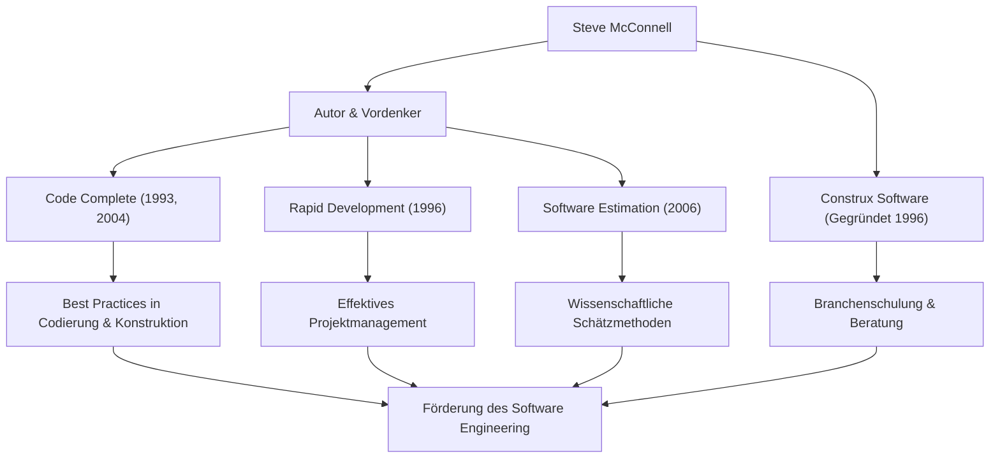

Jeder, der mit Softwareentwicklung zu tun hat, ist wahrscheinlich schon auf das dicke, meisterhafte Buch mit dem Titel *Code Complete* gestoßen. Sein Autor, Steve McConnell, ist eine Persönlichkeit, die ihr Leben der Aufgabe gewidmet hat, Ordnung in die chaotische Aufgabe der Programmierung zu bringen und das „Software Engineering“ im wahrsten Sinne des Wortes zu etablieren. Dieser Artikel befasst sich eingehend mit seinem Leben, seiner einzigartigen Philosophie und dem immensen Einfluss, den er weiterhin auf die moderne Entwicklungsszene hat.

## Eine Karriere, die die Lücke zwischen Wissenschaft und Praxis schließt

Steve McConnell begann seine Karriere in einer Zeit, in der sich die Softwareindustrie noch stark auf die „Hacker-Kultur“ und das „Handwerk“ verließ. Nach seinem Master-Abschluss in Software Engineering an der Seattle University arbeitete er an einer Vielzahl von Projekten bei Technologiegiganten wie Microsoft und Boeing, die von Desktop-Software bis hin zu unternehmenskritischen Systemen für die Luft- und Raumfahrtindustrie reichten.

Als er praktische Erfahrungen sammelte, bemerkte er eine „massive Lücke“ zwischen akademischen Theorien und der Realität der Softwareentwicklung vor Ort. Die an Universitäten gelehrten idealen Entwicklungsmethoden funktionierten in der Praxis nicht so, wie sie waren, während auf der anderen Seite hochgradig personenabhängige und Ad-hoc-Codierungspraktiken an der Tagesordnung waren.

Um dieses Problem zu lösen, veröffentlichte er 1993 *Code Complete*. Dieses Buch integrierte meisterhaft akademische Forschungsergebnisse mit Best Practices der Branche und wurde als praktischer und systematischer Leitfaden für die Softwareerstellung schnell zur Bibel für Entwickler weltweit. Um seine Philosophie weiter in die Praxis umzusetzen und zu verbreiten, gründete er 1996 Construx Software, ein Unternehmen, das Beratung und Schulung für Softwareentwicklung anbietet, und unterstützt weiterhin zahlreiche Unternehmen als CEO und Chief Software Engineer.

## Eine Philosophie zur Förderung des Wandels vom Handwerk zur „Ingenieurskunst“

Die grundlegende Philosophie von McConnell ist, dass „Softwareentwicklung nicht bloße Kunst oder Handwerk sein sollte, sondern vorhersehbares und systematisiertes 'Engineering' (Ingenieurwesen).“

Das zentrale Thema, das sich durch alle seine Werke zieht, ist „Umgang mit Komplexität“. Er weist darauf hin, dass die Hauptursache für das Scheitern von Softwareprojekten unkontrollierbare Komplexität ist. Daher argumentierte er, dass der Entwurf einer exzellenten Architektur, die Festlegung klarer Codierungsstandards, die Verwendung gut lesbarer Namenskonventionen und die Integration von Qualität von den Anfangsstadien an wesentliche Prozesse sind.

Er hat auch tiefe Einblicke in die „Schätzung“ (Estimation). In seinem Buch *Software Estimation: Demystifying the Black Art* stellt er fest, dass „Schätzung keine Verhandlung ist“ und präsentierte Methoden für Entwickler, um wissenschaftliche Schätzungen auf der Grundlage objektiver Daten und Wahrscheinlichkeiten zu erstellen, ohne dem Druck der geschäftlichen Seite nachzugeben. Dies wurde zu einer mächtigen Waffe, die viele Projektmanager und Entwickler vor brutalen Death Marches rettete.

## Korrelationsdiagramm von Erfolgen und Auswirkungen

Seine vielfältigen Errungenschaften und wie sie zur Entwicklung der Softwareindustrie beitragen, sind im folgenden Diagramm zusammengefasst.

## Ein unerschütterliches Vermächtnis für zukünftige Generationen

Der Einfluss, den Steve McConnell auf die moderne Softwareentwicklung hatte, ist unermesslich. Viele der Praktiken, die wir heute als selbstverständlich ansehen – wie Code-Reviews, Refactoring, kontinuierliche Integration und selbstdokumentierender Code – bauen auf den Konzepten auf, die er in *Code Complete* und *Rapid Development* befürwortet und organisiert hat.

Auch in der heutigen Mainstream-Ära der agilen Entwicklung und DevOps sind seine Lehren keineswegs verblasst. Vielmehr ist in sich schnell ändernden Entwicklungszyklen sein Eintreten für ein „solides Fundament in der Codierung“ und eine „Quality-First-Einstellung“ wichtiger denn je. Software mit einem anfälligen Fundament wird letztendlich unter dem Gewicht der technischen Schulden zusammenbrechen, egal wie schnell Veröffentlichungen wiederholt werden.

Steve McConnell ist einer der größten Mitwirkenden, der Programmierer von bloßen „Leuten, die Code schreiben“ zu stolzen „Software-Ingenieuren“ erhoben hat, die für Qualität und Prozesse verantwortlich sind. Die Erkenntnisse und Schriften, die er hinterlässt, werden über Generationen hinweg gelesen werden und als unumstößlicher Wegweiser für die zukünftige Softwareerstellung dienen.
