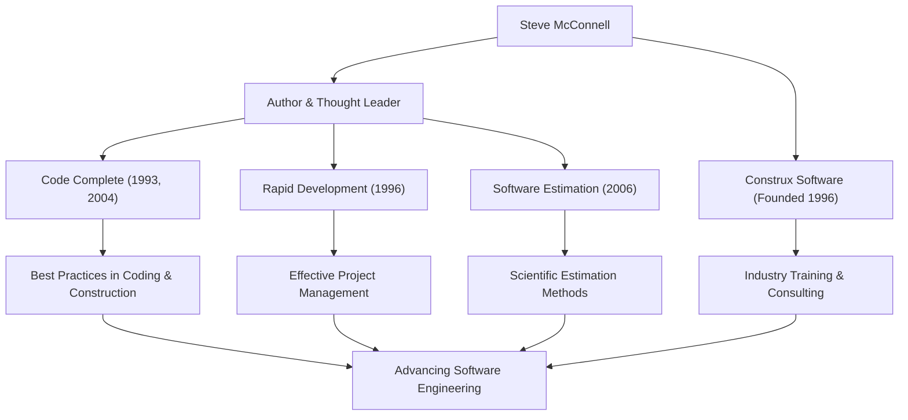

Anyone involved in software development has likely come across the thick, masterful book titled *Code Complete*. Its author, Steve McConnell, is a figure who has dedicated his life to bringing order to the chaotic task of programming and establishing "Software Engineering" in its truest sense. This article delves deeply into his life, his unique philosophy, and the immense influence he continues to have on the modern development scene.

## A Career Bridging the Gap Between Academia and the Field

Steve McConnell started his career during an era when the software industry still relied heavily on "hacker culture" and "craftsmanship". After earning his Master's degree in Software Engineering from Seattle University, he worked on a variety of projects at tech giants like Microsoft and Boeing, ranging from desktop software to mission-critical systems for the aerospace industry.

As he gained experience in the field, he noticed a "massive gap" between academic theories and the realities of software development on the ground. The ideal development methodologies taught in universities did not work as-is in the field, while on the other hand, highly dependent and ad-hoc coding practices were rampant on the front lines.

To solve this problem, he published *Code Complete* in 1993. This book masterfully integrated academic research findings with industry best practices, quickly becoming the bible for developers worldwide as a practical and systematic guide for software construction. Later, in 1996, to further practice and spread his philosophy, he founded Construx Software, a company providing software development consulting and training, and continues to support numerous companies as its CEO and Chief Software Engineer.

## A Philosophy Promoting the Shift from Craftsmanship to "Engineering"

McConnell's underlying philosophy is that "software development should not be mere art or craftsmanship, but a predictable and systematized 'Engineering'."

The central theme running through all his works is "managing complexity". He points out that the biggest cause of software project failures is uncontrollable complexity. Therefore, he argued that designing excellent architecture, establishing clear coding standards, using highly readable naming conventions, and building in quality from the initial stages are essential processes.

He also has deep insights into "Estimation". In his book *Software Estimation: Demystifying the Black Art*, he asserts that "estimation is not negotiation" and presented methods for developers to create scientific estimates based on objective data and probability, without yielding to pressure from the business side. This became a powerful weapon that saved many project managers and developers from brutal death marches.

## Correlation Diagram of Achievements and Impact

His diverse achievements and how they contribute to the development of the software industry are summarized in the following diagram.

## An Unshakeable Legacy for Future Generations

The impact Steve McConnell has had on modern software development is immeasurable. Many of the practices we take for granted today—such as code reviews, refactoring, continuous integration, and self-documenting code—are built upon the concepts he advocated and organized in *Code Complete* and *Rapid Development*.

Even in today's mainstream era of Agile development and DevOps, his teachings have not faded at all. Rather, in fast-changing development cycles, his advocacy for a "solid foundation in coding" and a "quality-first attitude" are more important than ever. Software with a fragile foundation will ultimately collapse under the weight of technical debt, no matter how quickly releases are repeated.

Steve McConnell is one of the greatest contributors who elevated programmers from mere "people who write code" to proud "software engineers" responsible for quality and process. The insights and writings he leaves behind will continue to be read across generations, serving as an immovable guidepost for software construction in the future.
