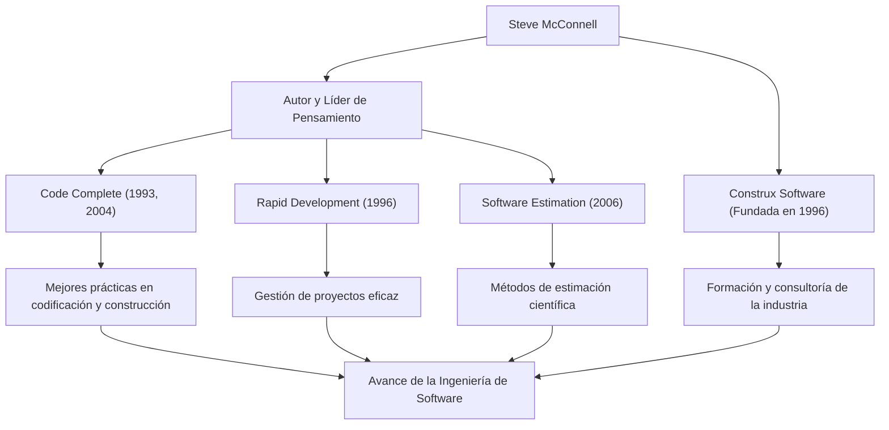

Cualquiera que esté involucrado en el desarrollo de software probablemente se haya encontrado con el grueso y magistral libro titulado *Code Complete* (Código Completo). Su autor, Steve McConnell, es una figura que ha dedicado su vida a poner orden en la caótica tarea de la programación y establecer la "Ingeniería de Software" (Software Engineering) en su sentido más verdadero. Este artículo profundiza en su vida, su filosofía única y la inmensa influencia que continúa ejerciendo en la escena del desarrollo moderno.

## Una carrera que redujo la brecha entre la academia y el campo laboral

Steve McConnell comenzó su carrera durante una época en la que la industria del software todavía dependía en gran medida de la "cultura hacker" y la "artesanía". Después de obtener su maestría en Ingeniería de Software en la Universidad de Seattle, trabajó en una variedad de proyectos en gigantes tecnológicos como Microsoft y Boeing, abarcando desde software de escritorio hasta sistemas de misión crítica para la industria aeroespacial.

A medida que acumulaba experiencia en el campo, notó una "brecha masiva" entre las teorías académicas y las realidades del desarrollo de software en la práctica. Las metodologías de desarrollo ideales que se enseñaban en las universidades no funcionaban tal cual en el mundo real, mientras que, por otro lado, las prácticas de codificación ad hoc y dependientes de las personas abundaban en primera línea.

Para resolver este problema, publicó *Code Complete* en 1993. Este libro integró magistralmente los hallazgos de la investigación académica con las mejores prácticas de la industria, convirtiéndose rápidamente en la biblia de los desarrolladores en todo el mundo como una guía práctica y sistemática para la construcción de software. Más tarde, en 1996, para poner en práctica y difundir aún más su filosofía, fundó Construx Software, una empresa que ofrece consultoría y capacitación en desarrollo de software, y continúa apoyando a numerosas empresas como su CEO y Arquitecto Jefe de Software.

## Una filosofía que promueve el cambio de artesanía a "Ingeniería"

La filosofía subyacente de McConnell es que "el desarrollo de software no debe ser un mero arte o artesanía, sino una 'Ingeniería' predecible y sistematizada".

El tema central que atraviesa todas sus obras es la "gestión de la complejidad". Señala que la principal causa de los fracasos de los proyectos de software es la complejidad incontrolable. Por lo tanto, argumentó que diseñar una arquitectura excelente, establecer estándares de codificación claros, usar convenciones de nomenclatura altamente legibles e integrar la calidad desde las etapas iniciales son procesos esenciales.

También tiene profundos conocimientos sobre la "Estimación". En su libro *Software Estimation: Demystifying the Black Art*, afirma que "la estimación no es negociación" y presentó métodos para que los desarrolladores creen estimaciones científicas basadas en datos objetivos y probabilidades, sin ceder a la presión del lado empresarial. Esto se convirtió en un arma poderosa que salvó a muchos gerentes de proyectos y desarrolladores de las brutales marchas de la muerte.

## Diagrama de correlación de logros e impacto

Sus diversos logros y cómo contribuyen al desarrollo de la industria del software se resumen en el siguiente diagrama.

## Un legado inquebrantable para las generaciones futuras

El impacto que Steve McConnell ha tenido en el desarrollo de software moderno es inmensurable. Muchas de las prácticas que hoy damos por sentadas, como las revisiones de código, la refactorización, la integración continua y el código autodocumentado, se basan en los conceptos que propuso y organizó en *Code Complete* y *Rapid Development*.

Incluso en la era actual donde el desarrollo Ágil y DevOps son predominantes, sus enseñanzas no se han desvanecido en absoluto. Más bien, en los ciclos de desarrollo de cambios rápidos, su defensa de una "base sólida de codificación" y una "actitud de calidad primero" son más importantes que nunca. El software con una base frágil colapsará bajo el peso de la deuda técnica sin importar qué tan rápido se repitan los lanzamientos.

Steve McConnell es uno de los mayores contribuyentes que elevó a los programadores de ser simplemente "personas que escriben código" a "ingenieros de software" orgullosos y responsables de la calidad y el proceso. Los conocimientos y escritos que deja atrás continuarán siendo leídos de generación en generación, sirviendo como un faro inamovible para la construcción de software en el futuro.
