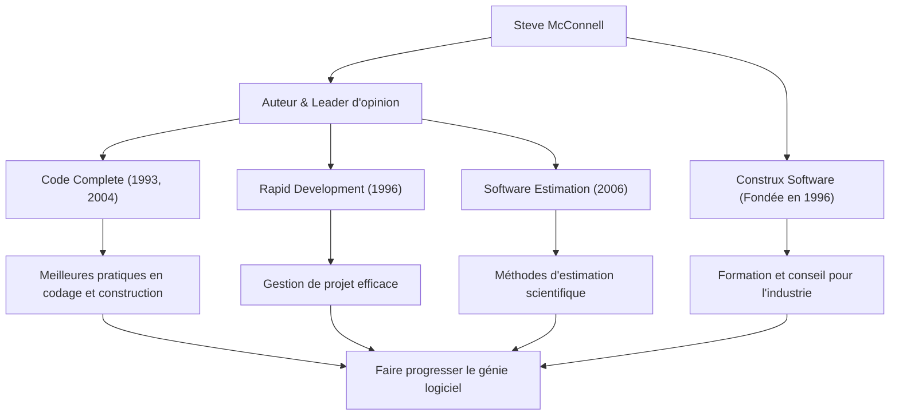

Quiconque est impliqué dans le développement de logiciels a probablement croisé l'épais et magistral ouvrage intitulé *Code Complete*. Son auteur, Steve McConnell, est une figure qui a consacré sa vie à mettre de l'ordre dans la tâche chaotique qu'est la programmation, et à établir le « Génie logiciel » (Software Engineering) dans son sens le plus vrai. Cet article plonge au cœur de sa vie, de sa philosophie unique et de l'influence immense qu'il continue d'exercer sur la scène du développement moderne.

## Une carrière comblant le fossé entre le monde académique et le terrain

Steve McConnell a commencé sa carrière à une époque où l'industrie du logiciel s'appuyait encore fortement sur la « culture hacker » et « l'artisanat ». Après avoir obtenu sa maîtrise en génie logiciel à l'Université de Seattle, il a travaillé sur une variété de projets chez des géants de la technologie comme Microsoft et Boeing, allant des logiciels de bureau aux systèmes critiques pour l'industrie aérospatiale.

En acquérant de l'expérience sur le terrain, il a remarqué un « fossé massif » entre les théories académiques et les réalités du développement logiciel sur le terrain. Les méthodologies de développement idéales enseignées dans les universités ne fonctionnaient pas telles quelles sur le terrain, tandis que d'autre part, des pratiques de codage ad hoc et hautement dépendantes des individus étaient omniprésentes en première ligne.

Pour résoudre ce problème, il a publié *Code Complete* en 1993. Ce livre a magistralement intégré les résultats de la recherche académique aux meilleures pratiques de l'industrie, devenant rapidement la bible des développeurs du monde entier en tant que guide pratique et systématique pour la construction de logiciels. Plus tard, en 1996, pour mettre davantage en pratique et diffuser sa philosophie, il a fondé Construx Software, une société fournissant des conseils et des formations en développement de logiciels, et continue de soutenir de nombreuses entreprises en tant que PDG et ingénieur logiciel en chef.

## Une philosophie favorisant le passage de l'artisanat à « l'Ingénierie »

La philosophie sous-jacente de McConnell est que « le développement de logiciels ne devrait pas être un simple art ou artisanat, mais une 'Ingénierie' prévisible et systématisée. »

Le thème central de toutes ses œuvres est la « gestion de la complexité ». Il souligne que la principale cause d'échec des projets logiciels est une complexité incontrôlable. Par conséquent, il a fait valoir que la conception d'une excellente architecture, l'établissement de normes de codage claires, l'utilisation de conventions de nommage hautement lisibles et l'intégration de la qualité dès les premières étapes sont des processus essentiels.

Il a également une vision approfondie de « l'Estimation ». Dans son livre *Software Estimation: Demystifying the Black Art*, il affirme que « l'estimation n'est pas une négociation » et a présenté des méthodes permettant aux développeurs de créer des estimations scientifiques basées sur des données objectives et des probabilités, sans céder à la pression commerciale. C'est devenu une arme puissante qui a sauvé de nombreux chefs de projet et développeurs de marches de la mort brutales.

## Diagramme de corrélation des réalisations et de l'impact

Ses diverses réalisations et la manière dont elles contribuent au développement de l'industrie du logiciel sont résumées dans le diagramme suivant.

## Un héritage inébranlable pour les générations futures

L'impact que Steve McConnell a eu sur le développement logiciel moderne est incommensurable. Bon nombre des pratiques que nous tenons pour acquises aujourd'hui — telles que les revues de code, la refactorisation, l'intégration continue et le code auto-documenté — reposent sur les concepts qu'il a défendus et organisés dans *Code Complete* et *Rapid Development*.

Même dans l'ère actuelle où le développement Agile et DevOps sont prédominants, ses enseignements n'ont pas du tout pâli. Au contraire, dans les cycles de développement en évolution rapide, son plaidoyer pour une « base solide en codage » et une « attitude axée sur la qualité avant tout » sont plus importants que jamais. Un logiciel avec des fondations fragiles finira par s'effondrer sous le poids de la dette technique, quelle que soit la rapidité avec laquelle les versions se succèdent.

Steve McConnell est l'un des plus grands contributeurs qui a élevé les programmeurs du simple statut de « personnes qui écrivent du code » à celui d'« ingénieurs logiciels » fiers et responsables de la qualité et des processus. Les idées et les écrits qu'il laisse derrière lui continueront d'être lus de génération en génération, servant de point de repère immuable pour la construction de logiciels à l'avenir.
