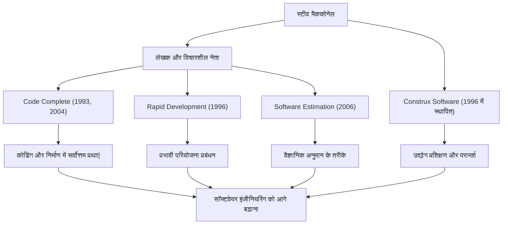

सॉफ्टवेयर विकास से जुड़ा कोई भी व्यक्ति शायद *Code Complete* (कोड कम्प्लीट) नामक मोटी, शानदार किताब से परिचित होगा। इसके लेखक, स्टीव मैककोनेल, एक ऐसे व्यक्ति हैं जिन्होंने प्रोग्रामिंग के अराजक कार्य में व्यवस्था लाने और सही मायने में "सॉफ्टवेयर इंजीनियरिंग" स्थापित करने के लिए अपना जीवन समर्पित कर दिया। यह लेख उनके जीवन, उनके अनूठे दर्शन और आधुनिक विकास परिदृश्य पर उनके निरंतर और गहरे प्रभाव पर प्रकाश डालता है।

## शिक्षाविदों और कार्यक्षेत्र के बीच की खाई को पाटने वाला करियर

स्टीव मैककोनेल ने अपने करियर की शुरुआत उस दौर में की जब सॉफ्टवेयर उद्योग अभी भी "हैकर संस्कृति" और "शिल्प कौशल" पर बहुत अधिक निर्भर था। सिएटल विश्वविद्यालय से सॉफ्टवेयर इंजीनियरिंग में मास्टर डिग्री प्राप्त करने के बाद, उन्होंने माइक्रोसॉफ्ट और बोइंग जैसी विशाल प्रौद्योगिकी कंपनियों में डेस्कटॉप सॉफ्टवेयर से लेकर एयरोस्पेस उद्योग के लिए मिशन-क्रिटिकल सिस्टम तक विभिन्न प्रकार की परियोजनाओं पर काम किया।

कार्यक्षेत्र में अनुभव प्राप्त करने के साथ, उन्होंने शैक्षणिक सिद्धांतों और वास्तविक सॉफ्टवेयर विकास की वास्तविकताओं के बीच एक "बड़ी खाई" देखी। विश्वविद्यालयों में सिखाई जाने वाली आदर्श विकास पद्धतियां कार्यक्षेत्र में ज्यों की त्यों काम नहीं करती थीं, जबकि दूसरी ओर, फ्रंट लाइन्स पर अत्यधिक व्यक्तिगत और तदर्थ कोडिंग प्रथाएं व्याप्त थीं।

इस समस्या को हल करने के लिए, उन्होंने 1993 में *Code Complete* प्रकाशित की। इस पुस्तक ने अकादमिक शोध परिणामों और उद्योग की सर्वोत्तम प्रथाओं को शानदार ढंग से एकीकृत किया, और जल्दी ही सॉफ्टवेयर निर्माण के लिए एक व्यावहारिक और व्यवस्थित मार्गदर्शिका के रूप में दुनिया भर के डेवलपर्स की बाइबिल बन गई। बाद में, 1996 में, अपने दर्शन को और अधिक अभ्यास में लाने और फैलाने के लिए, उन्होंने Construx Software की स्थापना की, जो सॉफ्टवेयर विकास परामर्श और प्रशिक्षण प्रदान करने वाली एक कंपनी है, और इसके सीईओ और मुख्य सॉफ्टवेयर इंजीनियर के रूप में कई कंपनियों का समर्थन करना जारी रखा है।

## शिल्प कौशल से "इंजीनियरिंग" में बदलाव को बढ़ावा देने वाला दर्शन

मैककोनेल का मूल दर्शन यह है कि "सॉफ्टवेयर विकास केवल कला या शिल्प कौशल नहीं होना चाहिए, बल्कि एक अनुमानित और व्यवस्थित 'इंजीनियरिंग' होना चाहिए।"

उनके सभी कार्यों का मुख्य विषय "जटिलता का प्रबंधन" (managing complexity) है। वह बताते हैं कि सॉफ्टवेयर परियोजनाओं की विफलता का सबसे बड़ा कारण अनियंत्रित जटिलता है। इसलिए, उन्होंने तर्क दिया कि उत्कृष्ट आर्किटेक्चर डिजाइन करना, स्पष्ट कोडिंग मानक स्थापित करना, अत्यधिक पठनीय नामकरण सम्मेलनों का उपयोग करना और प्रारंभिक चरणों से गुणवत्ता का निर्माण करना आवश्यक प्रक्रियाएं हैं।

"अनुमान" (Estimation) पर भी उनकी गहरी पकड़ है। अपनी पुस्तक *Software Estimation: Demystifying the Black Art* में, वे जोर देकर कहते हैं कि "अनुमान कोई बातचीत नहीं है" (estimation is not negotiation) और डेवलपर्स को व्यावसायिक पक्ष के दबाव के आगे झुके बिना वस्तुनिष्ठ डेटा और संभावनाओं के आधार पर वैज्ञानिक अनुमान बनाने के तरीके प्रस्तुत किए। यह एक शक्तिशाली हथियार बन गया जिसने कई परियोजना प्रबंधकों और डेवलपर्स को क्रूर डेथ मार्च से बचाया।

## उपलब्धियों और प्रभाव का सहसंबंध आरेख

उनकी विविध उपलब्धियों और वे सॉफ्टवेयर उद्योग के विकास में कैसे योगदान करते हैं, इसे निम्नलिखित आरेख में संक्षेपित किया गया है:

## भावी पीढ़ियों के लिए एक अटूट विरासत

आधुनिक सॉफ्टवेयर विकास पर स्टीव मैककोनेल के प्रभाव को मापा नहीं जा सकता है। आज हम जिन प्रथाओं को हल्के में लेते हैं—जैसे कि कोड समीक्षा, रीफैक्टरिंग, निरंतर एकीकरण, और स्वयं-दस्तावेज़ीकरण कोड—वे उन अवधारणाओं पर बने हैं जिनका उन्होंने *Code Complete* और *Rapid Development* में समर्थन और आयोजन किया था।

आज के एजाइल (Agile) विकास और DevOps के मुख्यधारा के युग में भी, उनकी शिक्षाएं बिल्कुल भी फीकी नहीं पड़ी हैं। बल्कि, तेजी से बदलते विकास चक्रों में, "कोडिंग में एक ठोस आधार" और "गुणवत्ता-प्रथम दृष्टिकोण" की उनकी वकालत पहले से कहीं अधिक महत्वपूर्ण है। कमजोर आधार वाला सॉफ्टवेयर अंततः तकनीकी ऋण के भार के नीचे ढह जाएगा, चाहे कितनी भी तेजी से रिलीज क्यों न दोहराए जाएं।

स्टीव मैककोनेल उन महानतम योगदानकर्ताओं में से एक हैं जिन्होंने प्रोग्रामर्स को केवल "कोड लिखने वाले लोग" से गुणवत्ता और प्रक्रिया के लिए जिम्मेदार गौरवशाली "सॉफ्टवेयर इंजीनियर" बना दिया। उनके पीछे छोड़ी गई अंतर्दृष्टि और लेखन को पीढ़ियों तक पढ़ा जाता रहेगा, जो भविष्य में सॉफ्टवेयर निर्माण के लिए एक अचल मार्गदर्शक के रूप में काम करेगा।
