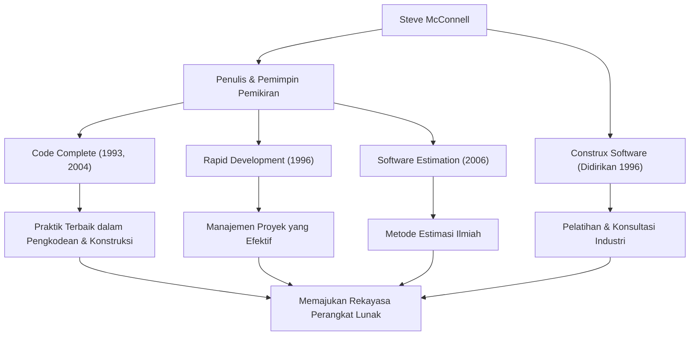

Siapa pun yang terlibat dalam pengembangan perangkat lunak kemungkinan besar pernah menemukan buku tebal dan luar biasa berjudul *Code Complete*. Penulisnya, Steve McConnell, adalah sosok yang telah mendedikasikan hidupnya untuk menertibkan tugas pemrograman yang kacau dan membangun "Rekayasa Perangkat Lunak" (Software Engineering) dalam arti yang sebenarnya. Artikel ini menggali lebih dalam tentang kehidupannya, filosofi uniknya, dan pengaruh besarnya yang terus berlanjut di kancah pengembangan modern.

## Karier yang Menjembatani Kesenjangan antara Akademisi dan Lapangan

Steve McConnell memulai kariernya pada era di mana industri perangkat lunak masih sangat bergantung pada "budaya peretas" dan "keterampilan tangan". Setelah memperoleh gelar Magister Rekayasa Perangkat Lunak dari Seattle University, ia mengerjakan berbagai proyek di raksasa teknologi seperti Microsoft dan Boeing, mulai dari perangkat lunak desktop hingga sistem yang sangat penting (mission-critical) untuk industri kedirgantaraan.

Seiring bertambahnya pengalaman di lapangan, ia menyadari adanya "kesenjangan besar" antara teori akademis dan realitas pengembangan perangkat lunak di lapangan. Metodologi pengembangan ideal yang diajarkan di universitas tidak berjalan apa adanya di lapangan, sementara di sisi lain, praktik pengkodean yang ad-hoc dan sangat bergantung pada individu merajalela di garis depan.

Untuk mengatasi masalah ini, ia menerbitkan *Code Complete* pada tahun 1993. Buku ini secara luar biasa memadukan temuan penelitian akademis dengan praktik terbaik industri, dan dengan cepat menjadi alkitab bagi pengembang di seluruh dunia sebagai panduan praktis dan sistematis untuk konstruksi perangkat lunak. Kemudian, pada tahun 1996, untuk lebih mempraktikkan dan menyebarkan filosofinya, ia mendirikan Construx Software, sebuah perusahaan yang menyediakan konsultasi dan pelatihan pengembangan perangkat lunak, dan terus mendukung banyak perusahaan sebagai CEO dan Chief Software Engineer.

## Filosofi yang Mendorong Peralihan dari Keterampilan Tangan ke "Rekayasa"

Filosofi dasar McConnell adalah bahwa "pengembangan perangkat lunak tidak boleh sekadar seni atau keterampilan tangan, melainkan sebuah 'Rekayasa' (Engineering) yang dapat diprediksi dan disistematisasi."

Tema sentral yang mengalir di seluruh karyanya adalah "manajemen kompleksitas". Ia menunjukkan bahwa penyebab terbesar kegagalan proyek perangkat lunak adalah kompleksitas yang tidak terkendali. Oleh karena itu, ia berpendapat bahwa merancang arsitektur yang sangat baik, menetapkan standar pengkodean yang jelas, menggunakan konvensi penamaan yang sangat mudah dibaca, dan membangun kualitas sejak tahap awal adalah proses yang esensial.

Ia juga memiliki wawasan mendalam tentang "Estimasi". Dalam bukunya *Software Estimation: Demystifying the Black Art*, ia menegaskan bahwa "estimasi bukanlah negosiasi" dan menyajikan metode bagi pengembang untuk membuat estimasi ilmiah berdasarkan data objektif dan probabilitas, tanpa menyerah pada tekanan dari sisi bisnis. Hal ini menjadi senjata ampuh yang menyelamatkan banyak manajer proyek dan pengembang dari proyek-proyek yang mustahil (death marches).

## Diagram Korelasi Pencapaian dan Dampak

Beragam pencapaiannya dan bagaimana hal itu berkontribusi pada pengembangan industri perangkat lunak dirangkum dalam diagram berikut.

## Warisan yang Tak Tergoyahkan bagi Generasi Mendatang

Dampak yang diberikan Steve McConnell pada pengembangan perangkat lunak modern tidak terukur. Banyak praktik yang kita anggap remeh saat ini—seperti tinjauan kode (code reviews), refactoring, integrasi berkelanjutan (continuous integration), dan kode yang mendokumentasikan dirinya sendiri—dibangun di atas konsep yang ia dukung dan atur dalam *Code Complete* dan *Rapid Development*.

Bahkan di era mainstream pengembangan Agile dan DevOps saat ini, ajarannya sama sekali tidak memudar. Sebaliknya, dalam siklus pengembangan yang berubah cepat, dukungannya terhadap "fondasi pengkodean yang kuat" dan "sikap mengutamakan kualitas" menjadi lebih penting dari sebelumnya. Perangkat lunak dengan fondasi yang rapuh pada akhirnya akan runtuh di bawah beban utang teknis (technical debt), tidak peduli seberapa cepat rilis diulang.

Steve McConnell adalah salah satu kontributor terbesar yang mengangkat pemrogram dari sekadar "orang yang menulis kode" menjadi "insinyur perangkat lunak" yang bangga dan bertanggung jawab atas kualitas dan proses. Wawasan dan tulisan yang ditinggalkannya akan terus dibaca lintas generasi, berfungsi sebagai pedoman yang tak tergoyahkan untuk konstruksi perangkat lunak di masa depan.
