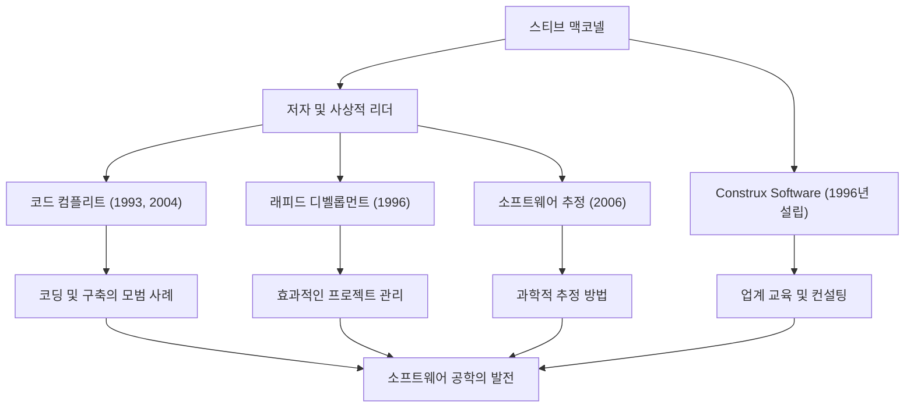

소프트웨어 개발에 종사하는 사람이라면 《코드 컴플리트》(Code Complete)라는 두꺼운 명저를 본 적이 있을 것입니다. 이 책의 저자인 스티브 맥코넬(Steve McConnell)은 프로그래밍이라는 혼돈스러운 작업에 질서를 가져오고, 진정한 의미의 '소프트웨어 공학'(Software Engineering)을 확립하기 위해 평생을 바친 인물입니다. 본 기사에서는 그의 생애, 독자적인 철학, 그리고 현대 개발 씬에 지속적으로 미치고 있는 엄청난 영향에 대해 깊이 파헤쳐 봅니다.

## 학계와 현장의 격차를 메운 커리어

스티브 맥코넬은 소프트웨어 업계가 아직 '해커 문화'나 '장인 정신'에 크게 의존하던 시대에 커리어를 시작했습니다. 그는 시애틀 대학에서 소프트웨어 공학 석사 학위를 취득한 후, 마이크로소프트와 보잉 같은 거대 기술 기업에서 데스크톱 소프트웨어부터 항공우주 산업을 위한 미션 크리티컬 시스템에 이르기까지 다양한 프로젝트에 참여했습니다.

현장에서 경험을 쌓으면서 그는 학술적인 이론과 실제 소프트웨어 개발 현장 사이에 존재하는 '거대한 격차'를 깨닫습니다. 대학에서 가르치는 이상적인 개발 방법론은 현장에서는 그대로 작동하지 않았고, 반면 현장에서는 개인에 의존하는 임시방편적인 코딩이 만연했습니다.

이 문제를 해결하기 위해 그는 1993년 《코드 컴플리트》를 출간합니다. 이 책은 학술적인 연구 결과와 현장의 모범 사례(Best Practice)를 훌륭하게 통합하여, 실용적이고 체계적인 소프트웨어 구축 가이드라인으로서 순식간에 전 세계 개발자들의 바이블이 되었습니다. 이후 1996년에는 자신의 이념을 더욱 실천하고 널리 알리기 위해 소프트웨어 개발 컨설팅 및 교육을 제공하는 기업 'Construx Software'를 설립하고, CEO 겸 수석 소프트웨어 엔지니어로서 수많은 기업을 계속해서 지원하고 있습니다.

## 장인 정신에서 '공학'으로의 전환을 촉구하는 철학

맥코넬의 근저에 있는 철학은 "소프트웨어 개발은 단순한 예술이나 장인 정신이 아니라 예측 가능하고 체계화된 '공학(Engineering)'이어야 한다"는 것입니다.

그의 저서 전체를 관통하는 핵심 주제는 '복잡성 관리(Managing Complexity)'입니다. 소프트웨어 프로젝트가 실패하는 가장 큰 원인은 통제 불능의 복잡성에 있다고 그는 지적합니다. 따라서 뛰어난 아키텍처 설계, 명확한 코딩 표준, 가독성 높은 명명 규칙, 그리고 초기 단계부터 품질을 구축하는 프로세스가 필수적이라고 역설했습니다.

또한 그는 '추정(Estimation)'에 관해서도 깊은 통찰력을 가지고 있습니다. 저서 《소프트웨어 프로젝트 생존 전략》(원제: Software Estimation: Demystifying the Black Art)에서 그는 "추정은 협상이 아니다"라고 단언하며, 개발자가 비즈니스 측의 압력에 굴복하지 않고 객관적인 데이터와 확률에 기반한 과학적인 추정을 수행하기 위한 방법을 제시했습니다. 이는 많은 프로젝트 관리자와 개발자를 가혹한 데스마치(Death March)에서 구하는 강력한 무기가 되었습니다.

## 공적과 영향의 상관도

그의 다방면에 걸친 공적과 그것이 소프트웨어 산업의 발전에 어떻게 기여하고 있는지를 아래 다이어그램에 요약했습니다.

## 후세에 남긴 흔들림 없는 유산

스티브 맥코넬이 현대 소프트웨어 개발에 미친 영향은 헤아릴 수 없습니다. 오늘날 우리가 당연하게 실천하고 있는 코드 리뷰, 리팩토링, 지속적 통합(CI), 그리고 자기 문서화된 코드(Self-documenting Code)와 같은 프랙티스의 대부분은 그가 《코드 컴플리트》와 《래피드 디벨롭먼트》에서 제창하고 정리한 개념이 토대가 되었습니다.

애자일(Agile) 개발과 DevOps가 주류가 된 현대에도 그의 가르침은 전혀 퇴색되지 않았습니다. 오히려 변화가 극심한 개발 사이클에서야말로 그가 제창하는 '확고한 코딩의 기초'와 '품질 제일주의의 자세'가 더욱 중요해지고 있습니다. 기초가 취약한 소프트웨어는 아무리 신속하게 릴리스를 반복하더라도 결국 기술 부채(Technical Debt)의 무게로 인해 무너져 버리기 때문입니다.

스티브 맥코넬은 프로그래머를 단순한 '코드를 짜는 사람'에서 품질과 프로세스에 책임을 지는 자랑스러운 '소프트웨어 엔지니어'로 끌어올린 최대의 공로자 중 한 명입니다. 그가 남긴 지식과 저작은 앞으로도 세대를 넘어 읽히며, 미래의 소프트웨어 구축에 있어 흔들리지 않는 이정표로 계속 남을 것입니다.
