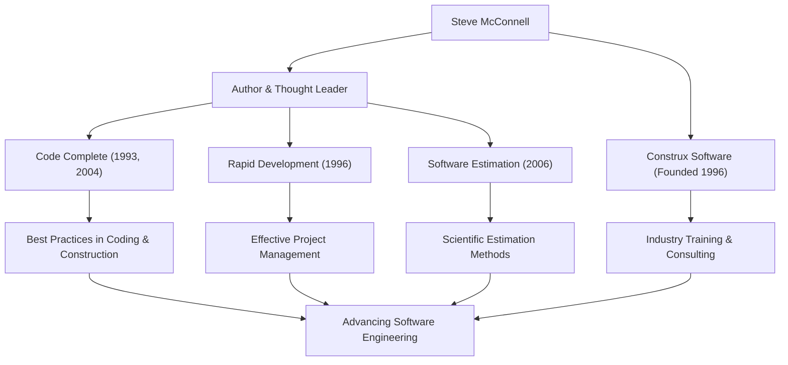

ソフトウェア開発に携わる者であれば、「Code Complete（コードコンプリート）」という分厚い名著を目にしたことがあるでしょう。この本の著者であるスティーブ・マコネル（Steve McConnell）は、プログラミングという混沌とした作業に秩序をもたらし、真の意味での「ソフトウェア工学（Software Engineering）」を確立するために生涯を捧げてきた人物です。本記事では、彼の生涯、独自の哲学、そして現代の開発シーンに与え続ける多大な影響について深く掘り下げます。

## 学術と現場の溝を埋めたキャリア

スティーブ・マコネルは、ソフトウェア業界がまだ「ハッカー文化」や「職人技」に大きく依存していた時代にキャリアをスタートさせました。彼はシアトル大学でソフトウェア工学の修士号を取得した後、マイクロソフトやボーイングといった巨大テクノロジー企業で、デスクトップソフトウェアから航空宇宙産業向けのミッションクリティカルなシステムまで、多様なプロジェクトに携わりました。

現場での経験を重ねる中で、彼は学術的な理論と実際のソフトウェア開発現場との間に存在する「大きな溝」に気づきます。大学で教えられる理想的な開発手法は現場ではそのままでは機能せず、一方で現場では属人的で場当たり的なコーディングが横行していました。

この問題を解決するため、彼は1993年に『Code Complete』を上梓します。この書籍は、学術的な研究結果と現場のベストプラクティスを見事に統合し、実用的かつ体系的なソフトウェア構築のガイドラインとして瞬く間に世界中の開発者のバイブルとなりました。その後、1996年には自らの理念をさらに実践し広めるため、ソフトウェア開発のコンサルティングおよびトレーニングを提供する企業「Construx Software」を設立し、CEOおよびチーフソフトウェアエンジニアとして数多くの企業を支援し続けています。

## 職人技から「工学」への転換を促す哲学

マコネルの根底にある哲学は、「ソフトウェア開発は単なるアートや職人技ではなく、予測可能で体系化された『工学（Engineering）』であるべきだ」というものです。

彼の著作全体を貫く中心的なテーマは「複雑性の管理」です。ソフトウェアプロジェクトが失敗する最大の原因は、制御不能な複雑さにあると彼は指摘します。そのため、優れたアーキテクチャの設計、明確なコーディング規約、可読性の高い命名規則、そして品質を初期段階から作り込むプロセスが不可欠であると説きました。

また、彼は「見積もり（Estimation）」に関しても深い洞察を持っています。著書『Software Estimation: Demystifying the Black Art（ソフトウェア見積り：人月の暗黙知を解き明かす）』の中で、彼は「見積もりは交渉ではない」と断言し、開発者がビジネス側の圧力に屈することなく、客観的なデータと確率に基づいた科学的な見積もりを行うための手法を提示しました。これは多くのプロジェクトマネージャーや開発者を過酷なデスマーチから救う強力な武器となりました。

## 功績と影響の相関図

彼の多岐にわたる功績と、それがどのようにソフトウェア業界の発展に寄与しているかを以下の図にまとめました。

## 後世への揺るぎないレガシー

スティーブ・マコネルが現代のソフトウェア開発に与えた影響は計り知れません。今日、私たちが当たり前のように実践しているコードレビュー、リファクタリング、継続的インテグレーション、そして自己文書化されたコードといったプラクティスの多くは、彼が『Code Complete』や『Rapid Development』で提唱・整理した概念が土台となっています。

アジャイル開発やDevOpsが主流となった現代においても、彼の教えは全く色褪せていません。むしろ、変化の激しい開発サイクルにおいてこそ、彼の提唱する「確固たるコーディングの基礎」と「品質第一の姿勢」がより重要性を増しています。基礎が脆いソフトウェアは、どれほど迅速にリリースを繰り返しても、最終的には技術的負債の重みで崩壊してしまうからです。

スティーブ・マコネルは、プログラマーを単なる「コードを書く人」から、品質とプロセスに責任を持つ誇り高き「ソフトウェアエンジニア」へと引き上げた最大の功労者の一人です。彼の残した知見と著作は、これからも世代を超えて読み継がれ、未来のソフトウェア構築における不動の道標となり続けるでしょう。
