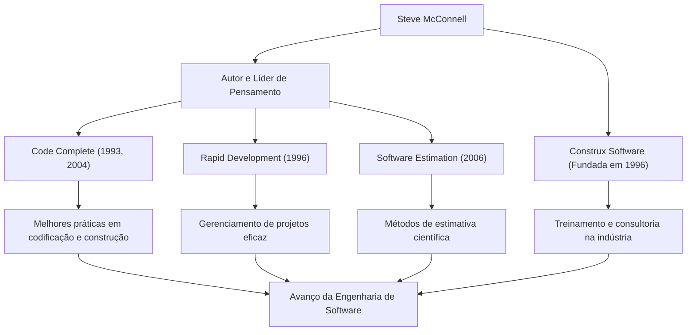

Qualquer pessoa envolvida com o desenvolvimento de software provavelmente já se deparou com o livro espesso e magistral intitulado *Code Complete*. Seu autor, Steve McConnell, é uma figura que dedicou sua vida a trazer ordem à tarefa caótica da programação e a estabelecer a "Engenharia de Software" (Software Engineering) em seu sentido mais verdadeiro. Este artigo investiga profundamente sua vida, sua filosofia única e a imensa influência que ele continua a ter no cenário de desenvolvimento moderno.

## Uma Carreira que Preencheu a Lacuna entre a Academia e a Prática

Steve McConnell começou sua carreira durante uma era em que a indústria de software ainda dependia fortemente da "cultura hacker" e do "artesanato". Depois de obter seu mestrado em Engenharia de Software pela Universidade de Seattle, ele trabalhou em uma variedade de projetos em gigantes da tecnologia como Microsoft e Boeing, variando de software de desktop a sistemas de missão crítica para a indústria aeroespacial.

À medida que ganhava experiência na área, ele notou uma "lacuna enorme" entre as teorias acadêmicas e as realidades do desenvolvimento de software na prática. As metodologias de desenvolvimento ideais ensinadas nas universidades não funcionavam como tal na prática, enquanto, por outro lado, práticas de codificação ad hoc e altamente dependentes das pessoas eram desenfreadas na linha de frente.

Para resolver este problema, ele publicou *Code Complete* em 1993. Este livro integrou magistralmente os resultados de pesquisas acadêmicas com as melhores práticas da indústria, tornando-se rapidamente a bíblia para desenvolvedores em todo o mundo como um guia prático e sistemático para a construção de software. Mais tarde, em 1996, para praticar e difundir ainda mais sua filosofia, ele fundou a Construx Software, uma empresa que fornece consultoria e treinamento em desenvolvimento de software, e continua a apoiar inúmeras empresas como seu CEO e Engenheiro de Software Chefe.

## Uma Filosofia que Promove a Mudança do Artesanato para a "Engenharia"

A filosofia subjacente de McConnell é que "o desenvolvimento de software não deve ser mera arte ou artesanato, mas uma 'Engenharia' previsível e sistematizada".

O tema central que perpassa todas as suas obras é o "gerenciamento da complexidade". Ele aponta que a maior causa do fracasso de projetos de software é a complexidade incontrolável. Portanto, ele argumentou que projetar uma excelente arquitetura, estabelecer padrões de codificação claros, usar convenções de nomenclatura altamente legíveis e incorporar a qualidade desde os estágios iniciais são processos essenciais.

Ele também tem insights profundos sobre "Estimativa". Em seu livro *Software Estimation: Demystifying the Black Art*, ele afirma que "estimativa não é negociação" e apresentou métodos para que os desenvolvedores criassem estimativas científicas baseadas em dados objetivos e probabilidade, sem ceder à pressão do lado dos negócios. Isso se tornou uma arma poderosa que salvou muitos gerentes de projeto e desenvolvedores de marchas da morte brutais.

## Diagrama de Correlação de Conquistas e Impacto

Suas diversas conquistas e como elas contribuem para o desenvolvimento da indústria de software estão resumidas no diagrama a seguir.

## Um Legado Inabalável para as Gerações Futuras

O impacto que Steve McConnell teve no desenvolvimento de software moderno é imensurável. Muitas das práticas que consideramos garantidas hoje – como revisões de código, refatoração, integração contínua e código autodocumentado – são construídas sobre os conceitos que ele defendeu e organizou em *Code Complete* e *Rapid Development*.

Mesmo na era dominante de hoje de desenvolvimento Ágil e DevOps, seus ensinamentos não desapareceram. Pelo contrário, em ciclos de desenvolvimento em rápida mudança, sua defesa de uma "base sólida em codificação" e uma "atitude de qualidade em primeiro lugar" são mais importantes do que nunca. Um software com uma base frágil acabará desmoronando sob o peso da dívida técnica, não importa o quão rápido os lançamentos sejam repetidos.

Steve McConnell é um dos maiores contribuidores que elevou os programadores de meras "pessoas que escrevem código" para orgulhosos "engenheiros de software" responsáveis pela qualidade e pelo processo. Os insights e escritos que ele deixa para trás continuarão a ser lidos através de gerações, servindo como um guia inabalável para a construção de software no futuro.
