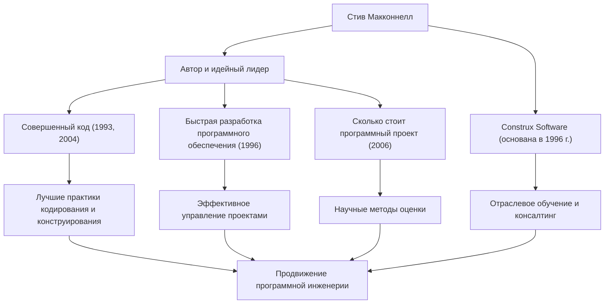

Любой, кто связан с разработкой программного обеспечения, вероятно, сталкивался с толстой, выдающейся книгой под названием *«Совершенный код»* (Code Complete). Ее автор, Стив Макконнелл, — человек, который посвятил свою жизнь наведению порядка в хаотичной задаче программирования и становлению «Программной инженерии» (Software Engineering) в ее истинном смысле. Эта статья подробно описывает его жизнь, его уникальную философию и то огромное влияние, которое он продолжает оказывать на современную сцену разработки.

## Карьера, преодолевшая разрыв между академической средой и практикой

Стив Макконнелл начал свою карьеру в эпоху, когда индустрия программного обеспечения все еще сильно зависела от «хакерской культуры» и «ремесленничества». Получив степень магистра в области программной инженерии в Университете Сиэтла, он работал над различными проектами в таких технологических гигантах, как Microsoft и Boeing, от настольного программного обеспечения до критически важных систем для аэрокосмической промышленности.

По мере накопления опыта на практике, он заметил «огромный разрыв» между академическими теориями и реалиями разработки программного обеспечения на местах. Идеальные методологии разработки, преподаваемые в университетах, не работали в том же виде на практике, в то время как на передовой процветали зависящие от конкретных людей и бессистемные подходы к написанию кода.

Чтобы решить эту проблему, он опубликовал *«Совершенный код»* в 1993 году. Эта книга мастерски объединила результаты академических исследований с лучшими отраслевыми практиками, быстро став библией для разработчиков по всему миру в качестве практического и систематического руководства по созданию программного обеспечения. Позже, в 1996 году, чтобы еще больше применять на практике и распространять свою философию, он основал Construx Software, компанию, предоставляющую консультации и обучение по разработке программного обеспечения, и продолжает поддерживать многочисленные компании в качестве генерального директора и главного инженера-программиста.

## Философия, способствующая переходу от ремесла к «Инженерии»

Основополагающая философия Макконнелла заключается в том, что «разработка программного обеспечения должна быть не просто искусством или ремеслом, а предсказуемой и систематизированной 'Инженерией'».

Центральной темой, проходящей через все его работы, является «управление сложностью». Он отмечает, что самой большой причиной провалов проектов по разработке программного обеспечения является неконтролируемая сложность. Поэтому он утверждал, что проектирование превосходной архитектуры, установление четких стандартов кодирования, использование хорошо читаемых соглашений об именовании и встраивание качества с начальных этапов являются важными процессами.

Он также обладает глубоким пониманием в области «Оценки» (Estimation). В своей книге *«Сколько стоит программный проект»* (Software Estimation: Demystifying the Black Art) он утверждает, что «оценка — это не переговоры», и представил разработчикам методы создания научных оценок, основанных на объективных данных и вероятности, не поддаваясь давлению со стороны бизнеса. Это стало мощным оружием, которое спасло многих менеджеров проектов и разработчиков от жестоких "маршей смерти" (death marches).

## Диаграмма корреляции достижений и влияния

Его разнообразные достижения и то, как они способствуют развитию индустрии программного обеспечения, обобщены на следующей диаграмме.

## Непоколебимое наследие для будущих поколений

Влияние, которое Стив Макконнелл оказал на современную разработку программного обеспечения, неизмеримо. Многие из практик, которые мы сегодня воспринимаем как должное — такие как проверка кода, рефакторинг, непрерывная интеграция и самодокументируемый код — построены на концепциях, которые он отстаивал и систематизировал в *«Совершенном коде»* и *«Быстрой разработке программного обеспечения»*.

Даже в сегодняшнюю эпоху повсеместного распространения Agile-разработки и DevOps его учения ничуть не померкли. Скорее, в быстро меняющихся циклах разработки его пропаганда «прочной основы в кодировании» и «отношения к качеству в первую очередь» важна как никогда. Программное обеспечение с хрупкой основой в конечном итоге рухнет под тяжестью технического долга, независимо от того, насколько быстро будут повторяться релизы.

Стив Макконнелл — один из величайших мыслителей, который поднял программистов от простых «людей, пишущих код», до гордых «инженеров-программистов», ответственных за качество и процессы. Идеи и труды, которые он оставляет после себя, будут продолжать читать поколения, служа непоколебимым ориентиром для создания программного обеспечения в будущем.
