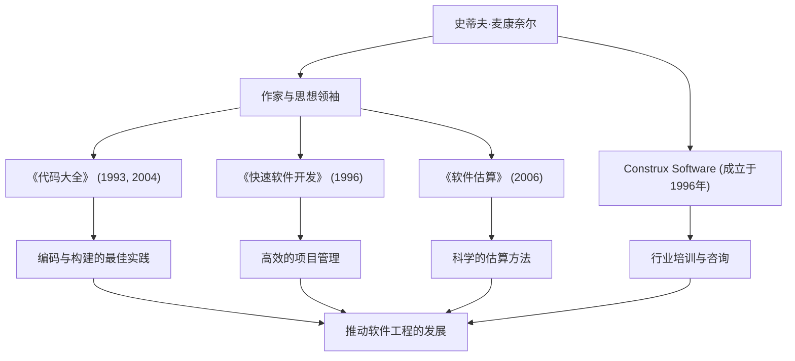

凡是从事软件开发的人，都可能见过那本厚厚的名著《代码大全》（Code Complete）。该书的作者史蒂夫·麦康奈尔（Steve McConnell），将毕生精力致力于为混乱的编程工作带来秩序，并确立真正意义上的“软件工程”（Software Engineering）。本文将深入探讨他的生平、独特的理念，以及他对现代开发领域持续产生的巨大影响。

## 填补学术与实践鸿沟的职业生涯

史蒂夫·麦康奈尔的职业生涯始于软件行业仍严重依赖“黑客文化”和“手工艺”的时代。在西雅图大学获得软件工程硕士学位后，他在微软和波音等大型科技公司参与了从桌面软件到航空航天关键任务系统的各种项目。

在不断积累现场经验的过程中，他注意到了学术理论与实际软件开发一线之间存在着“巨大的鸿沟”。大学里教授的理想化开发方法在实际现场无法直接奏效，而另一方面，现场却充斥着依赖个人且随意的编码方式。

为了解决这个问题，他在1993年出版了《代码大全》。这本书将学术研究成果与现场的最佳实践完美结合，作为实用且系统的软件构建指南，迅速成为全球开发者的圣经。此后，为了进一步实践和传播他的理念，他在1996年创立了提供软件开发咨询和培训的Construx Software公司，并作为CEO兼首席软件工程师持续支持着众多企业。

## 推动从手工艺向“工程”转变的哲学

麦康奈尔根本的哲学是：“软件开发不应仅仅是艺术或手工艺，而应该是可预测、系统化的‘工程’（Engineering）。”

贯穿他所有著作的中心主题是“复杂性管理”。他指出，软件项目失败的最大原因是失控的复杂性。因此，他主张优秀的架构设计、明确的编码规范、高可读性的命名规则以及从初始阶段就融入质量的流程是必不可少的。

此外，他对“估算”（Estimation）也有着深刻的洞见。在他的著作《软件估算：揭秘黑魔法》（Software Estimation: Demystifying the Black Art）中，他断言“估算不是谈判”，并提出了让开发者能够基于客观数据和概率进行科学估算的方法，从而不屈服于业务方的压力。这成为拯救许多项目经理和开发者免于残酷的“死亡行军”的强大武器。

## 成就与影响的关系图

他在多个领域的成就，以及这些成就如何促进软件行业的发展，总结在以下图表中：

## 留给后世的不可动摇的遗产

史蒂夫·麦康奈尔对现代软件开发产生的影响是无法估量的。今天我们理所当然地实践着的代码审查、重构、持续集成以及自文档化代码等许多实践，都是以他在《代码大全》和《快速软件开发》中提倡和整理的概念为基础的。

即使在敏捷开发和DevOps成为主流的今天，他的教诲也丝毫没有褪色。相反，在变化剧烈的开发周期中，他提倡的“坚实的编码基础”和“质量第一的态度”变得更加重要。因为基础脆弱的软件，无论多快地重复发布，最终都会在技术债务的重压下崩溃。

史蒂夫·麦康奈尔是将程序员从仅仅“写代码的人”提升为对质量和流程负责、充满自豪感的“软件工程师”的最大功臣之一。他留下的见解和著作，将在未来跨越世代被继续阅读，成为未来软件构建中不可动摇的灯塔。
