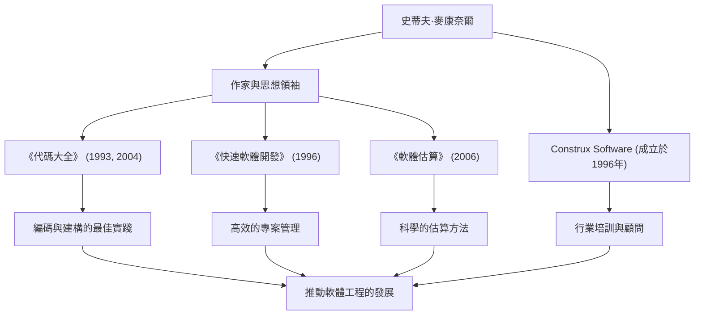

凡是從事軟體開發的人，都可能見過那本厚厚的名著《代碼大全》（Code Complete）。該書的作者史蒂夫·麥康奈爾（Steve McConnell），將畢生精力致力於為混亂的程式設計工作帶來秩序，並確立真正意義上的「軟體工程」（Software Engineering）。本文將深入探討他的生平、獨特的理念，以及他對現代開發領域持續產生的巨大影響。

## 填補學術與實踐鴻溝的職業生涯

史蒂夫·麥康奈爾的職業生涯始於軟體行業仍嚴重依賴「駭客文化」和「手工藝」的時代。在西雅圖大學獲得軟體工程碩士學位後，他在微軟和波音等大型科技公司參與了從桌面軟體到航空航天關鍵任務系統的各種專案。

在不斷累積現場經驗的過程中，他注意到了學術理論與實際軟體開發一線之間存在著「巨大的鴻溝」。大學裡教授的理想化開發方法在實際現場無法直接奏效，而另一方面，現場卻充斥著依賴個人且隨意的編碼方式。

為了解決這個問題，他在1993年出版了《代碼大全》。這本書將學術研究成果與現場的最佳實踐完美結合，作為實用且系統的軟體建構指南，迅速成為全球開發者的聖經。此後，為了進一步實踐和傳播他的理念，他在1996年創立了提供軟體開發顧問和培訓的Construx Software公司，並作為CEO兼首席軟體工程師持續支援著眾多企業。

## 推動從手工藝向「工程」轉變的哲學

麥康奈爾根本的哲學是：「軟體開發不應僅僅是藝術或手工藝，而應該是可預測、系統化的『工程』（Engineering）。」

貫穿他所有著作的中心主題是「複雜性管理」。他指出，軟體專案失敗的最大原因是失控的複雜性。因此，他主張優秀的架構設計、明確的編碼規範、高可讀性的命名規則以及從初始階段就融入品質的流程是必不可少的。

此外，他對「估算」（Estimation）也有著深刻的洞見。在他的著作《軟體估算：揭秘黑魔法》（Software Estimation: Demystifying the Black Art）中，他斷言「估算不是談判」，並提出了讓開發者能夠基於客觀數據和概率進行科學估算的方法，從而不屈服於業務方的壓力。這成為拯救許多專案經理和開發者免於殘酷的「死亡行軍」的強大武器。

## 成就與影響的關係圖

他在多個領域的成就，以及這些成就如何促進軟體行業的發展，總結在以下圖表中：

## 留給後世的不可動搖的遺產

史蒂夫·麥康奈爾對現代軟體開發產生的影響是無法估量的。今天我們理所當然地實踐著的程式碼審查、重構、持續整合以及自文件化程式碼等許多實踐，都是以他在《代碼大全》和《快速軟體開發》中提倡和整理的概念為基礎的。

即使在敏捷開發和DevOps成為主流的今天，他的教誨也絲毫沒有褪色。相反，在變化劇烈的開發週期中，他提倡的「堅實的編碼基礎」和「品質第一的態度」變得更加重要。因為基礎脆弱的軟體，無論多快地重複發布，最終都會在技術債務的重壓下崩潰。

史蒂夫·麥康奈爾是將程式設計師從僅僅「寫程式的人」提升為對品質和流程負責、充滿自豪感的「軟體工程師」的最大功臣之一。他留下的見解和著作，將在未來跨越世代被繼續閱讀，成為未來軟體建構中不可動搖的燈塔。
