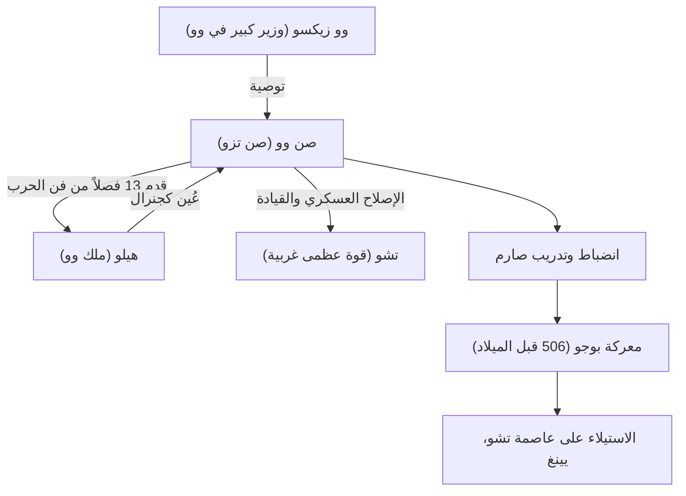

## مقدمة

"إذا كنت تعرف العدو وتعرف نفسك، فلا داعي للخوف من نتيجة مائة معركة." هذا الاقتباس الشهير، الذي يتم الاستشهاد به بشكل متكرر حتى في مشاهد الأعمال الحديثة، تركه خبير استراتيجي عسكري عاش في فترة الربيع والخريف في الصين قبل أكثر من 2500 عام. كان اسمه صن وو. ويُدعى باحترام "صن تزو" من قبل الأجيال اللاحقة، وقد ألف أعظم أطروحة عسكرية في العالم، "فن الحرب"، ويستمر في ممارسة تأثير عميق على الاستراتيجيات العسكرية والإدارية ليس فقط في الشرق ولكن في جميع أنحاء العالم. في هذا المقال، نتعمق في الحياة الغامضة لصن وو، وفلسفته المبتكرة، وتأثيره على الأجيال القادمة.

## حياة صن وو: المنفى من تشي وقفزة وو

تم تسجيل حياة صن وو في "سجلات المؤرخ الكبير" لسيما تشيان، لكن حياته المبكرة يكتنفها الغموض. ولد في أواخر القرن السادس قبل الميلاد في ولاية تشي، والتي تتوافق مع مقاطعة شاندونغ الحالية، ويقال إن صن وو ينحدر من عائلة نبيلة تولت الشؤون العسكرية لأجيال. ومع ذلك، ولتجنب الصراعات السياسية والاضطرابات داخل تشي، هرب جنوبًا إلى ولاية "وو" الناشئة.

بحثًا عن ملجأ في وو، تم اكتشاف صن وو من قبل وو زيكسو، وهو وزير كبير. وبفضل التوصية القوية من وو زيكسو، حصل صن وو على لقاء مع الملك هيلو ملك وو. في هذا الوقت، قدم صن وو الأطروحة العسكرية التي كتبها (والتي أصبحت لاحقًا الفصول الـ 13 من "فن الحرب") إلى هيلو، مما يدل على موهبته الاستثنائية. أعجب هيلو بشدة بنظريته العسكرية، وعين صن وو كجنرال.

تحت قيادة صن وو، تحول جيش وو إلى منظمة قوية ومنضبطة. في عام 506 قبل الميلاد، أطلقت وو حملة ضخمة (معركة بوجو) ضد القوة العظمى الغربية "تشو". وبتوجيه من استراتيجيات صن وو الرائعة، تغلب جيش وو على الفارق الهائل في أعداد القوات وحقق إنجازًا تاريخيًا يتمثل في الاستيلاء على يينغ، عاصمة تشو. من خلال هذا الانتصار، قفزت وو فجأة لتصبح قوة المهيمنة في فترة الربيع والخريف.

## فلسفة "فن الحرب": الانتصار دون قتال

أعظم إنجاز خالد لصن وو هو تأليف الأطروحة العسكرية المكونة من 13 فصلًا "فن الحرب". ما يميز "فن الحرب" عن الاستراتيجيات العسكرية السابقة هو إعادة تصورها للحرب ليس مجرد صراع بين القوات المسلحة، ولكن كـ "استراتيجية وطنية شاملة" يعتمد عليها بقاء الدولة.

### 1. قسوة الحرب والحصافة
ذكر صن وو: "إن فن الحرب ذو أهمية حيوية للدولة. إنها مسألة حياة أو موت، وطريق إما إلى الأمان أو إلى الخراب. ومن ثم فهو موضوع للبحث لا يمكن إهماله بأي حال من الأحوال"، في مواجهة التضحيات الهائلة التي تجلبها الحرب للدولة وشعبها بشكل مباشر. لذلك، فقد اتخذ موقفًا واقعيًا وحكيمًا للغاية يتمثل في أنه لا ينبغي بدء الحرب باستخفاف.

### 2. الهدف الأسمى "الانتصار دون قتال"
يتلخص جوهر الفلسفة في "فن الحرب" في الكلمات: "القتال والقهر في جميع معاركك ليس هو التميز الأسمى؛ التميز الأسمى يكمن في كسر مقاومة العدو دون قتال." وعلم أن تجنب الإرهاق الناجم عن الصراع المسلح واستخدام الدبلوماسية والحيلة وحرب المعلومات لإحباط نوايا العدو، وبالتالي ضمان النصر دون تقاطع السيوف، هو أعلى استراتيجية.

### 3. التركيز على المعلومات والعقلانية
"إذا كنت تعرف العدو وتعرف نفسك، فلا داعي للخوف من نتيجة مائة معركة." حذر صن وو بشدة من الاعتماد على الخرافات أو العرافة، مطالبًا بتحليل موضوعي وشامل لكل من المواقف الصديقة والعدوة (القوة العسكرية، التضاريس، الطقس، الوحدة بين الحاكم والشعب، إلخ). إن وجود فصل "توظيف الجواسيس"، والذي يؤكد على جمع المعلومات الاستخبارية، يوضح أيضًا مدى تقديره للمعلومات.

## مخطط: رسم بياني لعلاقات صن وو وإنجازاته

يوضح الرسم البياني أدناه المساعدين الرئيسيين لصن وو وتدفق إنجازاته.

## تأثير عميق على الأجيال القادمة

بعد وفاة صن وو، ورث أمراء الحرب والسياسيون من السلالات الصينية المتعاقبة أفكاره. أضاف تساو تساو، بطل فترة الممالك الثلاث، تعليقًا على "فن الحرب"، وحافظ على النص الذي تم تناقله حتى اليوم، كما جعله الإمبراطور تايزونج من عائلة تانغ وجنرالات سلالة سونغ شعارهم. علاوة على ذلك، من المعروف أن تاكيدا شينجن، أمير الحرب الياباني في سينجوكو، رفع لافتة "فورينكازان" (الرياح، الغابة، النار، الجبل - مقطع من الفصل الخاص بالقتال العسكري).

منذ العصور الحديثة، انتشر "فن الحرب" إلى ما وراء الشرق إلى العالم بأسره. هناك أسطورة مفادها أن نابليون في فرنسا أحب قراءته، واليوم تم تصنيفه كقراءة مطلوبة في الأكاديميات العسكرية الأمريكية والبنتاغون. والأمر الأكثر إثارة للدهشة هو أن نظرياته الاستراتيجية العالمية قد تجاوزت المجال العسكري وتستمر في التطبيق على نطاق واسع باعتبارها "الكتاب المقدس النهائي" في مجالات استراتيجية الأعمال والتسويق والإدارة الحديثة.

## خاتمة

لم يكن صن وو مجرد قائد في ساحة المعركة، بل كان مفكرًا عظيمًا لاحظ ببرود علم النفس البشري والهياكل التنظيمية ومصير الدول. إن السبب في بقاء إرثه، "فن الحرب"، غير متلاشى حتى بعد مرور 2500 عام مذهل هو أنه يضرب في الحقائق العالمية للمجتمع البشري: ليس "كيف تقتل العدو"، ولكن "كيف تنجو وتحقق الأهداف". عندما نضطر إلى اتخاذ قرارات صعبة، فمن المؤكد أن حكمة صن وو الباردة والعميقة ستستمر في العمل كبوصلة قوية.
