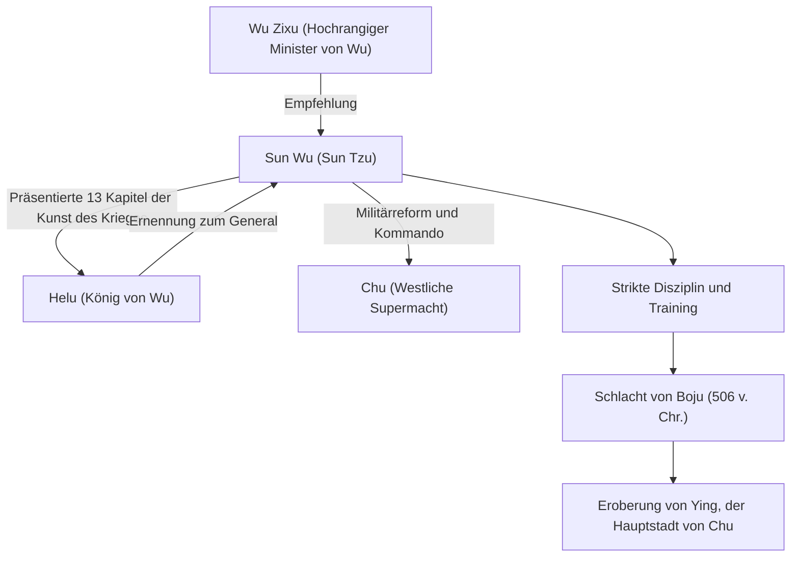

## Einleitung

„Wenn du den Feind und dich selbst kennst, brauchst du den Ausgang von hundert Schlachten nicht zu fürchten.“ Dieses berühmte Zitat, das selbst im modernen Geschäftsleben häufig zitiert wird, stammt von einem Militärstrategen, der vor über 2.500 Jahren in der chinesischen Frühlings- und Herbstperiode lebte. Sein Name war Sun Wu. Von späteren Generationen respektvoll „Sun Tzu“ genannt, verfasste er das weltgrößte Militärtraktat „Die Kunst des Krieges“ und übt bis heute einen tiefgreifenden Einfluss auf Militär- und Managementstrategien nicht nur im Osten, sondern weltweit aus. In diesem Artikel tauchen wir tief in das mysteriöse Leben von Sun Wu, seine innovative Philosophie und seine Auswirkungen auf künftige Generationen ein.

## Sun Wus Leben: Exil aus Qi und der Aufstieg von Wu

Sun Wus Leben ist in Sima Qians „Aufzeichnungen des Großen Historikers“ festgehalten, doch sein frühes Leben ist in ein Geheimnis gehüllt. Geboren im späten 6. Jahrhundert v. Chr. im Staat Qi, der der heutigen Provinz Shandong entspricht, soll Sun Wu aus einer Adelsfamilie stammen, die über Generationen hinweg militärische Angelegenheiten regelte. Um jedoch politischen Kämpfen und Unruhen innerhalb von Qi zu entgehen, lief er nach Süden in den aufstrebenden Staat „Wu“ über.

Auf der Suche nach Zuflucht in Wu wurde Sun Wu von Wu Zixu, einem hochrangigen Minister, entdeckt. Durch die nachdrückliche Empfehlung von Wu Zixu erhielt Sun Wu eine Audienz bei König Helu von Wu. Zu diesem Zeitpunkt überreichte Sun Wu das von ihm verfasste Militärtraktat (die späteren 13 Kapitel von „Die Kunst des Krieges“) an Helu und demonstrierte damit sein außergewöhnliches Talent. Tief beeindruckt von seiner Militärtheorie ernannte Helu Sun Wu zum General.

Unter Sun Wus Kommando verwandelte sich die Wu-Armee in eine disziplinierte und mächtige Organisation. Im Jahr 506 v. Chr. startete Wu eine massive Expedition (die Schlacht von Boju) gegen die westliche Supermacht „Chu“. Geführt von Sun Wus brillanten Strategien überwand die Wu-Armee einen überwältigenden Unterschied in der Truppenstärke und vollbrachte die historische Leistung, Ying, die Hauptstadt von Chu, zu erobern. Durch diesen Sieg stieg Wu schlagartig zur Hegemonialmacht der Frühlings- und Herbstperiode auf.

## Die Philosophie von „Die Kunst des Krieges“: Siegen ohne zu kämpfen

Sun Wus größte und unsterbliche Errungenschaft ist die Verfasserschaft des 13-bändigen Militärtraktats „Die Kunst des Krieges“. Was „Die Kunst des Krieges“ von früheren militärischen Strategien unterschied, war die Neukonzeptionierung des Krieges nicht bloß als Aufeinandertreffen bewaffneter Streitkräfte, sondern als „umfassende nationale Strategie“, von der das Überleben des Staates abhing.

### 1. Die Grausamkeit des Krieges und Besonnenheit
Sun Wu erklärte: „Krieg ist für den Staat von entscheidender Bedeutung. Es ist eine Frage von Leben und Tod, ein Weg entweder zur Sicherheit oder in den Untergang. Daher ist es ein Gegenstand der Untersuchung, der keinesfalls vernachlässigt werden darf“, und konfrontierte damit direkt die enormen Opfer, die der Krieg für den Staat und sein Volk mit sich bringt. Daher nahm er eine äußerst realistische und besonnene Haltung ein, dass Kriege nicht leichtfertig begonnen werden sollten.

### 2. Das höchste Ideal des „Siegens ohne zu kämpfen“
Der Kern der Philosophie in „Die Kunst des Krieges“ lässt sich in den Worten zusammenfassen: „In allen Schlachten zu kämpfen und zu siegen, ist nicht die höchste Vortrefflichkeit; die höchste Vortrefflichkeit besteht darin, den Widerstand des Feindes ohne Kampf zu brechen.“ Er lehrte, dass es die höchste Strategie ist, die Erschöpfung durch bewaffnete Konflikte zu vermeiden und Diplomatie, Kriegslist und Informationskriegsführung einzusetzen, um die Absichten des Feindes zu vereiteln und so den Sieg zu sichern, ohne die Klingen zu kreuzen.

### 3. Betonung von Informationen und Rationalität
„Wenn du den Feind und dich selbst kennst, brauchst du den Ausgang von hundert Schlachten nicht zu fürchten.“ Sun Wu warnte eindringlich davor, sich auf Aberglauben oder Wahrsagerei zu verlassen, und forderte eine objektive und gründliche Analyse sowohl der eigenen als auch der feindlichen Situation (Militärstärke, Gelände, Wetter, Einigkeit zwischen Herrscher und Volk usw.). Die Existenz des Kapitels „Der Einsatz von Spionen“, das die Sammlung von Informationen betont, zeigt ebenfalls, wie sehr er Informationen schätzte.

## Diagramm: Sun Wus Korrelationsdiagramm und Errungenschaften

Das folgende Diagramm zeigt Sun Wus wichtigste Mitarbeiter und den Ablauf seiner Errungenschaften.

## Tiefgreifender Einfluss auf künftige Generationen

Nach Sun Wus Tod wurden seine Ideen von Kriegsherren und Politikern der aufeinanderfolgenden chinesischen Dynastien geerbt. Cao Cao, der Held der Zeit der Drei Reiche, fügte „Die Kunst des Krieges“ Kommentare hinzu und bewahrte so den Text, der heute überliefert ist. Kaiser Taizong der Tang-Dynastie und die Generäle der Song-Dynastie machten es sich ebenfalls zum Motto. Darüber hinaus ist es berühmt, dass Takeda Shingen, ein japanischer Sengoku-Kriegsherr, das Banner von „Furinkazan“ (Wind, Wald, Feuer, Berg – eine Passage aus dem Kapitel über militärischen Kampf) hisste.

Seit der Neuzeit hat sich „Die Kunst des Krieges“ über den Osten hinaus auf die ganze Welt verbreitet. Es gibt die Legende, dass der französische Napoleon es gerne las, und heute ist es eine Pflichtlektüre an US-Militärakademien und im Pentagon. Noch erstaunlicher ist, dass seine universellen strategischen Theorien über den militärischen Bereich hinausgegangen sind und weiterhin weithin als „ultimative Bibel“ in modernen Bereichen der Geschäftsstrategie, des Marketings und des Managements angewendet werden.

## Fazit

Sun Wu war nicht nur ein Befehlshaber auf dem Schlachtfeld, sondern ein großer Denker, der kaltblütig die menschliche Psychologie, Organisationsstrukturen und das Schicksal von Nationen beobachtete. Der Grund, warum sein Vermächtnis, „Die Kunst des Krieges“, auch nach der unglaublichen Zeitspanne von 2.500 Jahren unverblasst bleibt, liegt darin, dass es die universellen Wahrheiten der menschlichen Gesellschaft trifft: nicht „wie man den Feind tötet“, sondern „wie man überlebt und Ziele erreicht“. Wenn wir gezwungen sind, schwierige Entscheidungen zu treffen, wird Sun Wus kühle, aber tiefe Weisheit sicherlich weiterhin als mächtiger Kompass dienen.
