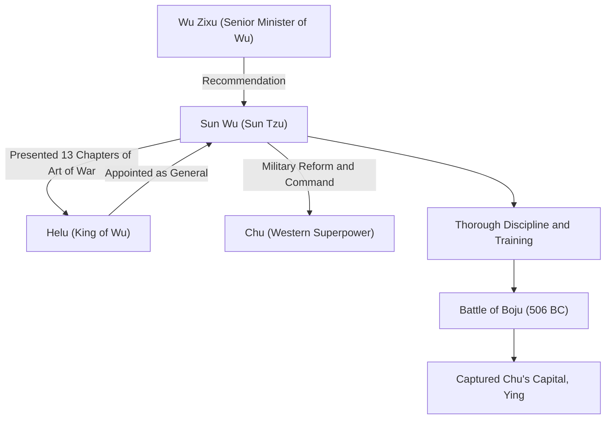

## Introduction

"If you know the enemy and know yourself, you need not fear the result of a hundred battles." This famous quote, frequently cited even in modern business scenes, was left by a military strategist who lived in China's Spring and Autumn period more than 2,500 years ago. His name was Sun Wu. Respectfully called "Sun Tzu" by later generations, he wrote the world's greatest military treatise, "The Art of War", and continues to exert a profound influence on military and management strategies not only in the East but worldwide. In this article, we delve deeply into the mysterious life of Sun Wu, his innovative philosophy, and his impact on future generations.

## Sun Wu's Life: Exile from Qi and the Leap of Wu

Sun Wu's life is recorded in Sima Qian's "Records of the Grand Historian", but his early life is shrouded in mystery. Born in the late 6th century BC in the state of Qi, corresponding to present-day Shandong province, Sun Wu is said to have come from a noble family that handled military affairs for generations. However, to avoid political struggles and turmoil within Qi, he defected south to the emerging state of "Wu".

Seeking refuge in Wu, Sun Wu was discovered by Wu Zixu, a senior minister. With Wu Zixu's strong recommendation, Sun Wu obtained an audience with King Helu of Wu. At this time, Sun Wu presented the military treatise he had written (later the 13 chapters of "The Art of War") to Helu, demonstrating his extraordinary talent. Deeply impressed by his military theory, Helu appointed Sun Wu as a general.

Under Sun Wu's command, the Wu army transformed into a disciplined and powerful organization. In 506 BC, Wu launched a massive expedition (the Battle of Boju) against the western superpower "Chu". Guided by Sun Wu's brilliant strategies, the Wu army overcame an overwhelming difference in troop numbers and achieved the historic feat of capturing Ying, the capital of Chu. Through this victory, Wu suddenly leaped to become the hegemonic power of the Spring and Autumn period.

## The Philosophy of "The Art of War": Winning Without Fighting

Sun Wu's greatest and immortal achievement is the authorship of the 13-chapter military treatise "The Art of War". What set "The Art of War" apart from previous military strategies was its reconceptualization of war not merely as a clash of armed forces, but as a "comprehensive national strategy" on which the survival of the state depended.

### 1. The Ruthlessness of War and Prudence
Sun Wu stated, "The art of war is of vital importance to the State. It is a matter of life and death, a road either to safety or to ruin. Hence it is a subject of inquiry which can on no account be neglected," directly confronting the enormous sacrifices war brings to the state and its people. Therefore, he adopted an extremely realistic and prudent stance that war should not be started lightly.

### 2. The Ultimate Ideal of "Winning Without Fighting"
The core of the philosophy in "The Art of War" is summarized in the words: "To fight and conquer in all your battles is not supreme excellence; supreme excellence consists in breaking the enemy's resistance without fighting." He taught that avoiding exhaustion from armed conflict and using diplomacy, stratagem, and information warfare to thwart the enemy's intentions, thus securing victory without crossing swords, is the highest strategy.

### 3. Emphasis on Information and Rationality
"If you know the enemy and know yourself, you need not fear the result of a hundred battles." Sun Wu strictly warned against relying on superstition or divination, demanding objective and thorough analysis of both friendly and enemy situations (military strength, terrain, weather, unity between ruler and people, etc.). The existence of the "Employment of Spies" chapter, which emphasizes intelligence gathering, also demonstrates how much he valued information.

## Diagram: Sun Wu's Correlation Chart and Achievements

The diagram below shows Sun Wu's key associates and the flow of his achievements.

## Profound Impact on Future Generations

After Sun Wu's death, his ideas were inherited by warlords and politicians of successive Chinese dynasties. Cao Cao, the hero of the Three Kingdoms period, added commentary to "The Art of War", maintaining the text that is passed down today, and Emperor Taizong of Tang and Song dynasty generals also made it their motto. Furthermore, it is famous that Takeda Shingen, a Japanese Sengoku warlord, raised the banner of "Furinkazan" (Wind, Forest, Fire, Mountain - a passage from the chapter on Military Combat).

Since modern times, "The Art of War" has spread beyond the East to the whole world. There is a legend that Napoleon of France loved to read it, and today it is designated as required reading at US military academies and the Pentagon. Even more surprisingly, its universal strategic theories have transcended the military realm and continue to be widely applied as the "ultimate bible" in modern business strategy, marketing, and management fields.

## Conclusion

Sun Wu was not just a battlefield commander, but a great thinker who coldly observed human psychology, organizational structures, and the fate of nations. The reason his legacy, "The Art of War", remains unfaded even after the staggering passage of 2,500 years is that it strikes at the universal truths of human society: not "how to kill the enemy," but "how to survive and achieve objectives." When we are forced to make difficult decisions, Sun Wu's cold yet profound wisdom will surely continue to serve as a powerful compass.
