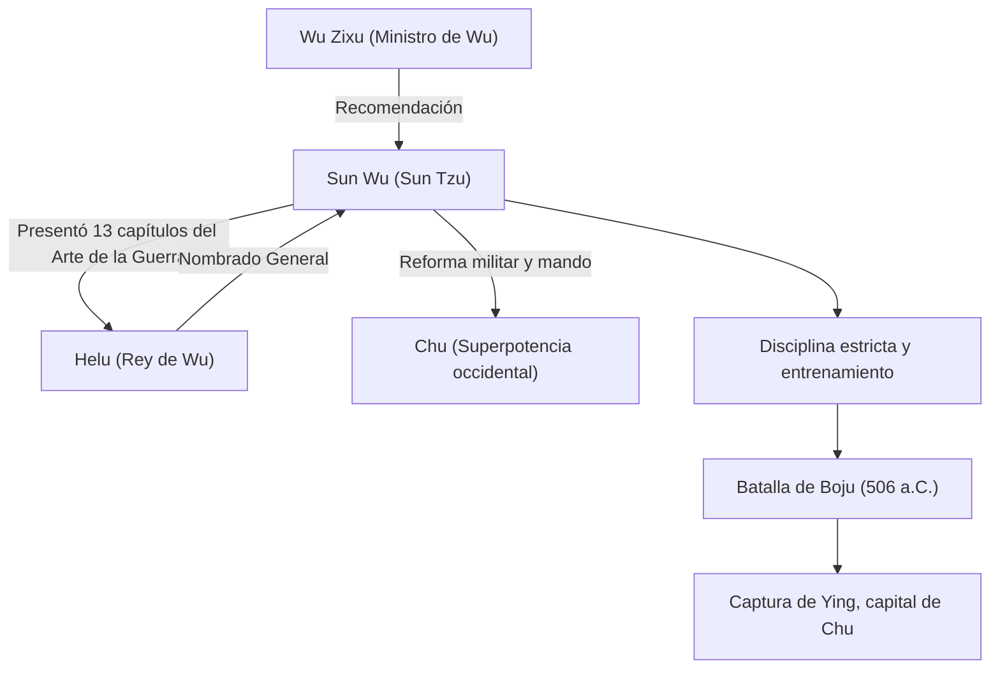

## Introducción

"Si conoces al enemigo y te conoces a ti mismo, no debes temer el resultado de cien batallas". Esta famosa cita, citada con frecuencia incluso en los escenarios empresariales modernos, fue dejada por un estratega militar que vivió en el período de Primavera y Otoño de China hace más de 2500 años. Su nombre era Sun Wu. Llamado respetuosamente "Sun Tzu" por las generaciones posteriores, escribió el tratado militar más importante del mundo, "El Arte de la Guerra", y continúa ejerciendo una profunda influencia en las estrategias militares y de gestión no solo en Oriente sino en todo el mundo. En este artículo, profundizamos en la misteriosa vida de Sun Wu, su filosofía innovadora y su impacto en las generaciones futuras.

## La vida de Sun Wu: Exilio de Qi y el salto de Wu

La vida de Sun Wu está registrada en las "Memorias históricas" de Sima Qian, pero su vida temprana está envuelta en misterio. Nacido a finales del siglo VI a.C. en el estado de Qi, que corresponde a la actual provincia de Shandong, se dice que Sun Wu provenía de una familia noble que manejaba asuntos militares durante generaciones. Sin embargo, para evitar luchas políticas y confusión dentro de Qi, desertó hacia el sur al estado emergente de "Wu".

Buscando refugio en Wu, Sun Wu fue descubierto por Wu Zixu, un ministro de alto rango. Con la fuerte recomendación de Wu Zixu, Sun Wu obtuvo una audiencia con el Rey Helu de Wu. En este momento, Sun Wu presentó el tratado militar que había escrito (más tarde los 13 capítulos de "El Arte de la Guerra") a Helu, demostrando su extraordinario talento. Profundamente impresionado por su teoría militar, Helu nombró a Sun Wu como general.

Bajo el mando de Sun Wu, el ejército de Wu se transformó en una organización disciplinada y poderosa. En 506 a.C., Wu lanzó una expedición masiva (la Batalla de Boju) contra la superpotencia occidental "Chu". Guiado por las brillantes estrategias de Sun Wu, el ejército de Wu superó una diferencia abrumadora en el número de tropas y logró la hazaña histórica de capturar Ying, la capital de Chu. A través de esta victoria, Wu saltó repentinamente para convertirse en la potencia hegemónica del período de Primavera y Otoño.

## La filosofía de "El Arte de la Guerra": Ganar sin luchar

El logro más grande e inmortal de Sun Wu es la autoría del tratado militar de 13 capítulos "El Arte de la Guerra". Lo que separó a "El Arte de la Guerra" de las estrategias militares anteriores fue su reconceptualización de la guerra no meramente como un choque de fuerzas armadas, sino como una "estrategia nacional integral" de la que dependía la supervivencia del estado.

### 1. La crueldad de la guerra y la prudencia
Sun Wu afirmó: "La guerra es de vital importancia para el Estado. Es una cuestión de vida o muerte, un camino hacia la seguridad o la ruina. Por lo tanto, es un tema de investigación que en ningún caso puede ser descuidado", confrontando directamente los enormes sacrificios que la guerra trae al estado y a su pueblo. Por lo tanto, adoptó una postura extremadamente realista y prudente de que la guerra no debe iniciarse a la ligera.

### 2. El ideal supremo de "Ganar sin luchar"
El núcleo de la filosofía en "El Arte de la Guerra" se resume en las palabras: "Luchar y conquistar en todas tus batallas no es la excelencia suprema; la excelencia suprema consiste en romper la resistencia del enemigo sin luchar". Enseñó que evitar el agotamiento del conflicto armado y usar la diplomacia, la estratagema y la guerra de información para frustrar las intenciones del enemigo, asegurando así la victoria sin cruzar espadas, es la estrategia más alta.

### 3. Énfasis en la información y la racionalidad
"Si conoces al enemigo y te conoces a ti mismo, no debes temer el resultado de cien batallas". Sun Wu advirtió estrictamente contra depender de supersticiones o adivinaciones, exigiendo un análisis objetivo y exhaustivo de las situaciones amigas y enemigas (fuerza militar, terreno, clima, unidad entre gobernante y pueblo, etc.). La existencia del capítulo "Empleo de espías", que enfatiza la recopilación de inteligencia, también demuestra cuánto valoraba la información.

## Diagrama: Cuadro de correlación y logros de Sun Wu

El siguiente diagrama muestra a los asociados clave de Sun Wu y el flujo de sus logros.

## Profundo impacto en las generaciones futuras

Después de la muerte de Sun Wu, sus ideas fueron heredadas por señores de la guerra y políticos de las sucesivas dinastías chinas. Cao Cao, el héroe del período de los Tres Reinos, agregó comentarios a "El Arte de la Guerra", manteniendo el texto que se transmite en la actualidad, y el emperador Taizong de Tang y los generales de la dinastía Song también lo convirtieron en su lema. Además, es famoso que Takeda Shingen, un señor de la guerra del período Sengoku japonés, levantó la bandera de "Furinkazan" (Viento, Bosque, Fuego, Montaña - un pasaje del capítulo sobre Combate Militar).

Desde los tiempos modernos, "El Arte de la Guerra" se ha extendido más allá de Oriente hacia todo el mundo. Existe la leyenda de que a Napoleón de Francia le encantaba leerlo, y hoy está designado como lectura obligatoria en las academias militares de EE. UU. y el Pentágono. Aún más sorprendente, sus teorías estratégicas universales han trascendido el ámbito militar y continúan aplicándose ampliamente como la "biblia definitiva" en los campos de estrategia empresarial moderna, marketing y gestión.

## Conclusión

Sun Wu no fue solo un comandante en el campo de batalla, sino un gran pensador que observó fríamente la psicología humana, las estructuras organizativas y el destino de las naciones. La razón por la que su legado, "El Arte de la Guerra", permanece intacto incluso después del asombroso paso de 2500 años es que golpea las verdades universales de la sociedad humana: no "cómo matar al enemigo", sino "cómo sobrevivir y lograr objetivos". Cuando nos veamos obligados a tomar decisiones difíciles, la sabiduría fría pero profunda de Sun Wu seguramente continuará sirviendo como una brújula poderosa.
