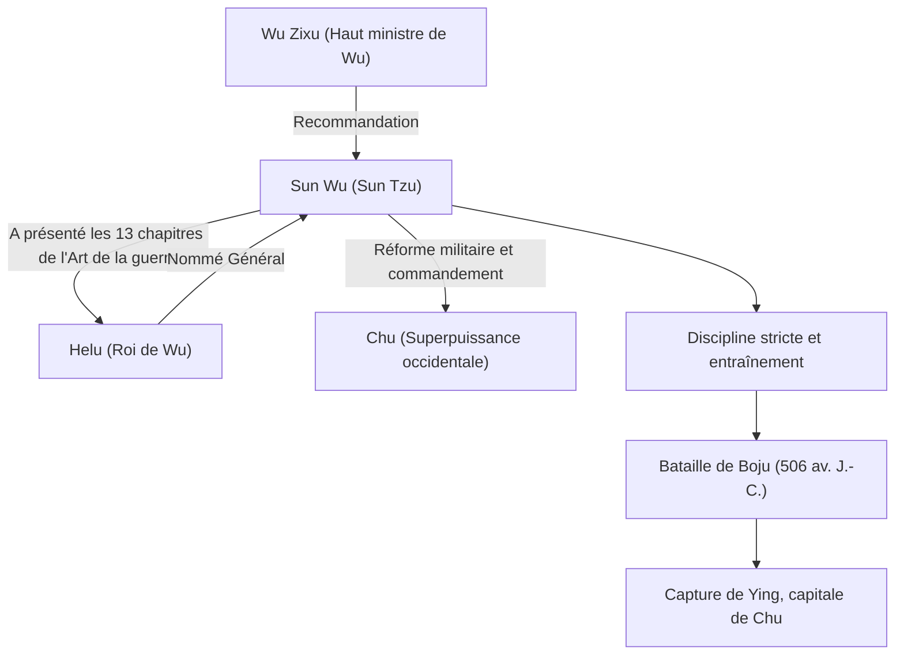

## Introduction

« Connais ton ennemi et connais-toi toi-même, eussions-nous cent guerres à soutenir, cent fois tu seras victorieux. » Cette célèbre citation, fréquemment évoquée même dans le monde des affaires moderne, nous vient d'un stratège militaire ayant vécu en Chine durant la période des Printemps et Automnes, il y a plus de 2500 ans. Son nom était Sun Wu. Appelé respectueusement « Sun Tzu » par les générations suivantes, il a écrit le plus grand traité militaire du monde, « L'Art de la guerre », et continue d'exercer une profonde influence sur les stratégies militaires et de gestion, non seulement en Orient, mais dans le monde entier. Dans cet article, nous plongeons au cœur de la vie mystérieuse de Sun Wu, de sa philosophie novatrice et de son impact sur les générations futures.

## La vie de Sun Wu : Exil de Qi et l'essor de Wu

La vie de Sun Wu est consignée dans les « Mémoires historiques » de Sima Qian, mais le début de sa vie reste entouré de mystère. Né à la fin du VIe siècle av. J.-C. dans l'État de Qi, qui correspond à l'actuelle province du Shandong, Sun Wu serait issu d'une noble famille ayant géré les affaires militaires pendant des générations. Cependant, pour éviter les luttes politiques et les troubles au sein de Qi, il fit défection vers le sud, dans l'État émergent de « Wu ».

Cherchant refuge à Wu, Sun Wu fut découvert par Wu Zixu, un haut ministre. Grâce à la forte recommandation de Wu Zixu, Sun Wu obtint une audience avec le roi Helu de Wu. À cette occasion, Sun Wu présenta le traité militaire qu'il avait rédigé (qui deviendra les 13 chapitres de « L'Art de la guerre ») à Helu, démontrant son talent extraordinaire. Profondément impressionné par sa théorie militaire, Helu nomma Sun Wu général.

Sous le commandement de Sun Wu, l'armée de Wu s'est transformée en une organisation disciplinée et puissante. En 506 av. J.-C., Wu a lancé une expédition massive (la bataille de Boju) contre la superpuissance occidentale « Chu ». Guidée par les brillantes stratégies de Sun Wu, l'armée de Wu a surmonté une différence écrasante en nombre de troupes et a réalisé l'exploit historique de capturer Ying, la capitale de Chu. Grâce à cette victoire, Wu est soudainement devenu la puissance hégémonique de la période des Printemps et Automnes.

## La philosophie de « L'Art de la guerre » : Gagner sans combattre

La réalisation la plus grande et immortelle de Sun Wu est d'avoir écrit le traité militaire en 13 chapitres, « L'Art de la guerre ». Ce qui a distingué « L'Art de la guerre » des stratégies militaires antérieures a été sa reconceptualisation de la guerre, non pas simplement comme un affrontement de forces armées, mais comme une « stratégie nationale globale » dont dépendait la survie de l'État.

### 1. La cruauté de la guerre et la prudence
Sun Wu a déclaré : « La guerre est d'une importance vitale pour l'État. C'est une question de vie ou de mort, une route menant soit à la sécurité, soit à la ruine. C'est pourquoi c'est un sujet d'étude qui ne peut en aucun cas être négligé », confrontant directement les énormes sacrifices que la guerre impose à l'État et à son peuple. Par conséquent, il a adopté une position extrêmement réaliste et prudente, affirmant que la guerre ne devait pas être déclenchée à la légère.

### 2. L'idéal suprême de « Gagner sans combattre »
Le cœur de la philosophie de « L'Art de la guerre » se résume en ces mots : « Remporter cent victoires après cent batailles n'est pas le plus grand bien ; soumettre l'armée ennemie sans combattre est le plus grand bien. » Il a enseigné qu'éviter l'épuisement des conflits armés et utiliser la diplomatie, les stratagèmes et la guerre de l'information pour déjouer les intentions de l'ennemi, assurant ainsi la victoire sans croiser le fer, est la stratégie suprême.

### 3. L'importance de l'information et de la rationalité
« Connais ton ennemi et connais-toi toi-même, eussions-nous cent guerres à soutenir, cent fois tu seras victorieux. » Sun Wu a strictement mis en garde contre le recours aux superstitions ou à la divination, exigeant une analyse objective et approfondie des situations, tant alliées qu'ennemies (force militaire, terrain, météo, unité entre le dirigeant et le peuple, etc.). L'existence du chapitre « L'Emploi des espions », qui met l'accent sur le renseignement, démontre également la valeur qu'il accordait à l'information.

## Diagramme : Organigramme de Sun Wu et ses accomplissements

Le diagramme ci-dessous illustre les collaborateurs clés de Sun Wu et le déroulement de ses accomplissements.

## Un impact profond sur les générations futures

Après la mort de Sun Wu, ses idées ont été héritées par les seigneurs de la guerre et les politiciens des dynasties chinoises successives. Cao Cao, le héros de la période des Trois Royaumes, a ajouté des commentaires à « L'Art de la guerre », préservant le texte qui nous est parvenu aujourd'hui. L'empereur Taizong des Tang et les généraux de la dynastie Song en ont également fait leur devise. De plus, il est célèbre que Takeda Shingen, un seigneur de guerre japonais de la période Sengoku, ait levé l'étendard de « Furinkazan » (Vent, Forêt, Feu, Montagne - un passage du chapitre sur les Manœuvres militaires).

Depuis l'époque moderne, « L'Art de la guerre » s'est répandu au-delà de l'Orient, dans le monde entier. Une légende raconte que Napoléon de France aimait le lire, et aujourd'hui, il est une lecture obligatoire dans les académies militaires américaines et au Pentagone. Plus surprenant encore, ses théories stratégiques universelles ont transcendé le domaine militaire et continuent d'être largement appliquées comme « la bible ultime » dans les domaines de la stratégie d'entreprise moderne, du marketing et de la gestion.

## Conclusion

Sun Wu n'était pas seulement un commandant sur le champ de bataille, mais un grand penseur qui a observé froidement la psychologie humaine, les structures organisationnelles et le destin des nations. La raison pour laquelle son héritage, « L'Art de la guerre », reste inaltérable même après 2500 ans, c'est qu'il touche aux vérités universelles de la société humaine : non pas « comment tuer l'ennemi », mais « comment survivre et atteindre ses objectifs ». Lorsque nous sommes contraints de prendre des décisions difficiles, la sagesse froide et profonde de Sun Wu continuera sûrement de nous servir de puissante boussole.
