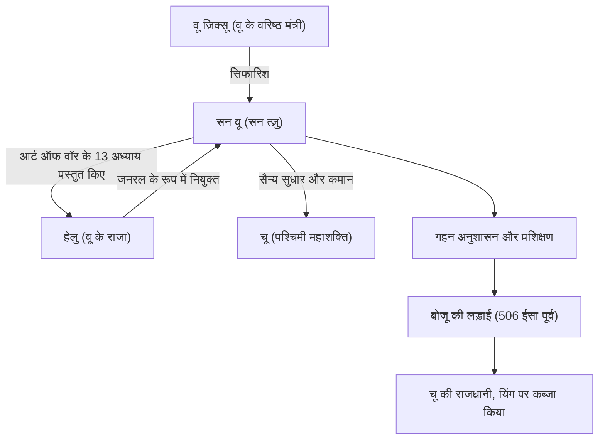

## परिचय

"यदि आप शत्रु को जानते हैं और स्वयं को जानते हैं, तो आपको सौ युद्धों के परिणाम से डरने की आवश्यकता नहीं है।" यह प्रसिद्ध उद्धरण, जो आधुनिक व्यापारिक परिदृश्यों में भी अक्सर उद्धृत किया जाता है, 2,500 से अधिक वर्ष पहले चीन के वसंत और शरद ऋतु काल में रहने वाले एक सैन्य रणनीतिकार द्वारा दिया गया था। उनका नाम सन वू था। आने वाली पीढ़ियों द्वारा सम्मानपूर्वक "सन त्ज़ु" कहे जाने वाले, उन्होंने दुनिया का सबसे महान सैन्य ग्रंथ, "द आर्ट ऑफ वॉर" लिखा, और न केवल पूर्व में बल्कि दुनिया भर में सैन्य और प्रबंधन रणनीतियों पर गहरा प्रभाव डालना जारी रखा है। इस लेख में, हम सन वू के रहस्यमय जीवन, उनके अभिनव दर्शन और आने वाली पीढ़ियों पर उनके प्रभाव के बारे में गहराई से जानेंगे।

## सन वू का जीवन: क्यूई से निर्वासन और वू की छलांग

सन वू का जीवन सिमा कियान के "रिकॉर्ड्स ऑफ द ग्रैंड हिस्टोरियन" में दर्ज है, लेकिन उनका प्रारंभिक जीवन रहस्य में लिपटा हुआ है। छठी शताब्दी ईसा पूर्व के अंत में क्यूई राज्य में जन्मे, जो वर्तमान शेडोंग प्रांत से मेल खाता है, कहा जाता है कि सन वू एक कुलीन परिवार से आए थे जो पीढ़ियों से सैन्य मामलों को संभालता था। हालाँकि, क्यूई के भीतर राजनीतिक संघर्षों और उथल-पुथल से बचने के लिए, वह दक्षिण में उभरते हुए राज्य "वू" में चले गए।

वू में शरण लेने वाले सन वू को एक वरिष्ठ मंत्री वू ज़िक्सू द्वारा खोजा गया था। वू ज़िक्सू की मजबूत सिफारिश के साथ, सन वू ने वू के राजा हेलु के साथ दर्शक प्राप्त किए। इस समय, सन वू ने अपने लिखे सैन्य ग्रंथ (बाद में "द आर्ट ऑफ वॉर" के 13 अध्याय) को हेलु के सामने प्रस्तुत किया, जिसने उनकी असाधारण प्रतिभा का प्रदर्शन किया। उनके सैन्य सिद्धांत से गहराई से प्रभावित होकर, हेलु ने सन वू को जनरल नियुक्त किया।

सन वू की कमान के तहत, वू सेना एक अनुशासित और शक्तिशाली संगठन में बदल गई। 506 ईसा पूर्व में, वू ने पश्चिमी महाशक्ति "चू" के खिलाफ एक बड़े अभियान (बोजू की लड़ाई) की शुरुआत की। सन वू की शानदार रणनीतियों द्वारा निर्देशित, वू सेना ने सैनिकों की संख्या में भारी अंतर को पार कर लिया और चू की राजधानी यिंग पर कब्जा करने का ऐतिहासिक कारनामा किया। इस जीत के माध्यम से, वू अचानक वसंत और शरद ऋतु काल की प्रमुख शक्ति बनने के लिए छलांग लगा गया।

## "द आर्ट ऑफ वॉर" का दर्शन: बिना लड़े जीतना

सन वू की सबसे बड़ी और अमर उपलब्धि 13 अध्यायों वाले सैन्य ग्रंथ "द आर्ट ऑफ वॉर" का लेखक होना है। जिस बात ने "द आर्ट ऑफ वॉर" को पिछली सैन्य रणनीतियों से अलग किया, वह युद्ध को केवल सशस्त्र बलों के टकराव के रूप में नहीं, बल्कि एक "व्यापक राष्ट्रीय रणनीति" के रूप में पुनर्संकल्पना करना था, जिस पर राज्य का अस्तित्व निर्भर था।

### 1. युद्ध की क्रूरता और विवेक
सन वू ने कहा, "युद्ध राज्य के लिए अत्यंत महत्वपूर्ण है। यह जीवन और मृत्यु का मामला है, सुरक्षा या विनाश का रास्ता है। इसलिए यह जांच का विषय है जिसे किसी भी स्थिति में नजरअंदाज नहीं किया जा सकता है," यह राज्य और उसके लोगों के लिए युद्ध द्वारा लाए गए भारी बलिदानों का सीधे सामना करता है। इसलिए, उन्होंने एक अत्यंत यथार्थवादी और विवेकपूर्ण रुख अपनाया कि युद्ध को हल्के में शुरू नहीं किया जाना चाहिए।

### 2. "बिना लड़े जीतने" का अंतिम आदर्श
"द आर्ट ऑफ वॉर" में दर्शन का मूल इन शब्दों में संक्षेप में है: "अपने सभी युद्धों में लड़ना और जीतना सर्वोच्च उत्कृष्टता नहीं है; सर्वोच्च उत्कृष्टता बिना लड़े दुश्मन के प्रतिरोध को तोड़ने में शामिल है।" उन्होंने सिखाया कि सशस्त्र संघर्ष से होने वाली थकावट से बचना और दुश्मन के इरादों को विफल करने के लिए कूटनीति, चाल और सूचना युद्ध का उपयोग करना, इस प्रकार तलवारों को पार किए बिना जीत हासिल करना, सर्वोच्च रणनीति है।

### 3. सूचना और तर्कसंगतता पर जोर
"यदि आप शत्रु को जानते हैं और स्वयं को जानते हैं, तो आपको सौ युद्धों के परिणाम से डरने की आवश्यकता नहीं है।" सन वू ने अंधविश्वास या अटकल पर निर्भर रहने के खिलाफ सख्ती से चेतावनी दी, अनुकूल और दुश्मन दोनों स्थितियों (सैन्य शक्ति, इलाके, मौसम, शासक और लोगों के बीच एकता, आदि) के वस्तुनिष्ठ और गहन विश्लेषण की मांग की। खुफिया जानकारी जुटाने पर जोर देने वाले "जासूसों के रोजगार" अध्याय का अस्तित्व भी यह दर्शाता है कि उन्होंने जानकारी को कितना महत्व दिया।

## आरेख: सन वू का सहसंबंध चार्ट और उपलब्धियां

नीचे दिया गया आरेख सन वू के प्रमुख सहयोगियों और उनकी उपलब्धियों के प्रवाह को दर्शाता है।

## भावी पीढ़ियों पर गहरा प्रभाव

सन वू की मृत्यु के बाद, उनके विचारों को क्रमिक चीनी राजवंशों के सरदारों और राजनेताओं द्वारा विरासत में मिला। तीन राज्यों की अवधि के नायक काओ काओ ने "द आर्ट ऑफ वॉर" में टिप्पणी जोड़ी, उस पाठ को बनाए रखा जो आज भी पारित है, और तांग के सम्राट ताइज़ोंग और सोंग राजवंश के जनरलों ने भी इसे अपना आदर्श वाक्य बनाया। इसके अलावा, यह प्रसिद्ध है कि जापानी सेंगोकू सरदार ताकेदा शिंगेन ने "फुरिंकाजान" (हवा, जंगल, आग, पहाड़ - सैन्य युद्ध पर अध्याय का एक अंश) का बैनर उठाया।

आधुनिक काल से, "द आर्ट ऑफ वॉर" पूर्व से परे पूरी दुनिया में फैल गया है। एक किंवदंती है कि फ्रांस के नेपोलियन इसे पढ़ना पसंद करते थे, और आज इसे अमेरिकी सैन्य अकादमियों और पेंटागन में पढ़ने के लिए आवश्यक के रूप में नामित किया गया है। और भी आश्चर्य की बात है कि इसके सार्वभौमिक रणनीतिक सिद्धांत सैन्य दायरे से आगे निकल गए हैं और आधुनिक व्यापार रणनीति, विपणन और प्रबंधन क्षेत्रों में "अंतिम बाइबिल" के रूप में व्यापक रूप से लागू हो रहे हैं।

## निष्कर्ष

सन वू केवल एक युद्धक्षेत्र कमांडर नहीं थे, बल्कि एक महान विचारक थे जिन्होंने मानवीय मनोविज्ञान, संगठनात्मक संरचनाओं और राष्ट्रों के भाग्य का ठंडे दिमाग से अवलोकन किया। 2,500 साल बीत जाने के बाद भी उनकी विरासत, "द आर्ट ऑफ वॉर" के अप्रभावित रहने का कारण यह है कि यह मानव समाज की सार्वभौमिक सच्चाइयों पर प्रहार करता है: "दुश्मन को कैसे मारें," नहीं, बल्कि "कैसे जीवित रहें और उद्देश्यों को प्राप्त करें।" जब हमें कठिन निर्णय लेने के लिए मजबूर किया जाता है, तो सन वू की ठंडी लेकिन गहरी बुद्धिमत्ता निश्चित रूप से एक शक्तिशाली कम्पास के रूप में काम करती रहेगी।
