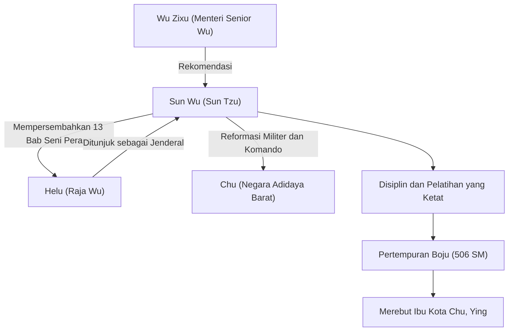

## Pengantar

"Jika Anda mengenali musuh dan mengenali diri Anda sendiri, Anda tidak perlu takut dengan hasil dari seratus pertempuran." Kutipan terkenal ini, yang sering dikutip bahkan di dunia bisnis modern, ditinggalkan oleh seorang ahli strategi militer yang hidup pada Periode Musim Semi dan Musim Gugur di Tiongkok lebih dari 2.500 tahun yang lalu. Namanya adalah Sun Wu. Dipanggil dengan hormat "Sun Tzu" oleh generasi berikutnya, ia menulis risalah militer terhebat di dunia, "Seni Perang", dan terus memberikan pengaruh besar pada strategi militer dan manajemen tidak hanya di Timur tetapi di seluruh dunia. Dalam artikel ini, kita menyelami lebih dalam kehidupan Sun Wu yang misterius, filosofi inovatifnya, dan dampaknya pada generasi mendatang.

## Kehidupan Sun Wu: Pengasingan dari Qi dan Lompatan Wu

Kehidupan Sun Wu tercatat dalam "Catatan Sejarawan Agung" karya Sima Qian, namun kehidupan awalnya masih diselimuti misteri. Lahir pada akhir abad ke-6 SM di negara Qi, yang sesuai dengan provinsi Shandong saat ini, Sun Wu dikatakan berasal dari keluarga bangsawan yang menangani urusan militer selama beberapa generasi. Namun, untuk menghindari pergulatan politik dan kekacauan di dalam negara Qi, ia membelot ke selatan menuju negara baru, "Wu".

Mencari perlindungan di Wu, Sun Wu ditemukan oleh Wu Zixu, seorang menteri senior. Dengan rekomendasi kuat dari Wu Zixu, Sun Wu memperoleh kesempatan untuk menghadap Raja Helu dari Wu. Pada saat itu, Sun Wu mempersembahkan risalah militer yang ditulisnya (yang kemudian menjadi 13 bab "Seni Perang") kepada Helu, menunjukkan bakatnya yang luar biasa. Sangat terkesan dengan teori militernya, Helu menunjuk Sun Wu sebagai jenderal.

Di bawah komando Sun Wu, tentara Wu berubah menjadi organisasi yang disiplin dan kuat. Pada tahun 506 SM, Wu melancarkan ekspedisi besar-besaran (Pertempuran Boju) melawan negara adidaya barat, "Chu". Dipandu oleh strategi brilian Sun Wu, tentara Wu berhasil mengatasi perbedaan jumlah pasukan yang sangat besar dan mencapai prestasi bersejarah dengan merebut Ying, ibu kota Chu. Melalui kemenangan ini, Wu tiba-tiba melompat menjadi negara hegemoni pada Periode Musim Semi dan Musim Gugur.

## Filosofi "Seni Perang": Menang Tanpa Bertempur

Pencapaian terbesar dan abadi Sun Wu adalah penulisan risalah militer 13 bab "Seni Perang". Hal yang membedakan "Seni Perang" dari strategi militer sebelumnya adalah konseptualisasi ulangnya mengenai perang bukan sekadar bentrokan angkatan bersenjata, melainkan sebagai "strategi nasional yang komprehensif" yang menentukan kelangsungan hidup negara.

### 1. Kekejaman Perang dan Kehati-hatian
Sun Wu menyatakan, "Perang adalah masalah yang sangat penting bagi Negara. Ini adalah masalah hidup dan mati, jalan menuju keselamatan atau kehancuran. Oleh karena itu, ini adalah subjek penyelidikan yang tidak boleh diabaikan," yang secara langsung menghadapi pengorbanan besar yang ditimbulkan perang bagi negara dan rakyatnya. Karena itu, ia mengambil sikap yang sangat realistis dan hati-hati bahwa perang tidak boleh dimulai dengan sembarangan.

### 2. Cita-cita Tertinggi "Menang Tanpa Bertempur"
Inti filosofi dalam "Seni Perang" dirangkum dalam kata-kata: "Bertempur dan menaklukkan di semua pertempuran bukanlah keunggulan tertinggi; keunggulan tertinggi terdiri dari mematahkan perlawanan musuh tanpa bertempur." Ia mengajarkan bahwa menghindari kelelahan akibat konflik bersenjata dan menggunakan diplomasi, tipu muslihat, serta perang informasi untuk menggagalkan niat musuh, sehingga mengamankan kemenangan tanpa menyilangkan pedang, adalah strategi tertinggi.

### 3. Penekanan pada Informasi dan Rasionalitas
"Jika Anda mengenali musuh dan mengenali diri Anda sendiri, Anda tidak perlu takut dengan hasil dari seratus pertempuran." Sun Wu secara tegas memperingatkan agar tidak mengandalkan takhayul atau ramalan, dan menuntut analisis yang objektif dan menyeluruh mengenai situasi teman dan musuh (kekuatan militer, medan, cuaca, persatuan antara penguasa dan rakyat, dll.). Keberadaan bab "Penggunaan Mata-Mata", yang menekankan pengumpulan intelijen, juga menunjukkan betapa ia sangat menghargai informasi.

## Diagram: Bagan Korelasi dan Pencapaian Sun Wu

Diagram di bawah ini menunjukkan rekan-rekan kunci Sun Wu dan alur pencapaiannya.

## Dampak Besar pada Generasi Mendatang

Setelah kematian Sun Wu, gagasan-gagasannya diwarisi oleh para panglima perang dan politikus dinasti Tiongkok berturut-turut. Cao Cao, pahlawan pada periode Tiga Kerajaan, menambahkan komentar pada "Seni Perang", mempertahankan teks yang diturunkan hingga saat ini, dan Kaisar Taizong dari Tang serta para jenderal dinasti Song juga menjadikannya sebagai pedoman mereka. Selain itu, terkenal bahwa Takeda Shingen, seorang panglima perang periode Sengoku Jepang, mengibarkan panji "Furinkazan" (Angin, Hutan, Api, Gunung - sebuah kutipan dari bab mengenai Pertempuran Militer).

Sejak zaman modern, "Seni Perang" telah menyebar melampaui Timur ke seluruh dunia. Ada legenda bahwa Napoleon dari Prancis suka membacanya, dan saat ini buku tersebut ditetapkan sebagai bacaan wajib di akademi militer AS dan Pentagon. Yang lebih mengejutkan lagi, teori-teori strategis universalnya telah melampaui ranah militer dan terus diterapkan secara luas sebagai "alkitab pamungkas" dalam bidang strategi bisnis, pemasaran, dan manajemen modern.

## Kesimpulan

Sun Wu bukan hanya seorang komandan medan perang, tetapi seorang pemikir hebat yang dengan dingin mengamati psikologi manusia, struktur organisasi, dan nasib negara-negara. Alasan mengapa warisannya, "Seni Perang", tidak pudar bahkan setelah melewati waktu yang sangat lama, yaitu 2.500 tahun, adalah karena ia menyentuh kebenaran universal masyarakat manusia: bukan "bagaimana membunuh musuh," melainkan "bagaimana bertahan hidup dan mencapai tujuan." Ketika kita dihadapkan pada keputusan yang sulit, kebijaksanaan Sun Wu yang dingin namun mendalam pasti akan terus berfungsi sebagai kompas yang kuat.
